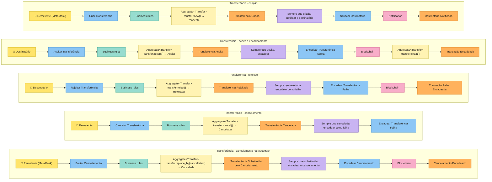
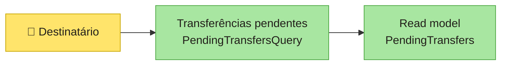

# Cerne

**Do Event Storming ao código Rust.** Cada post-it vira um bloco explícito: quem olha o código sabe na hora em que parte do fluxo está.

> ⚠️ **Em desenvolvimento.** A API ainda vai mudar. Veja o [ROADMAP](docs/ROADMAP.md).

---

## Post-it → código

| Post-it | Conceito | No Cerne |
|---|---|---|
| 🟦 | Command | trait `Command<Ports>`, que devolve `Executed { output, events }` |
| 🟨 | Aggregate / Entity | traits `Entity` e `Aggregate` |
| — | Value Object | trait `ValueObject`, que também é o tipo do id de toda entidade |
| 🟧 | Domain Event | trait `DomainEvent<Ports>` |
| 🟪 | Policy | `Policy` + `Policies`; os commands delas vão para a `Outbox`, na mesma transação, e o `OutboxPolicyProcessor` os executa |
| 🩷 | External System (Port) | trait `Repository<A>`, os ports da aplicação e o composition root `Ports` (`TransactionalPorts`) |
| — | Banco | `cerne::sqlite` (também em memória) e `cerne::postgres`: a mesma API, o mesmo SQL |
| — | HTTP | feature `axum`: REST ou JSON-RPC |
| — | Invariantes | `Invariant` + `Invariants` |
| — | Regras de negócio | `BusinessRule` + `BusinessRules` |
| — | Domain service | uma função pura do domínio |
| 🟩 | Read Model / Query | trait `Query<Ports>`, que devolve um `ReadModel` |

## Tutorial: uma transferência de RDEC, do board ao código

Este tutorial percorre o [`main.rs`](examples/rde/src/main.rs) do `examples/rde`, de cima para baixo. O exemplo implementa as raias de transferência do Event Storming da Blockchain RDE. Quem envia usa a MetaMask: a rde fala o JSON-RPC da Ethereum, e uma transferência chega como a transação que a MetaMask assinou (passo 7). Os diagramas usam as cores do board:



```mermaid
flowchart LR
  actor["👤 Ator"]:::actor ~~~ command["Command"]:::command ~~~ rule["Business rules"]:::rule ~~~ service["Domain service"]:::service ~~~ aggregate["Aggregate#lt;Nome#gt;<br/>método chamado"]:::aggregate ~~~ event["Domain event"]:::event ~~~ policy["Policy"]:::policy ~~~ external["Sistema externo"]:::external
  classDef actor fill:#ffe46b,stroke:#c9a800,color:#221f1a
  classDef command fill:#8cc6f5,stroke:#3d8fd1,color:#221f1a
  classDef rule fill:#97dccf,stroke:#3fa892,color:#221f1a
  classDef service fill:#dde2e7,stroke:#8a96a3,color:#221f1a
  classDef aggregate fill:#fff3b3,stroke:#c9b84a,color:#221f1a
  classDef event fill:#ffb25c,stroke:#d97a14,color:#221f1a
  classDef policy fill:#c9b4f2,stroke:#7d5cc4,color:#221f1a
  classDef external fill:#f8adc9,stroke:#d0578a,color:#221f1a
```

As raias:



O `main` percorre as duas primeiras raias. A rejeição e o cancelamento seguem o mesmo molde do aceite e estão cobertos nos testes. Os dois terminam na chain como transação que falhou: nenhum RDEC se move, mas o nonce do remetente anda, e a MetaMask para de esperar pela transação.

A última raia é o "Cancelar" da própria MetaMask. Ela assina uma transação nova, com o nonce da transferência pendente, valor 0 e a própria conta como destino. Essa transação substitui a transferência: o cancelamento entra na chain como sucesso, sem mover RDEC e sem cobrar taxa, e a transferência nunca ganha bloco. A MetaMask passa a acompanhar o hash do cancelamento e mostra a transferência como "Falhou".

A cada passo do `main`, o tutorial abre o código que aquele passo usa. Todos os trechos abaixo são copiados dos arquivos do `examples/rde`, e um teste (`examples/rde/tests/readme.rs`) falha se algum deles deixar de existir no arquivo de origem.

Uma aplicação Cerne é organizada por camada:

```text
examples/rde/src/
├── domain/           síncrono e puro: nenhum IO acontece aqui
│   ├── entities/     agregados e entidades (Transfer)
│   ├── events/       domain events e as policies de cada um
│   ├── services/     domain services (estimate_fees, transaction_hash, rdec)
│   └── value_objects/ valores sem identidade (SignedTransaction, Address, TxHash)
├── application/      assíncrono: os commands, as queries e os ports que eles usam
│   ├── commands/
│   ├── queries/      o que se consulta antes de decidir (PendingTransfersQuery, OpenTransfersQuery)
│   ├── read_models/  o que a query devolve, no formato da tela (PendingTransfers)
│   └── ports/        os sistemas externos (Blockchain, KycRegistry, Notifier)
├── infrastructure/   os adapters de cada port (SQLite, memória), a carteira local e o HTTP
├── ports.rs          o composition root
├── lib.rs
└── main.rs
```

Todo valor de RDEC está em **wei**, como na MetaMask: 1 RDEC = 10^18 wei. Por isso os valores são `u128`, e o `rdec(wei)` os escreve para leitura (`"0.1 RDEC"`).

### 1. O composition root

O `main` começa criando as carteiras e montando os `Ports`: a struct com todos os ports que os commands e as queries podem usar. Cada port recebe um adapter.

- **As carteiras são `LocalWallet`s**, com chaves privadas fixas. A `LocalWallet` faz o papel da MetaMask: guarda a chave e assina. A rde nunca vê a chave, só a transação assinada.
- **O banco é um SQLite em memória**, com as migrações de `examples/rde/migrations/` (a tabela `transfers` e a `cerne_outbox`). É o mesmo adapter SQL de produção: só a URL muda. Em Postgres, o SQL é o mesmo, e a troca é `SqliteDatabase` → `PostgresDatabase` e as migrações.
- **Os sistemas externos ficam em memória:** a Alice começa com 1000 RDEC, a Alice e o Bob já passaram pelo KYC, e o notificador guarda cada mensagem numa caixa de entrada (`inbox`) que o `main` lê logo depois da criação.

<!-- snippet: examples/rde/src/main.rs -->
```rust
// --- Composition root: SQLite in memory + in-memory external systems -----

let alice = LocalWallet::new(ALICE_PRIVATE_KEY);
let bob = LocalWallet::new(BOB_PRIVATE_KEY);

let database = SqliteDatabase::in_memory().await?;

database.migrate(&sqlx::migrate!()).await?;

let inbox = Arc::new(Mutex::new(vec![]));

let external_systems = ExternalSystems {
    blockchain: Arc::new(InMemoryBlockchain::new(vec![(
        alice.address().clone(),
        1000 * WEI_PER_RDEC,
    )])),
    kyc: Arc::new(InMemoryKycRegistry::new(vec![
        alice.address().clone(),
        bob.address().clone(),
    ])),
    notifier: Arc::new(InMemoryNotifier::new(Arc::clone(&inbox))),
};

let ports = Arc::new(Ports::new(database, external_systems));

let outbox_policy_processor =
    OutboxPolicyProcessor::new(Arc::clone(&ports), command_registry());
```

Os `Ports` são uma struct comum da aplicação. Cada campo é um post-it rosa (sistema externo), um repositório ou a outbox:

<!-- snippet: examples/rde/src/ports.rs -->
```rust
/// The composition root: every port the transfer commands and queries can use.
///
/// The repository and the outbox live in the database, so they follow its transaction. The external
/// systems do not: a transaction shares the same adapters.
pub struct Ports {
    pub database: SqliteDatabase,
    pub transfers: Box<dyn Repository<Transfer>>,
    pub outbox: Box<dyn Outbox<Ports>>,
    pub blockchain: Arc<dyn Blockchain>,
    pub kyc: Arc<dyn KycRegistry>,
    pub notifier: Arc<dyn Notifier>,
}
```

Um port é uma trait da aplicação, assíncrona, que devolve `Result<_, cerne::Error>`. O adapter em memória e um adapter de verdade (um nó da chain) implementam a mesma trait, e o command não sabe qual dos dois está rodando. A `Blockchain` guarda saldos, nonces e blocos, e é também o que a MetaMask lê pela rde:

<!-- snippet: examples/rde/src/application/ports/blockchain.rs -->
```rust
/// External system "Blockchain": holds the RDEC balances, the nonces and the blocks. Every amount is in wei.
///
/// It is also what MetaMask reads through the rde (`eth_getBalance`, `eth_blockNumber`, `eth_getTransactionReceipt`).
#[async_trait]
pub trait Blockchain: Send + Sync {
    async fn available_rdec(&self, wallet: &Address) -> Result<u128, Error>;

    /// The nonce the next transaction of `wallet` must carry: how many of its transactions are in a block.
    async fn next_nonce(&self, wallet: &Address) -> Result<u64, Error>;

    /// What the chain charges per unit of gas, in wei.
    async fn gas_price(&self) -> Result<u128, Error>;

    /// Puts the transaction in a new block: the sender pays the amount and the `fees`, the recipient receives the
    /// amount. Returns its hash.
    async fn send_transaction(
        &self,
        signed_transaction: &SignedTransaction,
        fees: Fees,
    ) -> Result<TxHash, Error>;

    /// Puts the transaction in a new block as failed: no balance changes, only the nonce of the sender moves on.
    async fn send_failed_transaction(
        &self,
        signed_transaction: &SignedTransaction,
    ) -> Result<TxHash, Error>;

    /// Puts the cancellation MetaMask signed in a new block, as succeeded: it moves no RDEC and charges no fee, only
    /// the nonce of the sender moves on. The transfer it replaces never gets a block.
    async fn send_cancellation(&self, cancellation: &SignedTransaction) -> Result<TxHash, Error>;

    /// The number of the last block.
    async fn block_number(&self) -> Result<u64, Error>;

    async fn block(&self, number: u64) -> Result<Option<Block>, Error>;

    /// MetaMask reads the block of a receipt by its hash, for the base fee and the time.
    async fn block_by_hash(&self, hash: &str) -> Result<Option<Block>, Error>;

    /// `None` while the transaction is in no block.
    async fn receipt(&self, tx_hash: &TxHash) -> Result<Option<Receipt>, Error>;
}
```

O repositório e a outbox moram no banco, então seguem a transação dele. O `begin` devolve os mesmos `Ports`, com os dois escrevendo numa transação nova; os sistemas externos são compartilhados, porque não há como desfazer uma chamada a eles:

<!-- snippet: examples/rde/src/ports.rs -->
```rust
#[async_trait]
impl TransactionalPorts for Ports {
    /// The same ports, with the repository and the outbox writing in a new transaction.
    async fn begin(&self) -> Result<Self, Error> {
        let transaction = self.database.begin().await?;

        let external_systems = ExternalSystems {
            blockchain: Arc::clone(&self.blockchain),
            kyc: Arc::clone(&self.kyc),
            notifier: Arc::clone(&self.notifier),
        };

        Ok(Ports::new(transaction, external_systems))
    }

    async fn commit(self) -> Result<(), Error> {
        self.database.commit().await
    }

    fn outbox(&self) -> &dyn Outbox<Self> {
        self.outbox.as_ref()
    }
}
```

O `outbox_policy_processor` é quem executa os commands que as policies disparam. Ele lê a tabela `cerne_outbox` e roda cada command numa transação própria: executa, guarda na outbox os commands que os eventos dele disparam, marca a linha como feita e faz o commit. Um command que falha volta atrás e tem a linha marcada com o erro. Se o processo cair no meio, nada foi gravado, e o command roda de novo; por isso os commands de policy precisam ser idempotentes. O `command_registry()` lista os commands que uma policy pode disparar, para a outbox transformar cada linha de volta no command.

### 2. A Alice cria a transferência 🟦

```mermaid
flowchart LR
  sender["👤 Remetente (MetaMask)"]:::actor --> create["Criar Transferência<br/>CreateTransferCommand"]:::command
  create --> fees["Estimar taxa de descarb e GasFee<br/>estimate_fees"]:::service
  fees --> rules["Remetente tem RDEC disponível<br/>Nonce é o próximo do remetente<br/>Remetente não tem transferência em aberto<br/>Remetente tem KYC<br/>Destinatário tem KYC"]:::rule
  rules --> transfer["Aggregate#lt;Transfer#gt;<br/>Transfer::new() → Pendente"]:::aggregate
  transfer --> created["Transferência Criada<br/>TransferCreated"]:::event
  created --> notifyPolicy["Sempre que uma transferência é criada, notificar o destinatário"]:::policy
  notifyPolicy --> notifyCmd["Notificar Destinatário<br/>NotifyRecipientCommand"]:::command
  notifyCmd --> notifier["Notificador<br/>Notifier"]:::external
  notifier --> notified["Destinatário Notificado<br/>RecipientNotified"]:::event
  kyc["KYC<br/>KycRegistry"]:::external -.-> rules
  chain["Blockchain: saldo e nonce<br/>Blockchain"]:::external -.-> rules
  classDef actor fill:#ffe46b,stroke:#c9a800,color:#221f1a
  classDef command fill:#8cc6f5,stroke:#3d8fd1,color:#221f1a
  classDef rule fill:#97dccf,stroke:#3fa892,color:#221f1a
  classDef service fill:#dde2e7,stroke:#8a96a3,color:#221f1a
  classDef aggregate fill:#fff3b3,stroke:#c9b84a,color:#221f1a
  classDef event fill:#ffb25c,stroke:#d97a14,color:#221f1a
  classDef policy fill:#c9b4f2,stroke:#7d5cc4,color:#221f1a
  classDef external fill:#f8adc9,stroke:#d0578a,color:#221f1a
```



Na MetaMask, a Alice escolhe o destinatário e o valor e confirma. A MetaMask pergunta à rde o próximo nonce da Alice, assina a transação com a chave dela e a manda no `eth_sendRawTransaction`. O `main` faz o mesmo com a `LocalWallet`:

<!-- snippet: examples/rde/src/main.rs -->
```rust
// --- Sender: alice signs the transfer in her wallet and sends it ---------

// MetaMask does this part: it asks the rde for the next nonce of alice, signs, and sends the signed transaction
// in `eth_sendRawTransaction`. The rde never sees the private key.
let next_nonce = ports.blockchain.next_nonce(alice.address()).await?;

let signed_transaction = alice.sign_transfer(bob.address(), 100 * WEI_PER_RDEC, next_nonce);

let create_transfer = CreateTransferCommand { signed_transaction };

// The transfer and the commands of its policies are written in the same transaction: both or neither.
let transaction = ports.begin().await?;

// Every command returns an `Executed` with two parts:
// - `output`: goes back to whoever sent the request (here, the tx_hash MetaMask follows);
// - `events`: go to the outbox, which stores the commands of their policies.
let create_transfer_execution = create_transfer.execute(&transaction).await?;

let tx_hash = create_transfer_execution.output;

let fired_policies = transaction
    .outbox
    .send_events(create_transfer_execution.events)
    .await?;

transaction.commit().await?;

println!("alice created the transfer {tx_hash}; policies fired: {fired_policies:?}");

// The policy only stored its command: it runs now, each command in a transaction of its own.
let command_runs = outbox_policy_processor.run_pending().await?;

println!("the outbox ran {command_runs:?}");

for notification in inbox.lock().unwrap().iter() {
    println!(
        "{} was notified: {}",
        notification.wallet, notification.message
    );
}
```

O command é uma struct com o que o ator envia, e o ator só envia a transação assinada. Quem envia, para quem e quanto saem dela. Ele não recebe id: a transferência é identificada pelo hash da transação. O `Deserialize` é o que deixa o command chegar por HTTP: o `params` do `eth_sendRawTransaction` é o próprio command (passo 7).

<!-- snippet: examples/rde/src/application/commands/create_transfer.rs -->
```rust
/// Actor: the sender, through MetaMask (`eth_sendRawTransaction`). The only field is the transaction MetaMask signed:
/// who sends, to whom and how much come out of it. There is no id: the transfer is the hash of that transaction.
#[derive(Deserialize)]
pub struct CreateTransferCommand {
    pub signed_transaction: SignedTransaction,
}
```

O `execute` é dividido nas partes do Event Storming, sempre nesta ordem: domain service, ports, business rules, aggregate e domain events.

<!-- snippet: examples/rde/src/application/commands/create_transfer.rs -->
```rust
#[async_trait]
impl Command<Ports> for CreateTransferCommand {
    type Output = TxHash; // the id of the new transfer, which MetaMask follows

    async fn execute(&self, ports: &Ports) -> Result<Executed<TxHash, Ports>, Error> {
        // --- Domain service --------------------------------------------------

        let fees = estimate_fees(&self.signed_transaction);
        let cost = self.signed_transaction.amount() + fees.total();

        // --- Ports -----------------------------------------------------------

        let sender = self.signed_transaction.sender();
        let recipient = self.signed_transaction.recipient();

        let available_rdec = ports.blockchain.available_rdec(sender).await?;
        let next_nonce = ports.blockchain.next_nonce(sender).await?;
        let sender_has_kyc = ports.kyc.is_verified(sender).await?;
        let recipient_has_kyc = ports.kyc.is_verified(recipient).await?;

        let open_transfers_query = OpenTransfersQuery {
            sender: sender.clone(),
        };

        let open_transfers = open_transfers_query.execute(ports).await?;
        let sender_has_an_open_transfer = !open_transfers.transfers.is_empty();

        // --- Business rules --------------------------------------------------

        let sender_can_pay = available_rdec >= cost;
        let nonce_is_the_next_one = self.signed_transaction.nonce() == next_nonce;

        BusinessRules::new(vec![
            BusinessRule::new("sender has RDEC available", move || sender_can_pay),
            BusinessRule::new("nonce is the next one of the sender", move || {
                nonce_is_the_next_one
            }),
            BusinessRule::new("sender has no open transfer", move || {
                !sender_has_an_open_transfer
            }),
            BusinessRule::new("sender has KYC", move || sender_has_kyc),
            BusinessRule::new("recipient has KYC", move || recipient_has_kyc),
        ])
        .check()?;

        // --- Aggregate -------------------------------------------------------

        let transfer = Transfer::new(TransferProps {
            signed_transaction: self.signed_transaction.clone(),
            fees,
        })?;

        let tx_hash = ports.transfers.save(transfer).await?;

        // --- Domain events ---------------------------------------------------

        let transfer_created = TransferCreated {
            tx_hash: tx_hash.clone(),
            sender: sender.clone(),
            recipient: recipient.clone(),
            amount: self.signed_transaction.amount(),
            fees,
        };

        Ok(Executed {
            output: tx_hash,
            events: vec![Box::new(transfer_created)],
        })
    }
}
```

Cada parte, em detalhe:

#### O value object `SignedTransaction`

A transação assinada é um value object: ela só existe se os bytes forem uma transação EIP-1559 da chain RDE, com uma assinatura válida. O remetente não vem escrito em lugar nenhum: ele sai da assinatura. Os bytes ficam como chegaram, porque são eles que vão para a chain, e o hash deles é o mesmo que a MetaMask calcula.

<!-- snippet: examples/rde/src/domain/value_objects/signed_transaction.rs -->
```rust
Invariants::new(vec![
    Invariant::new("signed transaction is EIP-1559", move || {
        is_an_eip1559_transaction
    }),
    Invariant::new("signature recovers the sender", move || {
        signature_recovers_the_sender
    }),
    Invariant::new("transaction is for the RDE chain", move || {
        is_for_the_rde_chain
    }),
    Invariant::new("transaction pays a wallet", move || pays_a_wallet),
    Invariant::new("transaction carries no data", move || carries_no_data),
    Invariant::new("amount fits in 128 bits", move || amount_fits_in_128_bits),
])
.enforce()?;
```

Uma transação para outra chain, que cria um contrato (sem destinatário) ou que leva dados volta com o nome da invariante violada, antes de chegar ao command.

#### Domain service

Um cálculo do domínio que não tem o que violar vira uma função pura. O gas é o que a transação assinada permite pagar, o mesmo valor que a MetaMask mostrou à Alice. A descarbonização é cobrada por cima, e a MetaMask não a mostra. A alíquota de 1% é provisória: a real ainda não está no board.

<!-- snippet: examples/rde/src/domain/services/fees.rs -->
```rust
pub fn estimate_fees(signed_transaction: &SignedTransaction) -> Fees {
    Fees {
        decarbonization: signed_transaction.amount() / 100,
        gas: signed_transaction.gas_limit() as u128 * signed_transaction.max_fee_per_gas(),
    }
}
```

#### Business rules

O `execute` primeiro lê nos ports o que precisa, cada valor numa variável que se lê como frase: o saldo e o nonce na chain, o KYC dos dois e se a Alice já tem uma transferência em aberto. Esse último vem de uma query, o `OpenTransfersQuery`, que o command executa como lê qualquer outro port. Só depois aplica as regras de negócio, cada condição numa variável calculada antes da closure:

<!-- snippet: examples/rde/src/application/commands/create_transfer.rs -->
```rust
let sender_can_pay = available_rdec >= cost;
let nonce_is_the_next_one = self.signed_transaction.nonce() == next_nonce;

BusinessRules::new(vec![
    BusinessRule::new("sender has RDEC available", move || sender_can_pay),
    BusinessRule::new("nonce is the next one of the sender", move || {
        nonce_is_the_next_one
    }),
    BusinessRule::new("sender has no open transfer", move || {
        !sender_has_an_open_transfer
    }),
    BusinessRule::new("sender has KYC", move || sender_has_kyc),
    BusinessRule::new("recipient has KYC", move || recipient_has_kyc),
])
.check()?;
```

> [!TIP]
> **Regras num método, só para exportar o domínio.** Numa aplicação só em Rust, as regras ficam no `execute`, como acima. Quando o domínio é exportado para outras linguagens, o front precisa rodar as mesmas regras sem os ports. Aí elas saem do `execute` para um método síncrono do command, que recebe os valores já lidos (ou o agregado carregado), e o `execute` só o chama:
>
> ```rust
> impl CreateTransferCommand {
>     pub fn business_rules(&self, available_rdec: u128, sender_has_kyc: bool, recipient_has_kyc: bool) -> BusinessRules {
>         // the same rules as above
>     }
> }
>
> // in execute
> self.business_rules(available_rdec, sender_has_kyc, recipient_has_kyc).check()?;
> ```
>
> A chamada passa variáveis com o mesmo nome dos parâmetros. Assim, trocar `sender_has_kyc` com `recipient_has_kyc`, que são dois `bool` e não dão erro de compilação, fica visível na leitura.

As duas regras do nonce vêm da chain. Uma transação só entra num bloco se o nonce dela for o próximo do remetente. E a Alice tem uma transferência em aberto por vez: duas abertas teriam o mesmo nonce, e a chain aceitaria só uma.

O `check()` roda **todas** as regras e devolve `DomainError::Violations` com o nome de cada uma que falhou. O `?` interrompe o command antes de qualquer mudança.

#### Aggregate e `save`

O `save` funciona como no Rails: um agregado sem id é inserido, e o repositório decide o id; um agregado com id é atualizado. Nos dois casos, o `save` devolve o id. É esse id que o command devolve no `output` e coloca no evento. A `Transfer` já nasce com id (o hash), então o repositório só o devolve.

#### O agregado `Transfer` 🟨

Uma Entity ou Aggregate (neste caso, a `Transfer`) só existe se as invariantes dela valem. Ninguém escolhe o id da `Transfer`: ele é o hash da transação assinada, como na Polygon. Quem envia, para quem e quanto são copiados da transação, então não há como a `Transfer` dizer uma coisa e a transação outra.

<!-- snippet: examples/rde/src/domain/entities/transfer.rs -->
```rust
impl Entity for Transfer {
    type Id = TxHash;
    type Props = TransferProps;

    /// Always `Some`: the hash exists before the first save, so the repository has no id to decide.
    fn id(&self) -> Option<&TxHash> {
        Some(&self.tx_hash)
    }

    fn with_id(self, tx_hash: TxHash) -> Self {
        Self { tx_hash, ..self }
    }

    /// A transfer is born pending, with what the signed transaction says: who sends, to whom, how much.
    fn new(props: TransferProps) -> EnforcementResult<Self> {
        let signed_transaction = props.signed_transaction;

        Self {
            tx_hash: signed_transaction.tx_hash().clone(),
            sender: signed_transaction.sender().clone(),
            recipient: signed_transaction.recipient().clone(),
            amount: signed_transaction.amount(),
            nonce: signed_transaction.nonce(),
            signed_transaction,
            fees: props.fees,
            status: TransferStatus::Pending,
            chained: false,
            cancellation: None,
        }
        .validate()
    }

    fn validate(self) -> EnforcementResult<Self> {
        let amount_is_positive = self.amount > 0;
        let sender_is_not_recipient = self.sender != self.recipient;
        let is_pending = self.status == TransferStatus::Pending;
        let not_chained_yet = !self.chained;
        let is_canceled = self.status == TransferStatus::Canceled;
        let cancellation_has_the_nonce_of_the_transfer = self
            .cancellation
            .as_ref()
            .is_none_or(|cancellation| cancellation.nonce() == self.nonce);
        let cancellation_comes_from_the_sender = self
            .cancellation
            .as_ref()
            .is_none_or(|cancellation| cancellation.sender() == &self.sender);
        let has_no_cancellation = self.cancellation.is_none();

        Invariants::new(vec![
            Invariant::new("amount is positive", move || amount_is_positive),
            Invariant::new("sender is not the recipient", move || {
                sender_is_not_recipient
            }),
            Invariant::new("a pending transfer is not chained", move || {
                not_chained_yet || !is_pending
            }),
            Invariant::new("only a canceled transfer has a cancellation", move || {
                has_no_cancellation || is_canceled
            }),
            Invariant::new("cancellation has the nonce of the transfer", move || {
                cancellation_has_the_nonce_of_the_transfer
            }),
            Invariant::new("cancellation comes from the sender", move || {
                cancellation_comes_from_the_sender
            }),
        ])
        .enforce()?;

        Ok(self)
    }
}
```

O id é sempre um value object (veja o `TxHash` logo abaixo), e o `id()` devolve um `Option`:

- **`None`:** a entidade ainda não foi salva. É o caso comum, em que o repositório decide o id no primeiro `save` e o entrega à entidade com `with_id`. Só o repositório chama o `with_id`.
- **`Some`:** a entidade já foi salva, ou o id vem do próprio conteúdo. A `Transfer` é desse segundo tipo: o hash existe antes de qualquer `save`, então o `id()` sempre devolve `Some`.

Se alguma invariante for violada no `<Entity ou Aggregate>::new()` (aqui, `Transfer::new()`), nada é criado. O `new` devolve `Err(DomainError::Violations(..))` com o nome de **todas** as invariantes violadas, não só da primeira. Assim, quem chamou recebe a lista completa do que corrigir.

O `validate` não roda só no nascimento: toda mudança de estado de uma Entity ou Aggregate deve terminar em `.validate()`.

<!-- snippet: examples/rde/src/domain/entities/transfer.rs -->
```rust
impl Transfer {
    pub fn accept(self) -> EnforcementResult<Self> {
        self.change_status(TransferStatus::Accepted)
    }

    pub fn reject(self) -> EnforcementResult<Self> {
        self.change_status(TransferStatus::Rejected)
    }

    pub fn cancel(self) -> EnforcementResult<Self> {
        self.change_status(TransferStatus::Canceled)
    }

    /// Canceled in MetaMask: the cancellation goes to the chain instead of this transfer.
    pub fn replace_by(self, cancellation: SignedTransaction) -> EnforcementResult<Self> {
        Self {
            status: TransferStatus::Canceled,
            cancellation: Some(cancellation),
            ..self
        }
        .validate()
    }

    pub fn chain(self) -> EnforcementResult<Self> {
        Self {
            chained: true,
            ..self
        }
        .validate()
    }

    fn change_status(self, status: TransferStatus) -> EnforcementResult<Self> {
        Self { status, ..self }.validate()
    }
}
```

Só a raiz da consistência é marcada como `Aggregate`. É isso que permite um `Repository<Transfer>`: o compilador recusa um repositório de uma entidade que não é agregado.

<!-- snippet: examples/rde/src/domain/entities/transfer.rs -->
```rust
impl Aggregate for Transfer {}
```

#### O value object `TxHash`

Um value object é um valor sem identidade: dois `TxHash` com os mesmos dígitos são o mesmo hash, quem quer que o tenha calculado. Por isso a trait `ValueObject` exige `Clone + PartialEq`, e a igualdade compara os campos.

<!-- snippet: examples/rde/src/domain/value_objects/tx_hash.rs -->
```rust
impl ValueObject for TxHash {
    type Props = String;

    fn new(hash: String) -> EnforcementResult<Self> {
        let digits = hash.strip_prefix("0x").unwrap_or_default();

        let starts_with_0x = hash.starts_with("0x");
        let has_64_digits = digits.len() == 64;
        let digits_are_hex = digits.chars().all(|digit| digit.is_ascii_hexdigit());

        Invariants::new(vec![
            Invariant::new("tx hash starts with 0x", move || starts_with_0x),
            Invariant::new("tx hash has 64 digits", move || has_64_digits),
            Invariant::new("tx hash digits are hex", move || digits_are_hex),
        ])
        .enforce()?;

        Ok(Self(hash))
    }
}
```

Como a entidade, o value object só nasce se as invariantes dele valem: `TxHash::new("hash".into())` devolve `Err(DomainError::Violations(["tx hash starts with 0x", "tx hash has 64 digits"]))`. Diferente da entidade, ele não tem `validate` nem mudanças de estado: um value object nunca muda. Outro valor é outro value object, criado com `new`.

| | Entity / Aggregate | Value Object |
|---|---|---|
| Igualdade | pelo id | por todos os campos |
| Muda? | sim, e cada mudança termina em `validate()` | não; outro valor é outro `new` |
| Exemplo na rde | `Transfer` | `TxHash`, `Address`, `SignedTransaction` |

Invariante e regra de negócio são coisas diferentes:

- **Invariante:** vale para qualquer `Transfer`, em qualquer momento. Por isso fica no agregado ("sender is not the recipient").
- **Regra de negócio:** depende do contexto do command, como o saldo, o KYC ou quem é o ator. Por isso fica no command e é checada antes de mexer no agregado ("sender has RDEC available").

#### O evento `TransferCreated` 🟧

Um domain event registra um fato que já aconteceu no domínio. Por isso o nome vem no passado: `TransferCreated`, e não `CreateTransfer`. No código, ele tem duas partes:

- **Os dados do fato:** uma struct com o que as policies precisam saber sobre o que aconteceu. Aqui, quem enviou, para quem, quanto, as taxas e o `tx_hash` da transferência.
- **A reação ao fato:** a trait `DomainEvent<Ports>` e o método `trigger_policies`, que devolve as policies que o evento dispara. É a seta 🟧 → 🟪 do board.

<!-- snippet: examples/rde/src/domain/events/transfer_created.rs -->
```rust
pub struct TransferCreated {
    pub tx_hash: TxHash,
    pub sender: Address,
    pub recipient: Address,
    /// In wei.
    pub amount: u128,
    pub fees: Fees,
}
```

<!-- snippet: examples/rde/src/domain/events/transfer_created.rs -->
```rust
impl DomainEvent<Ports> for TransferCreated {
    fn trigger_policies(&self) -> EnforcementResult<Vec<FiredPolicy<Ports>>> {
        // --- Policies --------------------------------------------------------

        let tx_hash = self.tx_hash.clone();
        let sender = self.sender.clone();
        let recipient = self.recipient.clone();
        let amount = self.amount;

        let notify_recipient_policy = Policy::new(
            "whenever a transfer is created, notify the recipient",
            || true,
            move || {
                Box::new(NotifyRecipientCommand {
                    tx_hash: tx_hash.clone(),
                    sender: sender.clone(),
                    recipient: recipient.clone(),
                    amount,
                })
            },
        );

        Ok(Policies::new(vec![notify_recipient_policy]).trigger())
    }
}
```

O `TransferCreated` dispara uma policy: "sempre que uma transferência é criada, notificar o destinatário". Os valores que o command vai precisar são copiados do evento antes da closure, e o `then` só **constrói** o `NotifyRecipientCommand`, sem enviar nada. O `send_events` da outbox guarda esse command na mesma transação da transferência, e quem o executa depois é o `outbox_policy_processor`.

Isso é diferente do que acontece depois da notificação. Aceitar ou rejeitar não é automático: é uma decisão de um ator, o destinatário. Uma reação automática a um evento é uma policy. Uma decisão de ator é um command enviado por ele (passo 4).

O command da notificação não tem ator nem regras de negócio: ele só fala com um sistema externo e registra o fato. Como ele espera na outbox, ele deriva `Serialize` e `Deserialize`, e cada campo dele também: o `TxHash` vira texto no JSON e, ao ser lido de volta, passa pelo `new`, então as invariantes valem também ali. Na tabela, o nome do command é o do tipo sem o sufixo, em snake_case: `notify_recipient`.

<!-- snippet: examples/rde/src/application/commands/notify_recipient.rs -->
```rust
#[derive(Serialize, Deserialize)]
pub struct NotifyRecipientCommand {
```

<!-- snippet: examples/rde/src/application/commands/notify_recipient.rs -->
```rust
async fn execute(&self, ports: &Ports) -> Result<Executed<(), Ports>, Error> {
    // --- External system: Notifier ---------------------------------------

    let message = format!(
        "{} sent you {}. Accept or reject the transfer {}.",
        self.sender,
        rdec(self.amount),
        self.tx_hash
    );

    ports.notifier.notify(&self.recipient, &message).await?;

    // --- Domain events ---------------------------------------------------

    let recipient_notified = RecipientNotified {
        tx_hash: self.tx_hash.clone(),
        recipient: self.recipient.clone(),
    };

    Ok(Executed {
        output: (),
        events: vec![Box::new(recipient_notified)],
    })
}
```

> [!NOTE]
> **Curiosidade: a notificação entrou no meio do caminho.**
>
> A primeira versão deste exemplo não tinha nenhuma notificação. Ao escrever este tutorial, ficou visível um buraco no board: o `TransferCreated` não disparava nada, e o Bob não tinha como saber que havia uma transferência esperando a resposta dele. A policy "sempre que uma transferência é criada, notificar o destinatário" foi acrescentada ao board e ao código com o resto do fluxo já pronto e testado.
>
> O `CreateTransferCommand` não mudou nenhuma linha. Mudou isto:
>
> | Onde | O quê |
> |---|---|
> | `domain/events/transfer_created.rs` | a policy, no `trigger_policies` |
> | `application/commands/notify_recipient.rs` | o command que a policy dispara |
> | `domain/events/recipient_notified.rs` | o evento que esse command produz |
> | `application/ports/notifier.rs` | o port do sistema externo novo |
> | `infrastructure/in_memory_notifier.rs` | o adapter desse port |
> | `ports.rs` e o composition root do `main` | um campo `notifier` e o adapter ligado nele |
>
> A regra nova mora inteira no evento. O resto da lista é o que ela precisa para rodar: o command, o port e o adapter. Se a policy disparasse um command que já existe, bastaria a primeira linha da tabela.
>
> O caminho também valeu no sentido contrário: o código ajudou a corrigir o board.

#### O que o command devolve

Todo command devolve um `Executed` com duas partes:

- **`output`:** volta para quem enviou a requisição. Aqui, é o `tx_hash`, que a MetaMask recebe e acompanha (`type Output = TxHash`). Um command sem nada a devolver usa `type Output = ()`.
- **`events`:** vão para a outbox, que dispara as policies de cada evento e guarda os commands delas.

Um command de ator roda numa transação: `ports.begin()`, `execute`, `send_events` e `commit`. Se algo falhar antes do `commit`, nada foi gravado: nem a transferência, nem os commands na outbox. Sem a transação, uma queda entre o `save` e a outbox deixaria uma transferência que ninguém notificaria.

### 3. O Bob consulta as transferências pendentes 🟩



Na vida real, o Bob não recebe o `output` da Alice. Antes de aceitar, ele olha a lista das transferências que esperam por ele: o post-it verde do board. Uma query lê e não muda nada, então não abre transação, não produz eventos e não dispara policies:

<!-- snippet: examples/rde/src/main.rs -->
```rust
// --- Recipient: bob looks at his pending transfers -----------------------

// A query only reads: no transaction, no events, no policies. Bob never gets alice's output, he finds the
// transfer here.
let pending_transfers_query = PendingTransfersQuery {
    recipient: bob.address().clone(),
};

let pending_transfers = pending_transfers_query.execute(&ports).await?;

let transfer_from_alice = pending_transfers
    .transfers
    .iter()
    .find(|pending_transfer| &pending_transfer.sender == alice.address())
    .context("bob has no pending transfer from alice")?;
```

A query espelha o command: uma struct com o que o ator informa e um `execute` que recebe os `Ports`. A diferença está no retorno: no lugar do `Executed`, ela devolve o read model, como o `output` de um command. O `execute` lê do banco só as colunas que a tela mostra e monta o read model.

<!-- snippet: examples/rde/src/application/queries/pending_transfers.rs -->
```rust
#[async_trait]
impl Query<Ports> for PendingTransfersQuery {
    type ReadModel = PendingTransfers;

    async fn execute(&self, ports: &Ports) -> Result<PendingTransfers, Error> {
        // --- Ports -----------------------------------------------------------

        let select = sqlx::query(
            "SELECT tx_hash, sender, amount FROM transfers
             WHERE recipient = $1 AND status = 'Pending'
             ORDER BY sender, nonce",
        )
        .bind(self.recipient.to_string());

        let rows = ports.database.fetch_all(select).await?;

        // --- Read model ------------------------------------------------------

        let transfers = rows
            .iter()
            .map(|row| {
                Ok(PendingTransfer {
                    tx_hash: TxHash::new(column(row, "tx_hash")?)?,
                    sender: Address::new(column(row, "sender")?)?,
                    amount: column(row, "amount")?,
                })
            })
            .collect::<Result<Vec<_>, Error>>()?;

        let pending_transfers = PendingTransfers {
            recipient: self.recipient.clone(),
            transfers,
        };

        Ok(pending_transfers)
    }
}
```

O read model é só a struct da resposta, no formato da tela do Bob, não no do agregado: quem envia, quanto e o `tx_hash` para responder. Ele não tem invariantes nem comportamento. O valor vai como texto: um número em JSON perde precisão acima de 2^53, e 1 RDEC já tem 10^18 wei.

<!-- snippet: examples/rde/src/application/read_models/pending_transfers.rs -->
```rust
/// What the recipient sees before accepting or rejecting: every transfer still waiting for them.
#[derive(Debug, Clone, PartialEq, Serialize)]
pub struct PendingTransfers {
    pub recipient: Address,
    pub transfers: Vec<PendingTransfer>,
}

/// One line of the list: who sends, how much, and the tx_hash to accept or reject.
#[derive(Debug, Clone, PartialEq, Serialize)]
pub struct PendingTransfer {
    pub tx_hash: TxHash,
    pub sender: Address,
    /// In wei, as decimal text: a JSON number loses precision past 2^53, and 1 RDEC is already 10^18 wei.
    pub amount: String,
}

impl ReadModel for PendingTransfers {}
```

### 4. O Bob aceita, e a policy encadeia a transação 🟦 → 🟧 → 🟪 → 🟦


<!-- snippet: examples/rde/src/main.rs -->
```rust
// --- Recipient: bob accepts, and the policy chains the transaction -------

let accept_transfer = AcceptTransferCommand {
    tx_hash: transfer_from_alice.tx_hash.clone(),
    recipient: bob.address().clone(),
};

let transaction = ports.begin().await?;

let accept_transfer_execution = accept_transfer.execute(&transaction).await?;

let fired_policies = transaction
    .outbox
    .send_events(accept_transfer_execution.events)
    .await?;

transaction.commit().await?;

println!("bob accepted it; policies fired: {fired_policies:?}");

let command_runs = outbox_policy_processor.run_pending().await?;

println!("the outbox ran {command_runs:?}");
```

O aceite segue o mesmo molde da criação. As regras de negócio dizem quem pode aceitar e em que estado, e a mudança de estado acontece no agregado:

<!-- snippet: examples/rde/src/application/commands/accept_transfer.rs -->
```rust
async fn execute(&self, ports: &Ports) -> Result<Executed<(), Ports>, Error> {
    // --- Ports -----------------------------------------------------------

    let transfer = ports.transfers.load(&self.tx_hash).await?;

    // --- Business rules --------------------------------------------------

    let actor_is_the_recipient = transfer.recipient == self.recipient;
    let is_still_pending = transfer.status == TransferStatus::Pending;

    BusinessRules::new(vec![
        BusinessRule::new("only the recipient accepts", move || actor_is_the_recipient),
        BusinessRule::new("transfer is still pending", move || is_still_pending),
    ])
    .check()?;

    // --- Aggregate -------------------------------------------------------

    let transfer = transfer.accept()?;

    ports.transfers.save(transfer).await?;

    // --- Domain events ---------------------------------------------------

    let transfer_accepted = TransferAcceptedByRecipient {
        tx_hash: self.tx_hash.clone(),
    };

    Ok(Executed {
        output: (),
        events: vec![Box::new(transfer_accepted)],
    })
}
```

O evento `TransferAcceptedByRecipient` tem uma policy. Uma policy **não executa** o command: ela só diz qual command deve rodar, e o domínio continua sem IO. Cada policy ganha uma variável com o próprio nome e o sufixo `_policy`.

<!-- snippet: examples/rde/src/domain/events/transfer_accepted_by_recipient.rs -->
```rust
impl DomainEvent<Ports> for TransferAcceptedByRecipient {
    fn trigger_policies(&self) -> EnforcementResult<Vec<FiredPolicy<Ports>>> {
        // --- Policies --------------------------------------------------------

        let tx_hash = self.tx_hash.clone();

        let chain_accepted_transfer_policy = Policy::new(
            "whenever a transfer is accepted, chain it",
            || true,
            move || {
                Box::new(ChainAcceptedTransferCommand {
                    tx_hash: tx_hash.clone(),
                })
            },
        );

        Ok(Policies::new(vec![chain_accepted_transfer_policy]).trigger())
    }
}
```

O `outbox_policy_processor` recebe esse command e o executa. Um command disparado por policy sempre tem `type Output = ()`, porque ninguém está esperando o retorno dele, e o compilador recusa uma policy que tente disparar outro tipo. O command de encadeamento tem uma parte a mais, a do sistema externo. A chain recebe a transação que a Alice assinou, sem mudar um byte, então o hash na chain é o mesmo que a MetaMask acompanha:

<!-- snippet: examples/rde/src/application/commands/chain_accepted_transfer.rs -->
```rust
async fn execute(&self, ports: &Ports) -> Result<Executed<(), Ports>, Error> {
    // --- Ports -----------------------------------------------------------

    let transfer = ports.transfers.load(&self.tx_hash).await?;

    // --- Business rules --------------------------------------------------

    let was_accepted = transfer.status == TransferStatus::Accepted;
    let not_chained_yet = !transfer.chained;

    BusinessRules::new(vec![
        BusinessRule::new("transfer was accepted", move || was_accepted),
        BusinessRule::new("transfer is not chained yet", move || not_chained_yet),
    ])
    .check()?;

    // --- External system: Blockchain -------------------------------------

    let tx_hash = ports
        .blockchain
        .send_transaction(&transfer.signed_transaction, transfer.fees)
        .await?;

    // --- Aggregate -------------------------------------------------------

    let transfer = transfer.chain()?;

    ports.transfers.save(transfer).await?;

    // --- Domain events ---------------------------------------------------

    let transaction_chained = TransactionChained { tx_hash };

    Ok(Executed {
        output: (),
        events: vec![Box::new(transaction_chained)],
    })
}
```

Uma rejeição ou um cancelamento também termina na chain. A policy "sempre que uma transferência é rejeitada, encadear como falha" dispara o `ChainFailedTransferCommand`, que põe a transação num bloco como falha: nenhum RDEC se move, mas o nonce da Alice anda. Sem isso, a MetaMask mostraria a transferência como pendente para sempre, e o próximo envio da Alice ficaria preso atrás dela.

### 5. O resultado

<!-- snippet: examples/rde/src/main.rs -->
```rust
// --- Result --------------------------------------------------------------

let transfer = ports.transfers.load(&tx_hash).await?;

println!(
    "status: {:?}, chained: {}",
    transfer.status, transfer.chained
);

println!(
    "alice has {}, bob has {}",
    rdec(ports.blockchain.available_rdec(alice.address()).await?),
    rdec(ports.blockchain.available_rdec(bob.address()).await?)
);

Ok(())
```

```bash
cargo run -p rde
```

```text
alice created the transfer 0x1b18b26354f3951bc93663adba77c2f0790d8b1af338363685825b6eead69d65; policies fired: ["whenever a transfer is created, notify the recipient"]
the outbox ran [CommandRun { command: "notify_recipient", error: None }]
0x2b5ad5c4795c026514f8317c7a215e218dccd6cf was notified: 0x7e5f4552091a69125d5dfcb7b8c2659029395bdf sent you 100 RDEC. Accept or reject the transfer 0x1b18b26354f3951bc93663adba77c2f0790d8b1af338363685825b6eead69d65.
bob has 1 pending transfer(s); the one from alice is 100 RDEC
bob accepted it; policies fired: ["whenever a transfer is accepted, chain it"]
the outbox ran [CommandRun { command: "chain_accepted_transfer", error: None }]
status: Accepted, chained: true
alice has 898.999979 RDEC, bob has 100 RDEC
```

A Alice pagou 100 RDEC de valor, 1 de descarbonização e 0,000021 de gas (21000 de gas a 1 gwei). O Bob achou a transferência na lista de pendentes e a aceitou. Os endereços são os das chaves fixas do `main`: `0x7e5f…` é a Alice, e `0x2b5a…` é o Bob.

### 6. Quando algo dá errado

Todo erro é um `cerne::Error`, de uma de três categorias. Isso permite à camada HTTP escolher a resposta com um `match`:

| Categoria | Quando | Exemplo na rde | HTTP |
|---|---|---|---|
| `DomainError` | Uma invariante ou regra de negócio não vale | "recipient has KYC" | 422 |
| `ApplicationError` | O caso de uso não pode seguir, embora o domínio esteja certo | `NotFound`: o `tx_hash` não existe | 404 |
| `InfrastructureError` | Um sistema externo falhou | a chain recusou a transação | 500 |

Uma transferência para a Carol, que não tem KYC, e acima do saldo da Alice volta com as duas violações de uma vez:

<!-- snippet: examples/rde/tests/transfers.rs -->
```rust
async fn creation_reports_every_broken_business_rule() {
    let ports = ports().await;

    let signed_transaction = sign(&ports, &alice(), &carol(), 2000).await;
    let result = run(&ports, create(signed_transaction)).await;

    assert_eq!(
        violations(result),
        vec!["sender has RDEC available", "recipient has KYC"]
    );
}
```

```bash
cargo test -p rde
```

Os testes estão organizados por raia do board: criação, transferências pendentes, e resposta com encadeamento.

### 7. A mesma aplicação por HTTP, chamada pela MetaMask

O `main` percorre o fluxo numa função só. Numa aplicação de verdade, cada passo é uma requisição de um ator. O binário [`server`](examples/rde/src/bin/server.rs) monta os mesmos `Ports`, com as transferências num SQLite em arquivo (`rde.db`) e a chain em outro (`rde-chain.db`, o adapter `SqliteBlockchain`), e atende JSON-RPC 2.0 em `POST /rpc`. O projeto escolhe entre REST e JSON-RPC no `cerne new` (`--http rest|jsonrpc`); a rde usa JSON-RPC, como os nós de blockchain.

O mesmo endpoint atende dois tipos de cliente:

- **A MetaMask** fala o JSON-RPC da Ethereum, com os `params` por posição. O `eth_sendRawTransaction` é o `CreateTransferCommand`: o array `["0x02f8…"]` é lido direto na struct, cujo único campo é a transação assinada. Quando a transação não manda nada para a própria conta, ela é um cancelamento, e o método executa o `SendCancellationCommand`. Uma transação que a rde já recebeu volta com o mesmo hash, como num nó: o "Acelerar" de um cancelamento manda os mesmos bytes de novo. O "Acelerar" de uma transferência pendente é recusado pela regra "sender has no open transfer". Os outros métodos `eth_*` leem a chain e respondem no formato de um nó Ethereum (`eth.rs`). O que a MetaMask chama, e quando, está em [docs/METAMASK.md](docs/METAMASK.md).
- **O Bob** usa os métodos da rde, com o nome do command ou da query em snake_case.

O handler recebe o corpo cru e o lê com o `Request::from_body`. Assim, um corpo que não é JSON-RPC 2.0 também recebe uma resposta JSON-RPC, com HTTP 200 e `"id": null`: um corpo que não é JSON volta `-32700`, e um JSON sem `method`, ou com um `jsonrpc` diferente de `"2.0"`, volta `-32600`.

O `Methods` lê os `params` com `serde`, por nome (um objeto) ou por posição (um array), como a especificação JSON-RPC 2.0 permite. Por posição, o array segue a ordem dos campos do command: `{"tx_hash": "0x…", "recipient": "0x…"}` e `["0x…", "0x…"]` são o mesmo `AcceptTransferCommand`. Por isso, a ordem dos campos de um command faz parte da API: trocar dois campos do mesmo tipo quebra os clientes sem erro de compilação. Um `params` que não é array nem objeto volta `-32602`. Depois, um command passa pelo `execute_in_transaction` (begin, execute, outbox, commit), e uma query só lê.

<!-- snippet: examples/rde/src/infrastructure/http/rpc.rs -->
```rust
pub async fn rpc(State(ports): State<Arc<Ports>>, body: Bytes) -> Json<Response> {
    let request = match Request::from_body(&body) {
        Ok(request) => request,
        Err(not_a_request) => return Json(Response::new(Value::Null, Err(not_a_request))),
    };

    let methods = Methods::new(ports.as_ref());
    let params = request.params;

    let result = match request.method.as_str() {
        // --- Sender, through MetaMask --------------------------------------------
        "eth_sendRawTransaction" => eth::send_raw_transaction(&ports, &methods, params).await,

        // --- MetaMask reading the chain --------------------------------------------
        "eth_chainId" => eth::chain_id(),
        "net_version" => eth::net_version(),
        "eth_blockNumber" => eth::block_number(&ports).await,
        "eth_getBlockByNumber" => eth::block_by_number(&ports, params).await,
        "eth_getBlockByHash" => eth::block_by_hash(&ports, params).await,
        "eth_gasPrice" => eth::gas_price(&ports).await,
        "eth_estimateGas" => eth::estimate_gas(),
        "eth_getBalance" => eth::balance(&ports, params).await,
        "eth_getTransactionCount" => eth::transaction_count(&ports, params).await,
        "eth_getCode" => eth::code(),
        "eth_call" => eth::call(),
        "eth_getTransactionReceipt" => eth::receipt(&ports, params).await,
        "eth_getTransactionByHash" => eth::transaction_by_hash(),

        // --- Sender ----------------------------------------------------------------
        "cancel_transfer" => methods.command::<CancelTransferCommand>(params).await,

        // --- Recipient -------------------------------------------------------------
        "pending_transfers" => methods.query::<PendingTransfersQuery>(params).await,
        "accept_transfer" => methods.command::<AcceptTransferCommand>(params).await,
        "reject_transfer" => methods.command::<RejectTransferCommand>(params).await,

        method => methods.not_found(method),
    };

    Json(Response::new(request.id, result))
}
```

Os commands das policies rodam em background: o servidor dispara o `outbox_policy_processor` numa task, que olha a outbox a cada 200 ms. O `RDE_WALLETS` diz quais carteiras começam com 1000 RDEC e com KYC:

```bash
RDE_WALLETS=0x<a sua carteira>,0x<outra carteira> cargo run -p rde --bin server
```

Na MetaMask, adicione uma rede com a URL `http://127.0.0.1:3000/rpc`, o chain id `8808` e a moeda `RDEC`. A partir daí, um envio pela MetaMask fica pendente até o destinatário chamar o `accept_transfer`. Com os `params` por posição, como a MetaMask manda:

```bash
curl -s localhost:3000/rpc -H 'content-type: application/json' -d '{"jsonrpc":"2.0","method":"pending_transfers","params":["0x<outra carteira>"],"id":1}'
```

```bash
curl -s localhost:3000/rpc -H 'content-type: application/json' -d '{"jsonrpc":"2.0","method":"accept_transfer","params":["0x<o hash>","0x<outra carteira>"],"id":2}'
```

Ou por nome, com os campos do command:

```bash
curl -s localhost:3000/rpc -H 'content-type: application/json' -d '{"jsonrpc":"2.0","method":"accept_transfer","params":{"tx_hash":"0x<o hash>","recipient":"0x<outra carteira>"},"id":2}'
```

A cada vez que sobe, o servidor apaga o `rde.db` e o `rde-chain.db` e começa uma chain nova, então as transferências e a chain sempre batem. Enquanto ele roda, dá para ler a chain com o `sqlite3 rde-chain.db`. A MetaMask lembra os nonces da chain antiga: depois de reiniciar o servidor, use **Configurações → Avançado → Limpar dados da guia de atividade**.

Os erros seguem as categorias do passo 6: uma regra de negócio violada volta com o código `-32001` e as violações no `message` (o que a MetaMask mostra) e em `data`, um `tx_hash` desconhecido volta com `-32004`, e uma falha de infraestrutura volta como `-32603`, sem detalhes. Um `tx_hash` malformado, ou bytes que não são uma transação assinada, nem chegam ao command: o value object é lido pelo `new`, e a requisição volta com `-32602` (params inválidos). Em REST, as mesmas categorias viram 422, 404 e 500. Os testes estão em [`tests/http.rs`](examples/rde/tests/http.rs).

## CLI

O binário `cerne` cria um projeto com as camadas do board e gera um post-it por vez. Cada arquivo gerado compila na hora, porque o generator registra o `mod` no `mod.rs` da pasta.

```bash
cargo install --git https://github.com/ecdesa-labs/cerne cerne-cli
```

```bash
cerne new loja --db memory --http jsonrpc
```

O `cerne new` escolhe duas coisas, gravadas em `[package.metadata.cerne]` no `Cargo.toml` do projeto:

| Flag | Valores | Padrão |
|---|---|---|
| `--db` | `memory` (SQLite em memória), `sqlite` (arquivo) ou `postgres` (`DATABASE_URL`) | `memory` |
| `--http` | `rest` ou `jsonrpc` | sem HTTP |

"Em memória" é sempre o SQLite em memória, com o mesmo adapter SQL de produção. Passar para Postgres é trocar `Sqlite*` por `Postgres*` e as migrações. O projeto já nasce com a tabela da outbox (`migrations/1_create_cerne_outbox.sql`), os `Ports` com `begin`/`commit` e o `command_registry()`.

Dentro de `loja/`:

| Comando | Gera |
|---|---|
| `cerne g entity Order qty:i32` | `domain/entities/order.rs` e o id `OrderId(u64)` em `domain/value_objects/order_id.rs` |
| `cerne g entity Order qty:i32 --aggregate` | o mesmo, com o `impl Aggregate`, o repositório SQL `infrastructure/sqlite_order_repository.rs`, a migração da tabela `orders` e o campo `orders` nos `Ports` |
| `cerne g entity Order qty:i32 id:String --aggregate` | o mesmo, com o id `OrderId(String)`; o banco só decide ids inteiros, então o `save` marca onde decidir o id |
| `cerne g entity Product kind:Physical,Digital` | o enum `ProductKind` na seção `Kind` do arquivo; quem cria o produto escolhe o valor |
| `cerne g entity Order status=Pending:Pending,Accepted --aggregate` | o enum `OrderStatus` na seção `Status`; o `=Pending` faz todo `Order` novo começar `Pending`, fora da `OrderProps` |
| `cerne g value_object Amount value:u64` | `domain/value_objects/amount.rs`, lido do JSON pelo `new` |
| `cerne g event OrderPlaced order_id:u64` | `domain/events/order_placed.rs` |
| `cerne g command PlaceOrder order_id:u64 qty:i32` | `application/commands/place_order.rs` com `PlaceOrderCommand`, de um ator; num projeto JSON-RPC, também o método `place_order` |
| `cerne g command ShipOrder order_id:u64 --policy` | o command que uma policy dispara; entra no `command_registry()` da outbox |
| `cerne g read_model OrderSummary order_id:u64 total:u64` | `application/read_models/order_summary.rs` com o read model `OrderSummary` |
| `cerne g query OrderSummary order_id:u64` | `application/queries/order_summary.rs` com `OrderSummaryQuery`, que devolve o read model `OrderSummary` (gere o read model antes); num projeto JSON-RPC, também o método `order_summary` |
| `cerne g endpoint PlaceOrder POST /orders` | num projeto REST, `infrastructure/http/place_order.rs` e a rota; `GET` aponta para a query `OrderSummary` |
| `cerne g http rest` | num projeto criado sem `--http`, a camada HTTP que o `cerne new --http rest` teria escrito: o `axum` no `Cargo.toml`, `infrastructure/http/mod.rs` e o `main.rs` que serve o router. Com `jsonrpc`, também o `rpc.rs`, com um método para cada command de ator e cada query que já existem |
| `cerne g port Notifier` | a trait `Notifier` em `application/ports/notifier.rs` |
| `cerne g adapter SmtpNotifier Notifier` | `infrastructure/smtp_notifier.rs`, que implementa o port `Notifier` |

No repositório gerado, cada campo vira uma coluna: inteiros viram `BIGINT`, `f32`/`f64` viram `DOUBLE PRECISION`, `bool` vira `BOOLEAN`, `String` e os enums viram `TEXT`, e qualquer outro tipo (um value object, por exemplo) vira `TEXT` com JSON.

Os campos seguem o formato `nome:tipo`. Nenhum comando sobrescreve um arquivo que já existe, com uma exceção: o `cerne g http` reescreve o `main.rs` se ele ainda é o que o `cerne new` escreveu. Se o `main.rs` mudou, o generator não o toca e mostra o `main.rs` com HTTP, para a pessoa copiar o que falta. Num arquivo que já existe (`mod.rs`, `ports.rs`, `rpc.rs`, o `mod.rs` do HTTP), o generator só acrescenta linhas, ao lado de uma linha que o `cerne new` escreveu.

## Estrutura do repositório

```text
crates/cerne/     a biblioteca
crates/cerne-cli/ o binário cerne: cerne new e cerne g
examples/rde/     projeto de exemplo: as transferências de RDEC do Event Storming da Blockchain RDE
docs/             roadmap, decisões e licenças
```

## Desenvolvimento

```bash
cargo test --workspace
```

O CI também roda `cargo fmt --all --check` e `cargo clippy --workspace --all-targets -- -D warnings`.

## Documentação

- [ROADMAP](docs/ROADMAP.md): o que existe e o que vem a seguir.
- [Decisões](docs/DECISOES.md): as escolhas de design e o porquê de cada uma.
- [Licenças](docs/LICENCAS.md): por que Apache-2.0.

## Licença

O Cerne é distribuído sob a [Apache License 2.0](LICENSE).

O código gerado pelo `cerne new` e pelo `cerne g` pertence a quem o gerou, que pode usá-lo sob qualquer licença, sem obrigações com o Cerne.
