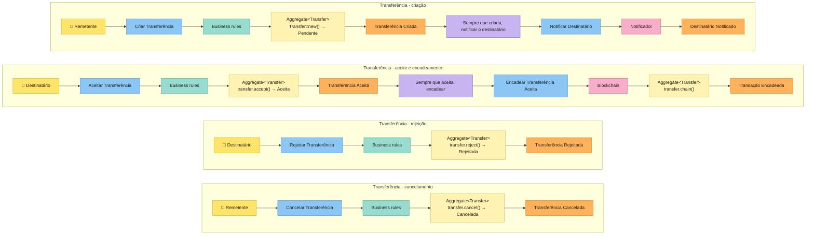

# Cerne

**Do Event Storming ao código Rust.** Cada post-it vira um bloco explícito: quem olha o código sabe na hora em que parte do fluxo está.

> ⚠️ **Em desenvolvimento.** A API ainda vai mudar. Veja o [ROADMAP](docs/ROADMAP.md).

---

## Post-it → código

| Post-it | Conceito | No Cerne |
|---|---|---|
| 🟦 | Command | trait `Command<Ports>`, que devolve `Executed { output, events }` |
| 🟨 | Aggregate / Entity | traits `Entity` e `Aggregate` |
| 🟧 | Domain Event | trait `DomainEvent<Ports>` |
| 🟪 | Policy | `Policy` + `Policies`, executadas por um `PolicyProcessor` |
| 🩷 | External System (Port) | trait `Repository<A>`, os ports da aplicação e o composition root `Ports` |
| — | Invariantes | `Invariant` + `Invariants` |
| — | Regras de negócio | `BusinessRule` + `BusinessRules` |
| — | Domain service | uma função pura do domínio |
| 🟩 | Read Model | *planejado (Fase 3)* |

## Tutorial: uma transferência de RDEC, do board ao código

Este tutorial percorre o [`main.rs`](examples/rde/src/main.rs) do `examples/rde`, de cima para baixo. O exemplo implementa as raias de transferência do Event Storming da Blockchain RDE. Os diagramas usam as cores do board:

```mermaid
flowchart LR
  actor["👤 Ator"]:::actor ~~~ command["Command"]:::command ~~~ rule["Business rules"]:::rule ~~~ service["Domain service"]:::service ~~~ aggregate["Aggregate#lt;Nome#gt;<br/>método chamado"]:::aggregate ~~~ event["Domain event"]:::event ~~~ policy["Policy"]:::policy ~~~ external["Sistema externo"]:::external
  classDef actor fill:#ffe46b,stroke:#c9a800,color:#221f1a
  classDef command fill:#8cc6f5,stroke:#3d8fd1,color:#221f1a
  classDef rule fill:#97dccf,stroke:#3fa892,color:#221f1a
  classDef service fill:#dde2e7,stroke:#8a96a3,color:#221f1a
  classDef aggregate fill:#fff3b3,stroke:#c9b84a,color:#221f1a
  classDef event fill:#ffb25c,stroke:#d97a14,color:#221f1a
  classDef policy fill:#c9b4f2,stroke:#7d5cc4,color:#221f1a
  classDef external fill:#f8adc9,stroke:#d0578a,color:#221f1a
```



As raias:



O `main` percorre as duas primeiras raias. A rejeição e o cancelamento seguem o mesmo molde do aceite e estão cobertos nos testes.

A cada passo do `main`, o tutorial abre o código que aquele passo usa. Todos os trechos abaixo são copiados dos arquivos do `examples/rde`, e um teste (`examples/rde/tests/readme.rs`) falha se algum deles deixar de existir no arquivo de origem.

Uma aplicação Cerne é organizada por camada:

```text
examples/rde/src/
├── domain/           síncrono e puro: nenhum IO acontece aqui
│   ├── entities/     agregados e entidades (Transfer)
│   ├── events/       domain events e as policies de cada um
│   └── services/     domain services (estimate_fees, transaction_hash)
├── application/      assíncrono: os commands e os ports que eles usam
│   ├── commands/
│   └── ports/        os sistemas externos (Blockchain, KycRegistry)
├── infrastructure/   os adapters de cada port (aqui, em memória)
├── ports.rs          o composition root
├── lib.rs
└── main.rs
```

### 1. O composition root

O `main` começa montando os `Ports`: a struct com todos os ports que os commands podem usar. Cada port recebe um adapter. Aqui, todos ficam em memória: a Alice começa com 1000 RDEC, a Alice e o Bob já passaram pelo KYC, e o notificador guarda cada mensagem numa caixa de entrada (`inbox`) que o `main` lê logo depois da criação.

<!-- snippet: examples/rde/src/main.rs -->
```rust
// --- Composition root: in-memory adapters --------------------------------

let inbox = Arc::new(Mutex::new(vec![]));

let ports = Arc::new(Ports {
    transfers: Box::new(InMemoryRepository::new(vec![])),
    blockchain: Box::new(InMemoryBlockchain::new(vec![("alice", 1000)])),
    kyc: Box::new(InMemoryKycRegistry::new(vec!["alice", "bob"])),
    notifier: Box::new(InMemoryNotifier::new(Arc::clone(&inbox))),
});

let sync_policy_processor = InlinePolicyProcessor::new(Arc::clone(&ports));
```

Os `Ports` são uma struct comum da aplicação. Cada campo é um post-it rosa (sistema externo) ou um repositório:

<!-- snippet: examples/rde/src/ports.rs -->
```rust
/// The composition root: every port the transfer commands can use.
pub struct Ports {
    pub transfers: Box<dyn Repository<Transfer>>,
    pub blockchain: Box<dyn Blockchain>,
    pub kyc: Box<dyn KycRegistry>,
    pub notifier: Box<dyn Notifier>,
}
```

Um port é uma trait da aplicação, assíncrona, que devolve `Result<_, cerne::Error>`. O adapter em memória e um adapter de verdade (um nó da Polygon) implementam a mesma trait, e o command não sabe qual dos dois está rodando:

<!-- snippet: examples/rde/src/application/ports/blockchain.rs -->
```rust
/// External system "Blockchain": holds the RDEC balances and records the transactions.
#[async_trait]
pub trait Blockchain: Send + Sync {
    async fn available_rdec(&self, wallet: &str) -> Result<u64, Error>;

    /// The nonce the next transaction of `wallet` must carry: how many it has sent so far.
    async fn next_nonce(&self, wallet: &str) -> Result<u64, Error>;

    /// Sends the transaction (`sender` pays `amount` + the `fees`, `recipient` receives `amount`) and returns its hash.
    async fn send_transaction(
        &self,
        sender: &str,
        recipient: &str,
        amount: u64,
        fees: Fees,
        nonce: u64,
    ) -> Result<String, Error>;
}
```

O `sync_policy_processor` é quem executa os commands que as policies disparam. O `InlinePolicyProcessor` roda a cadeia inteira de policies antes de o `send_events` retornar, e um erro volta para quem chamou. Para rodar a cadeia em background, existe o `TokioPolicyProcessor`, encerrado com `shutdown().await`.

### 2. A Alice cria a transferência 🟦

```mermaid
flowchart LR
  sender["👤 Remetente"]:::actor --> create["Criar Transferência<br/>CreateTransferCommand"]:::command
  create --> fees["Estimar taxa de descarb e GasFee<br/>estimate_fees"]:::service
  fees --> rules["Remetente tem RDEC disponível<br/>Remetente tem KYC<br/>Destinatário tem KYC"]:::rule
  rules --> transfer["Aggregate#lt;Transfer#gt;<br/>Transfer::new() → Pendente"]:::aggregate
  transfer --> created["Transferência Criada<br/>TransferCreated"]:::event
  created --> notifyPolicy["Sempre que uma transferência é criada, notificar o destinatário"]:::policy
  notifyPolicy --> notifyCmd["Notificar Destinatário<br/>NotifyRecipientCommand"]:::command
  notifyCmd --> notifier["Notificador<br/>Notifier"]:::external
  notifier --> notified["Destinatário Notificado<br/>RecipientNotified"]:::event
  kyc["KYC<br/>KycRegistry"]:::external -.-> rules
  chain["Blockchain: saldo e nonce<br/>Blockchain"]:::external -.-> rules
  classDef actor fill:#ffe46b,stroke:#c9a800,color:#221f1a
  classDef command fill:#8cc6f5,stroke:#3d8fd1,color:#221f1a
  classDef rule fill:#97dccf,stroke:#3fa892,color:#221f1a
  classDef service fill:#dde2e7,stroke:#8a96a3,color:#221f1a
  classDef aggregate fill:#fff3b3,stroke:#c9b84a,color:#221f1a
  classDef event fill:#ffb25c,stroke:#d97a14,color:#221f1a
  classDef policy fill:#c9b4f2,stroke:#7d5cc4,color:#221f1a
  classDef external fill:#f8adc9,stroke:#d0578a,color:#221f1a
  classDef hotspot fill:#f2709a,stroke:#b8325e,color:#221f1a
```



<!-- snippet: examples/rde/src/main.rs -->
```rust
// --- Sender: alice creates the transfer ----------------------------------

let create_transfer = CreateTransferCommand {
    sender: "alice".into(),
    recipient: "bob".into(),
    amount: 100,
};

// Every command returns an `Executed` with two parts:
// - `output`: goes back to whoever sent the request (here, the tx_hash for alice);
// - `events`: go to the policy processor, which triggers their policies.
let create_transfer_execution = create_transfer.execute(&ports).await?;

let tx_hash = create_transfer_execution.output;

let fired_policies = sync_policy_processor
    .send_events(create_transfer_execution.events)
    .await?;

println!("alice created the transfer {tx_hash}; policies fired: {fired_policies:?}");

// The policy already ran: bob got his notification before `send_events` returned.
for notification in inbox.lock().unwrap().iter() {
    println!(
        "{} was notified: {}",
        notification.wallet, notification.message
    );
}
```

O command é uma struct com os dados que o ator envia. Ele não recebe id: a transferência é identificada pelo hash da transação, calculado pelo agregado.

<!-- snippet: examples/rde/src/application/commands/create_transfer.rs -->
```rust
/// Actor: the sender. There is no id: the transfer is identified by the hash of its transaction.
pub struct CreateTransferCommand {
    pub sender: String,
    pub recipient: String,
    pub amount: u64,
}
```

O `execute` é dividido nas partes do Event Storming, sempre nesta ordem: domain service, ports, business rules, aggregate e domain events.

<!-- snippet: examples/rde/src/application/commands/create_transfer.rs -->
```rust
#[async_trait]
impl Command<Ports> for CreateTransferCommand {
    type Output = String; // the tx_hash of the new transfer

    async fn execute(&self, ports: &Ports) -> Result<Executed<String, Ports>, Error> {
        // --- Domain service --------------------------------------------------

        let fees = estimate_fees(self.amount);
        let cost = self.amount + fees.total();

        // --- Ports -----------------------------------------------------------

        let nonce = ports.blockchain.next_nonce(&self.sender).await?;
        let available_rdec = ports.blockchain.available_rdec(&self.sender).await?;
        let sender_has_kyc = ports.kyc.is_verified(&self.sender).await?;
        let recipient_has_kyc = ports.kyc.is_verified(&self.recipient).await?;

        // --- Business rules --------------------------------------------------

        let sender_can_pay = available_rdec >= cost;

        BusinessRules::new(vec![
            BusinessRule::new("sender has RDEC available", move || sender_can_pay),
            BusinessRule::new("sender has KYC", move || sender_has_kyc),
            BusinessRule::new("recipient has KYC", move || recipient_has_kyc),
        ])
        .check()?;

        // --- Aggregate -------------------------------------------------------

        let transfer = Transfer::new(TransferProps {
            sender: self.sender.clone(),
            recipient: self.recipient.clone(),
            amount: self.amount,
            fees,
            nonce,
        })?;

        let tx_hash = transfer.tx_hash.clone();

        ports.transfers.save(transfer).await?;

        // --- Domain events ---------------------------------------------------

        let transfer_created = TransferCreated {
            tx_hash: tx_hash.clone(),
            sender: self.sender.clone(),
            recipient: self.recipient.clone(),
            amount: self.amount,
            fees,
        };

        Ok(Executed {
            output: tx_hash,
            events: vec![Box::new(transfer_created)],
        })
    }
}
```

Cada parte, em detalhe:

#### Domain service

Um cálculo do domínio que não tem o que violar vira uma função pura. As alíquotas são provisórias: as reais ainda não estão no board.

<!-- snippet: examples/rde/src/domain/services/fees.rs -->
```rust
/// Domain service "Estimar taxa de descarb e GasFee": a calculation, nothing to violate.
///
/// Placeholder rates (1% decarbonization, 1 RDEC of gas): the real ones are not on the board yet.
pub fn estimate_fees(amount: u64) -> Fees {
    Fees {
        decarbonization: amount / 100,
        gas: 1,
    }
}
```

#### Business rules

O command primeiro lê os fatos de que precisa nos ports (saldo e KYC), cada um numa variável que se lê como frase. Só depois aplica as regras de negócio. O `check()` roda **todas** as regras e devolve `DomainError::Violations` com o nome de cada uma que falhou, e o `?` interrompe o command antes de qualquer mudança.

#### O agregado `Transfer` 🟨

Uma Entity ou Aggregate (neste caso, a `Transfer`) só existe se as invariantes dela valem. Ninguém escolhe o id da `Transfer`: ele é o hash da transação, como na Polygon.

<!-- snippet: examples/rde/src/domain/entities/transfer.rs -->
```rust
impl Entity for Transfer {
    type Id = String;
    type Props = TransferProps;

    fn id(&self) -> &String {
        &self.tx_hash
    }

    /// A transfer is born pending, identified by the hash of its transaction.
    fn new(props: TransferProps) -> EnforcementResult<Self> {
        let tx_hash = transaction_hash(
            &props.sender,
            &props.recipient,
            props.amount,
            props.fees,
            props.nonce,
        );

        Self {
            tx_hash,
            sender: props.sender,
            recipient: props.recipient,
            amount: props.amount,
            fees: props.fees,
            nonce: props.nonce,
            status: TransferStatus::Pending,
            chained: false,
        }
        .validate()
    }

    fn validate(self) -> EnforcementResult<Self> {
        let amount_is_positive = self.amount > 0;
        let sender_is_not_recipient = self.sender != self.recipient;
        let is_accepted = self.status == TransferStatus::Accepted;
        let not_chained_yet = !self.chained;

        Invariants::new(vec![
            Invariant::new("amount is positive", move || amount_is_positive),
            Invariant::new("sender is not the recipient", move || {
                sender_is_not_recipient
            }),
            Invariant::new("only an accepted transfer is chained", move || {
                not_chained_yet || is_accepted
            }),
        ])
        .enforce()?;

        Ok(self)
    }
}
```

Se alguma invariante for violada no `<Entity ou Aggregate>::new()` (aqui, `Transfer::new()`), nada é criado. O `new` devolve `Err(DomainError::Violations(..))` com o nome de **todas** as invariantes violadas, não só da primeira. Assim, quem chamou recebe a lista completa do que corrigir.

O `validate` não roda só no nascimento: toda mudança de estado de uma Entity ou Aggregate deve terminar em `.validate()`.

<!-- snippet: examples/rde/src/domain/entities/transfer.rs -->
```rust
impl Transfer {
    pub fn accept(self) -> EnforcementResult<Self> {
        self.change_status(TransferStatus::Accepted)
    }

    pub fn reject(self) -> EnforcementResult<Self> {
        self.change_status(TransferStatus::Rejected)
    }

    pub fn cancel(self) -> EnforcementResult<Self> {
        self.change_status(TransferStatus::Canceled)
    }

    pub fn chain(self) -> EnforcementResult<Self> {
        Self {
            chained: true,
            ..self
        }
        .validate()
    }

    fn change_status(self, status: TransferStatus) -> EnforcementResult<Self> {
        Self { status, ..self }.validate()
    }
}
```

Só a raiz da consistência é marcada como `Aggregate`. É isso que permite um `Repository<Transfer>`: o compilador recusa um repositório de uma entidade que não é agregado.

<!-- snippet: examples/rde/src/domain/entities/transfer.rs -->
```rust
impl Aggregate for Transfer {}
```

Invariante e regra de negócio são coisas diferentes:

- **Invariante:** vale para qualquer `Transfer`, em qualquer momento. Por isso fica no agregado ("sender is not the recipient").
- **Regra de negócio:** depende do contexto do command, como o saldo, o KYC ou quem é o ator. Por isso fica no command e é checada antes de mexer no agregado ("sender has RDEC available").

#### O evento `TransferCreated` 🟧

Um domain event registra um fato que já aconteceu no domínio. Por isso o nome vem no passado: `TransferCreated`, e não `CreateTransfer`. No código, ele tem duas partes:

- **Os dados do fato:** uma struct com o que as policies precisam saber sobre o que aconteceu. Aqui, quem enviou, para quem, quanto, as taxas e o `tx_hash` da transferência.
- **A reação ao fato:** a trait `DomainEvent<Ports>` e o método `trigger_policies`, que devolve as policies que o evento dispara. É a seta 🟧 → 🟪 do board.

<!-- snippet: examples/rde/src/domain/events/transfer_created.rs -->
```rust
pub struct TransferCreated {
    pub tx_hash: String,
    pub sender: String,
    pub recipient: String,
    pub amount: u64,
    pub fees: Fees,
}

impl DomainEvent<Ports> for TransferCreated {
    fn trigger_policies(&self) -> EnforcementResult<Vec<FiredPolicy<Ports>>> {
        // --- Policies --------------------------------------------------------

        let tx_hash = self.tx_hash.clone();
        let sender = self.sender.clone();
        let recipient = self.recipient.clone();
        let amount = self.amount;

        let notify_recipient_policy = Policy::new(
            "whenever a transfer is created, notify the recipient",
            || true,
            move || {
                Box::new(NotifyRecipientCommand {
                    tx_hash: tx_hash.clone(),
                    sender: sender.clone(),
                    recipient: recipient.clone(),
                    amount,
                })
            },
        );

        Ok(Policies::new(vec![notify_recipient_policy]).trigger())
    }
}
```

O `TransferCreated` dispara uma policy: "sempre que uma transferência é criada, notificar o destinatário". Os valores que o command vai precisar são copiados do evento antes da closure, e o `then` só **constrói** o `NotifyRecipientCommand`, sem enviar nada. Quem executa o command é o `sync_policy_processor`.

Isso é diferente do que acontece depois da notificação. Aceitar ou rejeitar não é automático: é uma decisão de um ator, o destinatário. Uma reação automática a um evento é uma policy. Uma decisão de ator é um command enviado por ele (passo 3).

O command da notificação não tem ator nem regras de negócio: ele só fala com um sistema externo e registra o fato.

<!-- snippet: examples/rde/src/application/commands/notify_recipient.rs -->
```rust
async fn execute(&self, ports: &Ports) -> Result<Executed<(), Ports>, Error> {
    // --- External system: Notifier ---------------------------------------

    let message = format!(
        "{} sent you {} RDEC. Accept or reject the transfer {}.",
        self.sender, self.amount, self.tx_hash
    );

    ports.notifier.notify(&self.recipient, &message).await?;

    // --- Domain events ---------------------------------------------------

    let recipient_notified = RecipientNotified {
        tx_hash: self.tx_hash.clone(),
        recipient: self.recipient.clone(),
    };

    Ok(Executed {
        output: (),
        events: vec![Box::new(recipient_notified)],
    })
}
```

> [!NOTE]
> **Curiosidade: a notificação entrou no meio do caminho.**
>
> A primeira versão deste exemplo não tinha nenhuma notificação. Ao escrever este tutorial, ficou visível um buraco no board: o `TransferCreated` não disparava nada, e o Bob não tinha como saber que havia uma transferência esperando a resposta dele. A policy "sempre que uma transferência é criada, notificar o destinatário" foi acrescentada ao board e ao código com o resto do fluxo já pronto e testado.
>
> O `CreateTransferCommand` não mudou nenhuma linha. Mudou isto:
>
> | Onde | O quê |
> |---|---|
> | `domain/events/transfer_created.rs` | a policy, no `trigger_policies` |
> | `application/commands/notify_recipient.rs` | o command que a policy dispara |
> | `domain/events/recipient_notified.rs` | o evento que esse command produz |
> | `application/ports/notifier.rs` | o port do sistema externo novo |
> | `infrastructure/in_memory_notifier.rs` | o adapter desse port |
> | `ports.rs` e o composition root do `main` | um campo `notifier` e o adapter ligado nele |
>
> A regra nova mora inteira no evento. O resto da lista é o que ela precisa para rodar: o command, o port e o adapter. Se a policy disparasse um command que já existe, bastaria a primeira linha da tabela.
>
> O caminho também valeu no sentido contrário: o código ajudou a corrigir o board. O mesmo aconteceu com o Hotspot 5 (o nonce das transferências pendentes), que apareceu num teste e voltou para o board como pergunta em aberto.

#### O que o command devolve

Todo command devolve um `Executed` com duas partes:

- **`output`:** volta para quem enviou a requisição. Aqui, é o `tx_hash` que a Alice recebe (`type Output = String`). Um command sem nada a devolver usa `type Output = ()`.
- **`events`:** vão para o processador, que dispara as policies de cada evento.

### 3. O Bob aceita, e a policy encadeia a transação 🟦 → 🟧 → 🟪 → 🟦

```mermaid
flowchart LR
  recipient["👤 Destinatário"]:::actor --> accept["Aceitar Transferência<br/>AcceptTransferCommand"]:::command
  accept --> rules["Quem aceita é o destinatário<br/>Transferência ainda pendente"]:::rule
  rules --> transfer["Aggregate#lt;Transfer#gt;<br/>transfer.accept() → Aceita"]:::aggregate
  transfer --> accepted["Transferência Aceita Pelo Destinatário<br/>TransferAcceptedByRecipient"]:::event
  accepted --> policy["Sempre que uma transferência é aceita, encadear"]:::policy
  policy --> chainCmd["Encadear Transferência Aceita<br/>ChainAcceptedTransferCommand"]:::command
  chainCmd --> chain["Blockchain: registra a transação<br/>Blockchain"]:::external
  chain --> chainedTransfer["Aggregate#lt;Transfer#gt;<br/>transfer.chain()"]:::aggregate
  chainedTransfer --> chained["Transação Encadeada<br/>TransactionChained"]:::event
  classDef actor fill:#ffe46b,stroke:#c9a800,color:#221f1a
  classDef command fill:#8cc6f5,stroke:#3d8fd1,color:#221f1a
  classDef rule fill:#97dccf,stroke:#3fa892,color:#221f1a
  classDef service fill:#dde2e7,stroke:#8a96a3,color:#221f1a
  classDef aggregate fill:#fff3b3,stroke:#c9b84a,color:#221f1a
  classDef event fill:#ffb25c,stroke:#d97a14,color:#221f1a
  classDef policy fill:#c9b4f2,stroke:#7d5cc4,color:#221f1a
  classDef external fill:#f8adc9,stroke:#d0578a,color:#221f1a
  classDef hotspot fill:#f2709a,stroke:#b8325e,color:#221f1a
```



<!-- snippet: examples/rde/src/main.rs -->
```rust
// --- Recipient: bob accepts, and the policy chains the transaction -------

let accept_transfer = AcceptTransferCommand {
    tx_hash: tx_hash.clone(),
    recipient: "bob".into(),
};

let accept_transfer_execution = accept_transfer.execute(&ports).await?;

let fired_policies = sync_policy_processor
    .send_events(accept_transfer_execution.events)
    .await?;

println!("bob accepted it; policies fired: {fired_policies:?}");
```

O aceite segue o mesmo molde da criação. As regras de negócio dizem quem pode aceitar e em que estado, e a mudança de estado acontece no agregado:

<!-- snippet: examples/rde/src/application/commands/accept_transfer.rs -->
```rust
async fn execute(&self, ports: &Ports) -> Result<Executed<(), Ports>, Error> {
    // --- Ports -----------------------------------------------------------

    let transfer = ports.transfers.load(&self.tx_hash).await?;

    // --- Business rules --------------------------------------------------

    let actor_is_the_recipient = transfer.recipient == self.recipient;
    let is_still_pending = transfer.status == TransferStatus::Pending;

    BusinessRules::new(vec![
        BusinessRule::new("only the recipient accepts", move || actor_is_the_recipient),
        BusinessRule::new("transfer is still pending", move || is_still_pending),
    ])
    .check()?;

    // --- Aggregate -------------------------------------------------------

    let transfer = transfer.accept()?;

    ports.transfers.save(transfer).await?;

    // --- Domain events ---------------------------------------------------

    let transfer_accepted = TransferAcceptedByRecipient {
        tx_hash: self.tx_hash.clone(),
    };

    Ok(Executed {
        output: (),
        events: vec![Box::new(transfer_accepted)],
    })
}
```

O evento `TransferAcceptedByRecipient` tem uma policy. Uma policy **não executa** o command: ela só diz qual command deve rodar, e o domínio continua sem IO. Cada policy ganha uma variável com o próprio nome e o sufixo `_policy`.

<!-- snippet: examples/rde/src/domain/events/transfer_accepted_by_recipient.rs -->
```rust
impl DomainEvent<Ports> for TransferAcceptedByRecipient {
    fn trigger_policies(&self) -> EnforcementResult<Vec<FiredPolicy<Ports>>> {
        // --- Policies --------------------------------------------------------

        let tx_hash = self.tx_hash.clone();

        let chain_accepted_transfer_policy = Policy::new(
            "whenever a transfer is accepted, chain it",
            || true,
            move || {
                Box::new(ChainAcceptedTransferCommand {
                    tx_hash: tx_hash.clone(),
                })
            },
        );

        Ok(Policies::new(vec![chain_accepted_transfer_policy]).trigger())
    }
}
```

O `sync_policy_processor` recebe esse command e o executa. Um command disparado por policy sempre tem `type Output = ()`, porque ninguém está esperando o retorno dele, e o compilador recusa uma policy que tente disparar outro tipo. O command de encadeamento tem uma parte a mais, a do sistema externo:

<!-- snippet: examples/rde/src/application/commands/chain_accepted_transfer.rs -->
```rust
async fn execute(&self, ports: &Ports) -> Result<Executed<(), Ports>, Error> {
    // --- Ports -----------------------------------------------------------

    let transfer = ports.transfers.load(&self.tx_hash).await?;

    // --- Business rules --------------------------------------------------

    let was_accepted = transfer.status == TransferStatus::Accepted;
    let not_chained_yet = !transfer.chained;

    BusinessRules::new(vec![
        BusinessRule::new("transfer was accepted", move || was_accepted),
        BusinessRule::new("transfer is not chained yet", move || not_chained_yet),
    ])
    .check()?;

    // --- External system: Blockchain -------------------------------------

    let tx_hash = ports
        .blockchain
        .send_transaction(
            &transfer.sender,
            &transfer.recipient,
            transfer.amount,
            transfer.fees,
            transfer.nonce,
        )
        .await?;

    // --- Aggregate -------------------------------------------------------

    let transfer = transfer.chain()?;

    ports.transfers.save(transfer).await?;

    // --- Domain events ---------------------------------------------------

    let transaction_chained = TransactionChained { tx_hash };

    Ok(Executed {
        output: (),
        events: vec![Box::new(transaction_chained)],
    })
}
```

### 4. O resultado

<!-- snippet: examples/rde/src/main.rs -->
```rust
// --- Result --------------------------------------------------------------

let transfer = ports.transfers.load(&tx_hash).await?;

println!(
    "status: {:?}, chained: {}",
    transfer.status, transfer.chained
);

println!(
    "alice has {} RDEC, bob has {} RDEC",
    ports.blockchain.available_rdec("alice").await?,
    ports.blockchain.available_rdec("bob").await?
);

Ok(())
```

```bash
cargo run -p rde
```

```text
alice created the transfer 0x72c6ac94db6f87802d270406ebf61ea412a32977f6af80a15baea9c0d6414fe6; policies fired: ["whenever a transfer is created, notify the recipient"]
bob was notified: alice sent you 100 RDEC. Accept or reject the transfer 0x72c6ac94db6f87802d270406ebf61ea412a32977f6af80a15baea9c0d6414fe6.
bob accepted it; policies fired: ["whenever a transfer is accepted, chain it"]
status: Accepted, chained: true
alice has 898 RDEC, bob has 100 RDEC
```

A Alice pagou 100 RDEC de valor, 1 de descarbonização e 1 de gas. O Bob recebeu a notificação com o `tx_hash` que ele precisa para aceitar.

### 5. Quando algo dá errado

Todo erro é um `cerne::Error`, de uma de três categorias. Isso permite à camada HTTP escolher a resposta com um `match`:

| Categoria | Quando | Exemplo na rde | HTTP |
|---|---|---|---|
| `DomainError` | Uma invariante ou regra de negócio não vale | "recipient has KYC" | 422 |
| `ApplicationError` | O caso de uso não pode seguir, embora o domínio esteja certo | `NotFound`: o `tx_hash` não existe | 404 |
| `InfrastructureError` | Um sistema externo falhou | a chain recusou a transação | 500 |

Uma transferência para a Carol, que não tem KYC, e acima do saldo da Alice volta com as duas violações de uma vez:

<!-- snippet: examples/rde/tests/transfers.rs -->
```rust
#[tokio::test]
async fn creation_reports_every_broken_business_rule() {
    let ports = ports();

    let result = run(&ports, create("alice", "carol", 2000)).await;

    assert_eq!(
        violations(result),
        vec!["sender has RDEC available", "recipient has KYC"]
    );
}
```

Os testes também documentam os hotspots do board. O Hotspot 5 mostra um `InfrastructureError`. O nonce entra no `tx_hash` na criação, mas só avança na chain depois do aceite. Por isso, duas transferências pendentes da Alice saem com o mesmo nonce, e a chain recusa a segunda:

<!-- snippet: examples/rde/tests/transfers.rs -->
```rust
/// Hotspot 5: the nonce goes into the tx_hash at creation, but only advances on the chain after acceptance.
/// Two pending transfers of a sender carry the same nonce, so the chain refuses the second one accepted.
#[tokio::test]
async fn hotspot_5_pending_transfers_of_a_sender_share_a_nonce() {
    let ports = ports();
    let first = create_transfer(&ports, "alice", "bob", 100).await;
    let second = create_transfer(&ports, "alice", "bob", 200).await;

    run(&ports, accept(&first, "bob")).await.unwrap();
    let result = run(&ports, accept(&second, "bob")).await;

    assert_eq!(
        result.unwrap_err().to_string(),
        "chain refused: alice expected nonce 1, got 0"
    );
    let second = ports.transfers.load(&second).await.unwrap();
    assert_eq!(second.status, TransferStatus::Accepted);
    assert!(!second.chained);
}
```

```bash
cargo test -p rde
```

Os testes estão organizados por raia do board: criação, resposta e encadeamento, e hotspots.

## Estrutura do repositório

```text
crates/cerne/     a biblioteca
examples/rde/     projeto de exemplo: as transferências de RDEC do Event Storming da Blockchain RDE
docs/             roadmap, decisões e licenças
```

## Desenvolvimento

```bash
cargo test --workspace
```

O CI também roda `cargo fmt --all --check` e `cargo clippy --workspace --all-targets -- -D warnings`.

## Documentação

- [ROADMAP](docs/ROADMAP.md): o que existe e o que vem a seguir.
- [Decisões](docs/DECISOES.md): as escolhas de design e o porquê de cada uma.
- [Licenças](docs/LICENCAS.md): por que Apache-2.0.

## Licença

O Cerne é distribuído sob a [Apache License 2.0](LICENSE).

O código gerado pelo `cerne new` e pelo `cerne g` pertence a quem o gerou, que pode usá-lo sob qualquer licença, sem obrigações com o Cerne.
