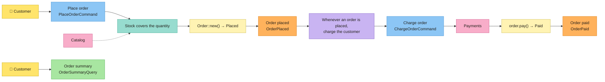

# Tutorial: a shop, from the board to the code

## Sticky note → code

| Sticky note | Concept | In Cerne |
|---|---|---|
| 🟦 | Command | trait `Command<CompositionRoot>`, which returns `Executed { output, events }` |
| 🟨 | Aggregate / Entity | attributes `#[entity]` and `#[aggregate]`, which write the traits `Entity` and `Aggregate`; the invariants go in the trait `Validate` |
| — | Value Object | trait `ValueObject`, also the type of every entity id; attribute `#[value_object]`, for a value object of one value |
| 🟧 | Domain Event | trait `DomainEvent<CompositionRoot>`; the command stores it in the `EventOutbox` |
| 🟪 | Policy | `Policy` + `Policies`; the `SyncEventBus` or the `AsyncEventBus` runs them |
| 🩷 | External System | a port (an async trait of the application) and its adapters, gathered in the `CompositionRoot` |
| 🟩 | Read Model / Query | trait `Query<CompositionRoot>`, which returns a read model: a struct of plain fields |
| — | Invariants | `Invariant` + `Invariants`: what is always true about an entity or a value object |
| — | Business rules | `BusinessRule` + `BusinessRules`: what must hold for a command to run |

## Install

```bash
cargo install cerne-cli
```

Cerne needs Rust 1.88 or newer.

## The board

The board has two flows. The customer places an order; the shop checks the stock, and a policy charges the customer. Then the customer reads the order.



Every block of code below is a whole file of the project. A test of this repository runs these commands, writes these files and runs `cargo test` on the result, so the tutorial always compiles.

## 1. The project and its sticky notes

Creates the `shop` project.

```bash
cerne new shop
```

Enters the project: the `cerne g` commands run inside it.

```bash
cd shop
```

Creates the 🟨 aggregate `Order`: an order, with the port of its repository and a status that starts at `Placed`. The `id` field the CLI creates by itself: a value object `OrderId`, with a `u64` inside. With `id:<type>` (for example, `id:String`), `OrderId` holds a `String` instead of the `u64`.

```bash
cerne g entity Order product:String quantity:u32 total:u64 status=Placed:Placed,Paid --aggregate
```

Creates the 🟧 event `OrderPlaced`: the order was placed.

```bash
cerne g event OrderPlaced order_id:OrderId total:u64
```

Creates the 🟧 event `OrderPaid`: the order was paid.

```bash
cerne g event OrderPaid order_id:OrderId
```

Creates the 🟦 command `PlaceOrder`: the customer places an order.

```bash
cerne g command PlaceOrder product:String quantity:u32
```

Creates the 🟦 command `ChargeOrder`: charge the order. A policy sends it, not an actor; for the CLI, it is a command like any other.

```bash
cerne g command ChargeOrder order_id:OrderId total:u64
```

Creates the 🩷 port `Catalog`: the external system with the prices and the stock.

```bash
cerne g port Catalog
```

Creates `HttpCatalog`: the adapter that talks to the catalog's API.

```bash
cerne g adapter HttpCatalog Catalog
```

Creates the 🩷 port `Payments`: the external system that charges the customer.

```bash
cerne g port Payments
```

Creates `HttpPayments`: the adapter that talks to the payment provider.

```bash
cerne g adapter HttpPayments Payments
```

Creates the 🟩 read model `OrderSummary`: the summary of the order that the customer sees.

```bash
cerne g read_model OrderSummary product:String quantity:u32 total:u64 status:String
```

Creates the query `OrderSummary`: it finds that summary by the id of the order.

```bash
cerne g query OrderSummary order_id:OrderId
```

The fields are `name:type`, and `status=Placed:Placed,Paid` creates an enum with the values `Placed` and `Paid` that starts at `Placed`. After each command the project still compiles. `--aggregate` also adds the field `order_repository` to the `CompositionRoot`, and, in `main.rs`, a function `order_repository_adapter()` with a `todo!()`: Cerne brings no adapter, and the repository is yours to write.

```console
$ tree shop
shop
├── Cargo.toml
├── rustfmt.toml
├── src
│   ├── application
│   │   ├── commands
│   │   │   ├── charge_order.rs
│   │   │   ├── mod.rs
│   │   │   └── place_order.rs
│   │   ├── mod.rs
│   │   ├── ports
│   │   │   ├── catalog.rs
│   │   │   ├── mod.rs
│   │   │   └── payments.rs
│   │   ├── queries
│   │   │   ├── mod.rs
│   │   │   └── order_summary.rs
│   │   └── read_models
│   │       ├── mod.rs
│   │       └── order_summary.rs
│   ├── composition_root.rs
│   ├── domain
│   │   ├── entities
│   │   │   ├── mod.rs
│   │   │   └── order.rs
│   │   ├── events
│   │   │   ├── mod.rs
│   │   │   ├── order_paid.rs
│   │   │   └── order_placed.rs
│   │   ├── mod.rs
│   │   └── value_objects
│   │       ├── mod.rs
│   │       └── order_id.rs
│   ├── infrastructure
│   │   ├── http_catalog.rs
│   │   ├── http_payments.rs
│   │   └── mod.rs
│   ├── lib.rs
│   └── main.rs
└── tests
    └── board.rs
```

Each layer has its folder. `domain/` is pure and synchronous: no IO. `application/` is asynchronous: commands, queries and the ports they use. `infrastructure/` holds the adapters, which you write: here, every one stays a `todo!()`.

What is left is to fill in the sticky notes.

## 2. Value object: `OrderId`

A value object has no identity: two `OrderId(7)` are the same thing. It only exists if its invariants hold, and it never changes. The id of every entity is a value object, so a `0` never becomes an order id, not even when read back from JSON.

The `src/domain/value_objects/order_id.rs` as `cerne g entity Order product:String quantity:u32 total:u64 status=Placed:Placed,Paid --aggregate` generated it:

<!-- generated: src/domain/value_objects/order_id.rs -->
```rust
use cerne::domain::{EnforcementResult, Invariants, ValueObject, value_object};
use serde::{Deserialize, Serialize};

/// In JSON it is the `u64` itself, and reading it back goes through `new`: the invariants hold there too.
#[value_object]
#[derive(Debug, Clone, PartialEq, Serialize, Deserialize)]
pub struct OrderId(u64);

impl ValueObject for OrderId {
    type Constructor = u64;

    fn new(value: u64) -> EnforcementResult<Self> {
        Invariants::enforce([])?;

        Ok(Self(value))
    }
}
```

Filled in:

<!-- file: src/domain/value_objects/order_id.rs -->
```rust
use cerne::domain::{EnforcementResult, Invariants, ValueObject, invariant, value_object};
use serde::{Deserialize, Serialize};

/// In JSON it is the `u64` itself, and reading it back goes through `new`: the invariants hold there too.
#[value_object]
#[derive(Debug, Clone, PartialEq, Serialize, Deserialize)]
pub struct OrderId(u64);

impl ValueObject for OrderId {
    type Constructor = u64;

    fn new(value: u64) -> EnforcementResult<Self> {
        let order_id_is_positive = value > 0;

        Invariants::enforce([invariant!("order id is positive", order_id_is_positive)])?;

        Ok(Self(value))
    }
}
```

Each invariant is a name plus a condition, written with `invariant!`. The condition goes into a variable before, named like the sentence on the board. `Invariants::enforce` runs all of them and, if any fails, returns `DomainError::Violations` with every failing name.

`#[value_object]` writes what a value object of one value has in common: `TryFrom<u64> for OrderId`, which goes through `new`, `From<OrderId> for u64`, which gives the `u64` back, and, because `OrderId` derives `Serialize` and `Deserialize`, `#[serde(try_from = "u64", into = "u64")]`. `new`, with the invariants, is yours. The repository of step 4 uses the `TryFrom` to make the id of a new order.

## 3. Aggregate: `Order` 🟨

The `src/domain/entities/order.rs` as `cerne g entity Order product:String quantity:u32 total:u64 status=Placed:Placed,Paid --aggregate` generated it:

<!-- generated: src/domain/entities/order.rs -->
```rust
use crate::domain::value_objects::order_id::OrderId;
use cerne::domain::{EnforcementResult, Invariants, Validate, aggregate};

// --- Status ------------------------------------------------------------------

#[derive(Debug, Clone, Copy, Default, PartialEq)]
pub enum OrderStatus {
    #[default]
    Placed,
    Paid,
}

// --- Aggregate ---------------------------------------------------------------

#[aggregate]
#[derive(Debug, Clone, PartialEq)]
pub struct Order {
    pub id: Option<OrderId>,
    pub product: String,
    pub quantity: u32,
    pub total: u64,
    #[skip_constructor]
    pub status: OrderStatus,
}

// --- Invariants --------------------------------------------------------------

impl Validate for Order {
    fn validate(self) -> EnforcementResult<Self> {
        Invariants::enforce([])?;

        Ok(self)
    }
}

// --- State transitions -------------------------------------------------------

impl Order {}
```

Filled in:

<!-- file: src/domain/entities/order.rs -->
```rust
use crate::domain::value_objects::order_id::OrderId;
use cerne::domain::{EnforcementResult, Invariants, Validate, aggregate, invariant};

// --- Status ------------------------------------------------------------------

#[derive(Debug, Clone, Copy, Default, PartialEq)]
pub enum OrderStatus {
    #[default]
    Placed,
    Paid,
}

// --- Aggregate ---------------------------------------------------------------

#[aggregate]
#[derive(Debug, Clone, PartialEq)]
pub struct Order {
    pub id: Option<OrderId>,
    pub product: String,
    pub quantity: u32,
    pub total: u64,
    #[skip_constructor]
    pub status: OrderStatus,
}

// --- Invariants --------------------------------------------------------------

impl Validate for Order {
    fn validate(self) -> EnforcementResult<Self> {
        let order_has_a_product = !self.product.is_empty();
        let quantity_is_positive = self.quantity > 0;

        Invariants::enforce([
            invariant!("order has a product", order_has_a_product),
            invariant!("quantity is positive", quantity_is_positive),
        ])?;

        Ok(self)
    }
}

// --- State transitions -------------------------------------------------------

impl Order {
    pub fn pay(self) -> EnforcementResult<Self> {
        Self {
            status: OrderStatus::Paid,
            ..self
        }
        .validate()
    }
}
```

- `#[aggregate]` writes what every aggregate has in common: `impl Entity` (the `id()`, the `with_id` the repository calls and `new`), `impl Aggregate` and the `OrderConstructor`. An entity that is not an aggregate (`cerne g entity` without `--aggregate`) gets `#[entity]`, which writes the same except `impl Aggregate`: no repository takes it.
- `Order::new` receives the `OrderConstructor`, with every field but two: the id, which the repository decides on the first `save` (until then, `id()` is `None`), and `status`, marked `#[skip_constructor]`. A skipped field starts at its `Default`: `OrderStatus` derives `Default`, with `#[default]` on `Placed`, the initial value of `status=Placed:Placed,Paid`.
- `validate`, in `impl Validate`, holds the invariants: the CLI generates it empty, for you to fill in. It runs in `new` and in every state transition (`pay`): an order that breaks an invariant never exists in memory.
- The state transitions are methods that consume the order and return the next one.

## 4. External systems: ports and adapters 🩷

A port is an async trait of the application, and every method returns `Result<_, cerne::Error>`. The command does not know which adapter is behind it.

The `src/application/ports/catalog.rs` as `cerne g port Catalog` generated it:

<!-- generated: src/application/ports/catalog.rs -->
```rust
use cerne::async_trait;

/// External system "Catalog": one async method per thing the commands ask of it, each returning
/// `Result<_, cerne::Error>`.
#[async_trait]
pub trait Catalog: Send + Sync {}
```

Filled in:

<!-- file: src/application/ports/catalog.rs -->
```rust
use cerne::{Error, async_trait};

/// External system "Catalog": what the shop sells, at what price, and how much is left.
#[async_trait]
pub trait Catalog: Send + Sync {
    /// The price of one unit, in cents.
    async fn unit_price(&self, product: &str) -> Result<u64, Error>;

    async fn units_in_stock(&self, product: &str) -> Result<u32, Error>;
}
```

The `src/application/ports/payments.rs` as `cerne g port Payments` generated it:

<!-- generated: src/application/ports/payments.rs -->
```rust
use cerne::async_trait;

/// External system "Payments": one async method per thing the commands ask of it, each returning
/// `Result<_, cerne::Error>`.
#[async_trait]
pub trait Payments: Send + Sync {}
```

Filled in:

<!-- file: src/application/ports/payments.rs -->
```rust
use crate::domain::value_objects::order_id::OrderId;
use cerne::{Error, async_trait};

/// External system "Payments": charges the customer. The order id is the idempotency key: charging the same order
/// twice charges it once.
#[async_trait]
pub trait Payments: Send + Sync {
    async fn charge(&self, order_id: &OrderId, amount: u64) -> Result<(), Error>;
}
```

Each adapter talks to a real system, and writing it is yours: here, every method stays a `todo!()`.

The `src/infrastructure/http_catalog.rs` as `cerne g adapter HttpCatalog Catalog` generated it:

<!-- generated: src/infrastructure/http_catalog.rs -->
```rust
use crate::application::ports::catalog::Catalog;
use cerne::async_trait;

/// An adapter of the port `Catalog`.
pub struct HttpCatalog;

#[async_trait]
impl Catalog for HttpCatalog {}
```

Filled in:

<!-- file: src/infrastructure/http_catalog.rs -->
```rust
use crate::application::ports::catalog::Catalog;
use cerne::{Error, async_trait};

/// The client of the catalog's HTTP API: writing it is yours (with `reqwest` or any other).
pub struct HttpCatalog;

#[async_trait]
impl Catalog for HttpCatalog {
    async fn unit_price(&self, _product: &str) -> Result<u64, Error> {
        todo!("ask the catalog API for the unit price")
    }

    async fn units_in_stock(&self, _product: &str) -> Result<u32, Error> {
        todo!("ask the catalog API for the units in stock")
    }
}
```

The `src/infrastructure/http_payments.rs` as `cerne g adapter HttpPayments Payments` generated it:

<!-- generated: src/infrastructure/http_payments.rs -->
```rust
use crate::application::ports::payments::Payments;
use cerne::async_trait;

/// An adapter of the port `Payments`.
pub struct HttpPayments;

#[async_trait]
impl Payments for HttpPayments {}
```

Filled in:

<!-- file: src/infrastructure/http_payments.rs -->
```rust
use crate::application::ports::payments::Payments;
use crate::domain::value_objects::order_id::OrderId;
use cerne::{Error, async_trait};

/// The client of the payment provider's HTTP API: writing it is yours. Send the order id as the idempotency key.
pub struct HttpPayments;

#[async_trait]
impl Payments for HttpPayments {
    async fn charge(&self, _order_id: &OrderId, _amount: u64) -> Result<(), Error> {
        todo!("charge the customer on the payment provider")
    }
}
```

Two ports are traits of Cerne itself: `Repository<Order, Transaction>`, which loads and saves the order, and `EventOutbox<Transaction>`, which stores every event a command produces. Both take the transaction the command opened, and their adapters sit on your database. `cerne new` writes the `Database` and its `Transaction` with a `todo!()`, because only you know how your database opens a transaction: in a real application, `Database` wraps a pool of `sqlx`, `diesel` or any other. The adapters of the two ports are a `todo!()` in `main.rs` (step 10).

The `src/infrastructure/database.rs` as `cerne new shop` generated it:

<!-- generated: src/infrastructure/database.rs -->
```rust
use cerne::Error;

/// The database of the application: write it on yours (a pool of `sqlx`, `diesel` or any other). The commands only
/// call `begin`, and pass the transaction to every repository and to the event outbox.
pub struct Database;

/// One transaction of the `Database`: the type every repository and the event outbox take.
pub struct Transaction;

impl Database {
    pub async fn begin(&self) -> Result<Transaction, Error> {
        todo!("open a transaction on your database")
    }
}

impl Transaction {
    /// Makes every write of the transaction permanent; dropping it without `commit` rolls them back.
    pub async fn commit(self) -> Result<(), Error> {
        todo!("commit the transaction on your database")
    }
}
```

The `src/infrastructure/mod.rs` as `cerne new shop`, `cerne g adapter HttpCatalog Catalog` and `cerne g adapter HttpPayments Payments` generated it:

<!-- generated: src/infrastructure/mod.rs -->
```rust
pub mod database;
pub mod http_catalog;
pub mod http_payments;
```

The `CompositionRoot` gathers every port, and `CompositionRoot::new` only keeps the adapters it gets: `main.rs` builds them. `cerne new` wrote the `database` and the `event_outbox`, and `cerne g entity --aggregate` added the `order_repository`; the two external systems are added by hand.

Nothing in it opens a transaction: the command does, with `composition_root.database.begin()`, and passes it to the repository and to the event outbox. The external systems take no transaction, because a call to them cannot be rolled back.

The `src/composition_root.rs` as `cerne new shop` and `cerne g entity Order product:String quantity:u32 total:u64 status=Placed:Placed,Paid --aggregate` generated it:

<!-- generated: src/composition_root.rs -->
```rust
use crate::domain::entities::order::Order;
use crate::infrastructure::database::{Database, Transaction};
use cerne::application::{EventOutbox, Repository};

/// The composition root: the database and every port the commands and queries can use.
pub struct CompositionRoot {
    pub database: Database,
    pub order_repository: Box<dyn Repository<Order, Transaction>>,
    pub event_outbox: Box<dyn EventOutbox<Transaction>>,
}

/// What `CompositionRoot::new` takes: every adapter, already built.
pub struct CompositionRootConstructor {
    pub database: Database,
    pub order_repository: Box<dyn Repository<Order, Transaction>>,
    pub event_outbox: Box<dyn EventOutbox<Transaction>>,
}

impl CompositionRoot {
    pub fn new(constructor: CompositionRootConstructor) -> Self {
        Self {
            database: constructor.database,
            order_repository: constructor.order_repository,
            event_outbox: constructor.event_outbox,
        }
    }
}
```

Filled in:

<!-- file: src/composition_root.rs -->
```rust
use crate::application::ports::catalog::Catalog;
use crate::application::ports::payments::Payments;
use crate::domain::entities::order::Order;
use crate::infrastructure::database::{Database, Transaction};
use cerne::application::{EventOutbox, Repository};
use std::sync::Arc;

/// The composition root: the database and every port the commands and queries can use.
pub struct CompositionRoot {
    pub database: Database,
    pub order_repository: Box<dyn Repository<Order, Transaction>>,
    pub event_outbox: Box<dyn EventOutbox<Transaction>>,
    pub catalog: Arc<dyn Catalog>,
    pub payments: Arc<dyn Payments>,
}

/// What `CompositionRoot::new` takes: every adapter, already built.
pub struct CompositionRootConstructor {
    pub database: Database,
    pub order_repository: Box<dyn Repository<Order, Transaction>>,
    pub event_outbox: Box<dyn EventOutbox<Transaction>>,
    pub catalog: Arc<dyn Catalog>,
    pub payments: Arc<dyn Payments>,
}

impl CompositionRoot {
    pub fn new(constructor: CompositionRootConstructor) -> Self {
        Self {
            database: constructor.database,
            order_repository: constructor.order_repository,
            event_outbox: constructor.event_outbox,
            catalog: constructor.catalog,
            payments: constructor.payments,
        }
    }
}
```

## 5. Command: `PlaceOrderCommand` 🟦

The command is a struct with what the actor sends, and nothing else: no id, since the repository decides it. The `execute` follows the board from left to right, one section per sticky note:

The `src/application/commands/place_order.rs` as `cerne g command PlaceOrder product:String quantity:u32` generated it:

<!-- generated: src/application/commands/place_order.rs -->
```rust
use crate::composition_root::CompositionRoot;
use cerne::application::{Command, Executed};
use cerne::{Error, async_trait};

/// Who sends it: an actor, or a policy?
pub struct PlaceOrderCommand {
    pub product: String,
    pub quantity: u32,
}

#[async_trait]
impl Command<CompositionRoot> for PlaceOrderCommand {
    type Output = ();

    async fn execute(&self, composition_root: &CompositionRoot) -> Result<Executed<(), CompositionRoot>, Error> {
        // --- Transaction -----------------------------------------------------

        let transaction = composition_root.database.begin().await?;

        // --- Ports -----------------------------------------------------------

        // --- Business rules --------------------------------------------------

        // --- Aggregate -------------------------------------------------------

        // --- Domain events ---------------------------------------------------

        transaction.commit().await?;

        Ok(Executed {
            output: (),
            events: vec![],
        })
    }
}
```

Filled in:

<!-- file: src/application/commands/place_order.rs -->
```rust
use crate::composition_root::CompositionRoot;
use crate::domain::entities::order::{Order, OrderConstructor};
use crate::domain::events::order_placed::OrderPlaced;
use crate::domain::value_objects::order_id::OrderId;
use cerne::application::{Command, Executed, OutboxEntry};
use cerne::domain::{BusinessRules, Entity, business_rule};
use cerne::{Error, async_trait};

/// Actor: the customer.
pub struct PlaceOrderCommand {
    pub product: String,
    pub quantity: u32,
}

#[async_trait]
impl Command<CompositionRoot> for PlaceOrderCommand {
    type Output = OrderId; // the id of the new order, for the customer to follow it

    async fn execute(&self, composition_root: &CompositionRoot) -> Result<Executed<OrderId, CompositionRoot>, Error> {
        // --- Transaction -----------------------------------------------------

        let mut transaction = composition_root.database.begin().await?;

        // --- Ports -----------------------------------------------------------

        let unit_price = composition_root.catalog.unit_price(&self.product).await?;
        let units_in_stock = composition_root.catalog.units_in_stock(&self.product).await?;

        // --- Business rules --------------------------------------------------

        let stock_covers_the_quantity = units_in_stock >= self.quantity;

        BusinessRules::check([business_rule!("stock covers the quantity", stock_covers_the_quantity)])?;

        // --- Aggregate -------------------------------------------------------

        let total = unit_price * u64::from(self.quantity);

        let order = Order::new(OrderConstructor {
            product: self.product.clone(),
            quantity: self.quantity,
            total,
        })?;

        let order_id = composition_root.order_repository.save(&mut transaction, order).await?;

        // --- Domain events ---------------------------------------------------

        let order_placed = OrderPlaced {
            order_id: order_id.clone(),
            total,
        };

        composition_root.event_outbox.store(&mut transaction, OutboxEntry::new(&order_placed)?).await?;
        transaction.commit().await?;

        Ok(Executed {
            output: order_id,
            events: vec![Box::new(order_placed)],
        })
    }
}
```

- **Transaction:** `composition_root.database.begin()` opens it, and the repository and the event outbox below take `&mut transaction`. The catalog does not: it is an external system.
- **Ports:** every read the command needs, before any decision.
- **Business rules:** each condition in a variable, then `BusinessRules::check([business_rule!(..)])?`. A business rule needs the outside world (here, the stock); an invariant only needs the entity itself.
- **Aggregate:** the change, then `save`, which returns the id.
- **Domain events:** each event in a variable, stored in the event outbox with `OutboxEntry::new`, in the same transaction as the order: both are saved, or neither is. Then the `commit`, and `Ok(Executed { output, events })`. The `output` goes back to whoever sent the command (here, the id of the new order), and so do the `events`, which that caller publishes on the event bus (step 6).

## 6. Domain event and policy: `OrderPlaced` 🟧 🟪

An event says what happened, in the past tense. It derives `Serialize` so the command can store it in the event outbox, and `Deserialize` to read it back from there. Its `trigger_policies` lists the policies that react to it: each one is a `policy!` with three arguments: a name, a condition (`true` for a policy that always fires) and the command it fires. The command is only built if the condition holds, and it takes the values it uses: here `order_id` and `total`, read from the event before. `Policies::trigger` returns the policies that fired.

The `src/domain/events/order_placed.rs` as `cerne g event OrderPlaced order_id:OrderId total:u64` generated it:

<!-- generated: src/domain/events/order_placed.rs -->
```rust
use crate::composition_root::CompositionRoot;
use crate::domain::value_objects::order_id::OrderId;
use cerne::domain::{DomainEvent, EnforcementResult, FiredPolicy, Policies};
use serde::{Deserialize, Serialize};

/// `Serialize`: the command that produces it stores it in the event outbox; `Deserialize`, to read it back from there.
#[derive(Serialize, Deserialize)]
pub struct OrderPlaced {
    pub order_id: OrderId,
    pub total: u64,
}

impl DomainEvent<CompositionRoot> for OrderPlaced {
    fn trigger_policies(&self) -> EnforcementResult<Vec<FiredPolicy<CompositionRoot>>> {
        // --- Policies --------------------------------------------------------

        Ok(Policies::trigger([]))
    }
}
```

Filled in:

<!-- file: src/domain/events/order_placed.rs -->
```rust
use crate::application::commands::charge_order::ChargeOrderCommand;
use crate::composition_root::CompositionRoot;
use crate::domain::value_objects::order_id::OrderId;
use cerne::domain::{DomainEvent, EnforcementResult, FiredPolicy, Policies, policy};
use serde::{Deserialize, Serialize};

/// `Serialize`: the command that produces it stores it in the event outbox; `Deserialize`, to read it back from there.
#[derive(Serialize, Deserialize)]
pub struct OrderPlaced {
    pub order_id: OrderId,
    pub total: u64,
}

impl DomainEvent<CompositionRoot> for OrderPlaced {
    fn trigger_policies(&self) -> EnforcementResult<Vec<FiredPolicy<CompositionRoot>>> {
        // --- Policies --------------------------------------------------------

        let order_id = self.order_id.clone();
        let total = self.total;

        let charge_the_customer_policy =
            policy!("whenever an order is placed, charge the customer", true, ChargeOrderCommand { order_id, total });

        Ok(Policies::trigger([charge_the_customer_policy]))
    }
}
```

The policy does not run the command: the event bus does. Whoever sent `PlaceOrderCommand` publishes its events with `sync_event_bus.publish(events)`, and, for each event, the bus calls `trigger_policies`, executes the command of each policy that fired and publishes the events that command returns, until the chain ends. The bus opens no transaction: each command opens its own. The command only returns its events: it never publishes them.

| | `SyncEventBus` | `AsyncEventBus` |
|---|---|---|
| Order | one chain at a time: the next `publish` waits for the current chain to end | every event starts as soon as it arrives |
| `publish` | returns, after the `.await`, when the whole chain has run | returns at once, without `.await`: the events have started |
| Threads | one chain, so one core at a time | every event in its own Tokio task, on every core |

Both run on Tokio, so `main` runs on `#[tokio::main]` and the tests on `#[tokio::test]`. The `AsyncEventBus` only uses every core on the multi-thread runtime, the default of `#[tokio::main]`; `#[tokio::test]` runs on one thread.

The bus hopes for the best. A command that fails, or an event whose invariants fail, goes to the `on_error` the bus was built with, and the bus moves on: nothing runs again, and nothing marks the event. How each policy survives a failure is up to you. Take a policy that sends an e-mail through a notification API: if the API is down, the command fails, and the e-mail is lost, unless you do something about it. You can read the `event_outbox` table again and publish what was left behind, or let the command try again itself; then the API may get the same e-mail twice, unless it takes an idempotency key. Cerne writes every event to the outbox; reading it back is yours.

`OrderPaid` stays as `cerne g event` generated it: no policy reacts to it yet.

## 7. The command a policy fires: `ChargeOrderCommand` 🟦

The `src/application/commands/charge_order.rs` as `cerne g command ChargeOrder order_id:OrderId total:u64` generated it:

<!-- generated: src/application/commands/charge_order.rs -->
```rust
use crate::composition_root::CompositionRoot;
use crate::domain::value_objects::order_id::OrderId;
use cerne::application::{Command, Executed};
use cerne::{Error, async_trait};

/// Who sends it: an actor, or a policy?
pub struct ChargeOrderCommand {
    pub order_id: OrderId,
    pub total: u64,
}

#[async_trait]
impl Command<CompositionRoot> for ChargeOrderCommand {
    type Output = ();

    async fn execute(&self, composition_root: &CompositionRoot) -> Result<Executed<(), CompositionRoot>, Error> {
        // --- Transaction -----------------------------------------------------

        let transaction = composition_root.database.begin().await?;

        // --- Ports -----------------------------------------------------------

        // --- Business rules --------------------------------------------------

        // --- Aggregate -------------------------------------------------------

        // --- Domain events ---------------------------------------------------

        transaction.commit().await?;

        Ok(Executed {
            output: (),
            events: vec![],
        })
    }
}
```

Filled in:

<!-- file: src/application/commands/charge_order.rs -->
```rust
use crate::composition_root::CompositionRoot;
use crate::domain::entities::order::OrderStatus;
use crate::domain::events::order_paid::OrderPaid;
use crate::domain::value_objects::order_id::OrderId;
use cerne::application::{Command, Executed, OutboxEntry};
use cerne::domain::{BusinessRules, business_rule};
use cerne::{Error, async_trait};

/// No actor: the policy "whenever an order is placed, charge the customer" fires it.
pub struct ChargeOrderCommand {
    pub order_id: OrderId,
    pub total: u64,
}

#[async_trait]
impl Command<CompositionRoot> for ChargeOrderCommand {
    type Output = ();

    async fn execute(&self, composition_root: &CompositionRoot) -> Result<Executed<(), CompositionRoot>, Error> {
        // --- Transaction -----------------------------------------------------

        let mut transaction = composition_root.database.begin().await?;

        // --- Ports -----------------------------------------------------------

        let order = composition_root.order_repository.load(&mut transaction, &self.order_id).await?;

        // --- Business rules --------------------------------------------------

        let order_is_still_placed = order.status == OrderStatus::Placed;

        BusinessRules::check([business_rule!("order is still placed", order_is_still_placed)])?;

        // --- External system: Payments ---------------------------------------

        composition_root.payments.charge(&self.order_id, self.total).await?;

        // --- Aggregate -------------------------------------------------------

        let paid_order = order.pay()?;

        composition_root.order_repository.save(&mut transaction, paid_order).await?;

        // --- Domain events ---------------------------------------------------

        let order_paid = OrderPaid {
            order_id: self.order_id.clone(),
        };

        composition_root.event_outbox.store(&mut transaction, OutboxEntry::new(&order_paid)?).await?;
        transaction.commit().await?;

        Ok(Executed {
            output: (),
            events: vec![Box::new(order_paid)],
        })
    }
}
```

If the charge fails, the error goes to the `on_error` of the bus, and the order stays `Placed`. Charging it again is up to the application, and it is safe here: the order id is the idempotency key of the payment, and the rule "order is still placed" refuses an order that was already paid. The section `External system: Payments` sits between the rules and the aggregate.

## 8. Query and read model: `OrderSummary` 🟩

The read model is what the actor sees on the screen: plain fields, no behavior. `cerne g read_model` generated it, and it stays as it is. The query reads the ports and builds it; it changes nothing, so it opens no transaction:

The `src/application/queries/order_summary.rs` as `cerne g query OrderSummary order_id:OrderId` generated it:

<!-- generated: src/application/queries/order_summary.rs -->
```rust
use crate::application::read_models::order_summary::OrderSummary;
use crate::composition_root::CompositionRoot;
use crate::domain::value_objects::order_id::OrderId;
use cerne::application::Query;
use cerne::{Error, async_trait};

pub struct OrderSummaryQuery {
    pub order_id: OrderId,
}

#[async_trait]
impl Query<CompositionRoot> for OrderSummaryQuery {
    type ReadModel = OrderSummary;

    async fn execute(&self, _ports: &CompositionRoot) -> Result<OrderSummary, Error> {
        // --- Ports -----------------------------------------------------------

        // --- Read model ------------------------------------------------------

        todo!("read the ports and build the OrderSummary read model")
    }
}
```

Filled in:

<!-- file: src/application/queries/order_summary.rs -->
```rust
use crate::application::read_models::order_summary::OrderSummary;
use crate::composition_root::CompositionRoot;
use crate::domain::value_objects::order_id::OrderId;
use cerne::application::Query;
use cerne::{Error, async_trait};

pub struct OrderSummaryQuery {
    pub order_id: OrderId,
}

#[async_trait]
impl Query<CompositionRoot> for OrderSummaryQuery {
    type ReadModel = OrderSummary;

    async fn execute(&self, composition_root: &CompositionRoot) -> Result<OrderSummary, Error> {
        // --- Transaction -----------------------------------------------------

        let mut transaction = composition_root.database.begin().await?;

        // --- Ports -----------------------------------------------------------

        let order = composition_root
            .order_repository
            .load(&mut transaction, &self.order_id)
            .await?;

        // --- Read model ------------------------------------------------------

        let order_summary = OrderSummary {
            product: order.product,
            quantity: order.quantity,
            total: order.total,
            status: format!("{:?}", order.status),
        };

        Ok(order_summary)
    }
}
```

## 9. The board as a test

`tests/board.rs` has one block per flow. Every adapter is still a `todo!()`, so the test checks what needs no IO: the aggregate, its invariants and state transitions, and the policies each event fires.

The `tests/board.rs` as `cerne new shop` generated it:

<!-- generated: tests/board.rs -->
```rust
//! One block per flow of the board: an actor sends a command, and the test checks its events and the policies that fired.
```

Filled in:

<!-- file: tests/board.rs -->
```rust
//! One block per flow of the board: an actor sends a command, and the test checks its events and the policies that fired.

use cerne::domain::{DomainError, DomainEvent, Entity, ValueObject};
use shop::domain::entities::order::{Order, OrderConstructor, OrderStatus};
use shop::domain::events::order_placed::OrderPlaced;
use shop::domain::value_objects::order_id::OrderId;

#[test]
fn the_customer_places_an_order_and_the_policy_charges_it() -> anyhow::Result<()> {
    // --- Customer: places an order -------------------------------------------

    let order = Order::new(OrderConstructor {
        product: "mug".into(),
        quantity: 2,
        total: 6000,
    })?;

    assert_eq!(order.status, OrderStatus::Placed);

    // --- Policy: whenever an order is placed, charge the customer -----------

    let order_placed = OrderPlaced {
        order_id: OrderId::new(1)?,
        total: 6000,
    };

    let fired_policies = order_placed.trigger_policies()?;
    let fired_policy_names: Vec<&str> = fired_policies.iter().map(|fired_policy| fired_policy.name).collect();

    assert_eq!(fired_policy_names, ["whenever an order is placed, charge the customer"]);

    // --- Payments: the order is paid -----------------------------------------

    let paid_order = order.pay()?;

    assert_eq!(paid_order.status, OrderStatus::Paid);

    Ok(())
}

#[test]
fn the_domain_refuses_what_breaks_an_invariant() {
    // --- Invariant: quantity is positive -------------------------------------

    let no_mugs = Order::new(OrderConstructor {
        product: "mug".into(),
        quantity: 0,
        total: 0,
    });

    assert!(matches!(no_mugs, Err(DomainError::Violations(violations)) if violations == ["quantity is positive"]));

    // --- Value object: order id is positive ----------------------------------

    assert!(OrderId::new(0).is_err());
}
```

The test follows the flow step by step: the order the command would save, the policy its event fires, and the state transition of the command that policy fires. Once the adapters exist, a test can execute the commands themselves and publish their events on the `SyncEventBus`.

```bash
cargo test
```

## 10. The application: `main.rs`

`main.rs` builds every adapter, the composition root and the event bus, then has one block per actor. `cerne new` writes a function with a `todo!()` for each adapter still missing, and here they stay: `main` compiles, and stops at the first `todo!()` it runs, the `begin` of the `Database`.

The `src/main.rs` as `cerne new shop` and `cerne g entity Order product:String quantity:u32 total:u64 status=Placed:Placed,Paid --aggregate` generated it:

<!-- generated: src/main.rs -->
```rust
use cerne::application::{EventOutbox, Repository, SyncEventBus};
use shop::composition_root::{CompositionRoot, CompositionRootConstructor};
use shop::domain::entities::order::Order;
use shop::infrastructure::database::{Database, Transaction};
use std::sync::Arc;

#[tokio::main]
async fn main() -> anyhow::Result<()> {
    // --- Composition root ----------------------------------------------------

    let database = Database;

    let order_repository = order_repository_adapter();
    let event_outbox = event_outbox_adapter();

    let composition_root_constructor = CompositionRootConstructor {
        database,
        order_repository,
        event_outbox,
    };

    let composition_root = Arc::new(CompositionRoot::new(composition_root_constructor));

    // --- Event bus: the policies of every event ------------------------------

    #[expect(unused_variables, reason = "the blocks of the actors publish their events on it")]
    let sync_event_bus = SyncEventBus::new(composition_root, |error| eprintln!("policy: {error}"));

    // One block per actor: execute the command, then publish its events with
    // `sync_event_bus.publish(execution.events).await;`.

    Ok(())
}

/// No adapter of EventOutbox yet: write one in `infrastructure/` and build it here.
fn event_outbox_adapter() -> Box<dyn EventOutbox<Transaction>> {
    todo!("an adapter of EventOutbox")
}

/// No adapter of Repository<Order> yet: write one in `infrastructure/` and build it here.
fn order_repository_adapter() -> Box<dyn Repository<Order, Transaction>> {
    todo!("an adapter of Repository<Order>")
}
```

Filled in:

<!-- file: src/main.rs -->
```rust
use cerne::application::{Command, EventOutbox, Query, Repository, SyncEventBus};
use shop::application::commands::place_order::PlaceOrderCommand;
use shop::application::queries::order_summary::OrderSummaryQuery;
use shop::composition_root::{CompositionRoot, CompositionRootConstructor};
use shop::domain::entities::order::Order;
use shop::infrastructure::database::{Database, Transaction};
use shop::infrastructure::http_catalog::HttpCatalog;
use shop::infrastructure::http_payments::HttpPayments;
use std::sync::Arc;

#[tokio::main]
async fn main() -> anyhow::Result<()> {
    // --- Composition root ----------------------------------------------------

    let database = Database;

    let order_repository = order_repository_adapter();
    let event_outbox = event_outbox_adapter();

    let catalog = HttpCatalog;
    let payments = HttpPayments;

    let composition_root_constructor = CompositionRootConstructor {
        database,
        order_repository,
        event_outbox,
        catalog: Arc::new(catalog),
        payments: Arc::new(payments),
    };

    let composition_root = Arc::new(CompositionRoot::new(composition_root_constructor));

    // --- Event bus: the policies of every event ------------------------------

    let sync_event_bus = SyncEventBus::new(Arc::clone(&composition_root), |error| eprintln!("policy: {error}"));

    // --- Customer: places an order -------------------------------------------

    let place_order = PlaceOrderCommand {
        product: "mug".into(),
        quantity: 2,
    };

    let place_order_execution = place_order.execute(&composition_root).await?;

    let order_id = place_order_execution.output;

    sync_event_bus.publish(place_order_execution.events).await;

    // --- Customer: reads the order -------------------------------------------

    let order_summary_query = OrderSummaryQuery { order_id };

    let order_summary = order_summary_query.execute(&composition_root).await?;

    println!("{order_summary:?}");

    Ok(())
}

/// No adapter of EventOutbox yet: write one in `infrastructure/` and build it here.
fn event_outbox_adapter() -> Box<dyn EventOutbox<Transaction>> {
    todo!("an adapter of EventOutbox")
}

/// No adapter of Repository<Order> yet: write one in `infrastructure/` and build it here.
fn order_repository_adapter() -> Box<dyn Repository<Order, Transaction>> {
    todo!("an adapter of Repository<Order>")
}
```

```bash
cargo run
```

```console
$ cargo run
OrderSummary { product: "mug", quantity: 2, total: 6000, status: "Paid" }
```

Once the adapters are written, the order is already `Paid` when the customer reads it: the `SyncEventBus` runs the `ChargeOrderCommand` before `publish(..).await` returns. A web server, a queue consumer or a CLI would take the place of these blocks: each one executes the command and publishes its events, the same way.

## 11. When something goes wrong

Every error is a `cerne::Error`, in one of three categories. An adapter of HTTP (or of anything else) matches on the category to decide its answer:

| Error | When |
|---|---|
| `DomainError::Violations` | an invariant or a business rule failed; it carries every failing name, as written on the board |
| `ApplicationError::NotFound` | the repository (or an adapter) found nothing |
| `InfrastructureError` | database, network, queue |

In the test of step 9, an order with `quantity: 0` comes back as `DomainError::Violations(["quantity is positive"])`. A command returns the same error inside a `cerne::Error::Domain`, and so does a broken business rule: `PlaceOrderCommand { product: "mug".into(), quantity: 11 }` comes back as `DomainError::Violations(["stock covers the quantity"])`.

## Other options

- **A real database:** write the `Database` and the `Transaction` of `src/infrastructure/database.rs` on it (with `sqlx`, `diesel` or any other), and the adapters of `Repository<Order, Transaction>` and `EventOutbox<Transaction>` on that transaction. The `event_outbox` table is yours: reading it back to publish what was left behind is how a policy survives a crash.
- **HTTP, a queue, a CLI:** each request runs one actor block of `main.rs`: execute the command, answer with its `output`, publish its `events`.
- **Async event bus:** `AsyncEventBus::new(..)` instead of the `SyncEventBus`: every event starts in its own task as soon as it arrives, and `async_event_bus.publish(..)` returns without waiting for the chain.

## CLI

```
cerne new <name>
cerne g entity <Name> [field:type ...] [field:Value1,Value2 ...] [field=Initial:Value1,Value2 ...] [id:type] [--aggregate]
cerne g value_object <Name> field:type [field:type ...]
cerne g event <Name> [field:type ...]
cerne g command <Name> [field:type ...]
cerne g read_model <Name> [field:type ...]
cerne g query <Name> [field:type ...]
cerne g port <Name>
cerne g adapter <Name> <Port>
```
