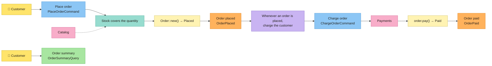

# Tutorial: a shop, from the board to the code

## Sticky note → code

| Sticky note | Concept | In Cerne |
|---|---|---|
| 🟦 | Command | trait `Command<Ports>`, which returns `Executed { output, events }` |
| 🟨 | Aggregate / Entity | attributes `#[entity]` and `#[aggregate]`, which write the traits `Entity` and `Aggregate`; the invariants go in the trait `Validate` |
| — | Value Object | trait `ValueObject`, also the type of every entity id; attribute `#[value_object]`, for a value object of one value |
| 🟧 | Domain Event | trait `DomainEvent<Ports>` |
| 🟪 | Policy | `Policy` + `Policies`; their commands go to the `Outbox`, and the `OutboxPolicyProcessor` runs them |
| 🩷 | External System | a port (an async trait of the application) and its adapters, gathered in the composition root `Ports` |
| 🟩 | Read Model / Query | trait `Query<Ports>`, which returns a `ReadModel` |
| — | Invariants | `Invariant` + `Invariants`: what is always true about an entity or a value object |
| — | Business rules | `BusinessRule` + `BusinessRules`: what must hold for a command to run |
| — | Database | `cerne::sqlite` (also in memory) and `cerne::postgres`: the same API, the same SQL |
| — | HTTP | feature `axum`: REST or JSON-RPC 2.0 |

## Install

```bash
cargo install cerne-cli
```

Cerne needs Rust 1.88 or newer.

## The board

The board has two flows. The customer places an order; the shop checks the stock, and a policy charges the customer. Then the customer reads the order.



Every block of code below is a whole file of the project. A test of this repository runs these commands, writes these files and runs `cargo test` on the result, so the tutorial always compiles.

## 1. The project and its sticky notes

Creates the `shop` project, with SQLite as the database and a REST API.

```bash
cerne new shop --db sqlite --http rest
```

Enters the project: the `cerne g` commands run inside it.

```bash
cd shop
```

Creates the 🟨 aggregate `Order`: An order, with its SQL repository (the project has a database, because of `--db sqlite`) and a status that starts at `Placed`. The `id` field the CLI creates by itself: a value object `OrderId`, with a `u64` inside. With `id:<type>` (for example, `id:String`), `OrderId` holds a `String` instead of the `u64`. Since `Order` is an aggregate, its repository only takes an integer or `String` id.

```bash
cerne g entity Order product:String quantity:u32 total:u64 status=Placed:Placed,Paid --aggregate
```

Creates the 🟧 event `OrderPlaced`: the order was placed.

```bash
cerne g event OrderPlaced order_id:OrderId total:u64
```

Creates the 🟧 event `OrderPaid`: the order was paid.

```bash
cerne g event OrderPaid order_id:OrderId
```

Creates the 🟦 command `PlaceOrder`: the customer places an order.

```bash
cerne g command PlaceOrder product:String quantity:u32
```

Creates the 🟦 command `ChargeOrder`: charge the order, fired by a policy instead of an actor.

```bash
cerne g command ChargeOrder order_id:OrderId total:u64 --policy
```

Creates the 🩷 port `Catalog`: the external system with the prices and the stock.

```bash
cerne g port Catalog
```

Creates `InMemoryCatalog`: a catalog in memory, for the tests and for this tutorial.

```bash
cerne g adapter InMemoryCatalog Catalog
```

Creates the 🩷 port `Payments`: the external system that charges the customer.

```bash
cerne g port Payments
```

Creates `InMemoryPayments`: a payment system in memory, for the tests and for this tutorial.

```bash
cerne g adapter InMemoryPayments Payments
```

Creates the 🟩 read model `OrderSummary`: the summary of the order that the customer sees.

```bash
cerne g read_model OrderSummary product:String quantity:u32 total:u64 status:String
```

Creates the query `OrderSummary`: it finds that summary by the id of the order.

```bash
cerne g query OrderSummary order_id:OrderId
```

Connects `PlaceOrder` to the route `POST /orders`.

```bash
cerne g endpoint PlaceOrder POST /orders
```

Connects `OrderSummary` to the route `GET /orders`.

```bash
cerne g endpoint OrderSummary GET /orders
```

The fields are `name:type`, and `status=Placed:Placed,Paid` creates an enum with the values `Placed` and `Paid` that starts at `Placed`. After each command the project still compiles. `--aggregate` also adds the field `orders` to the `Ports`, and `--policy` registers the command in the outbox.

```console
$ tree shop
shop
├── Cargo.toml
├── migrations
│   ├── 1791416037_create_orders.sql
│   └── 1_create_cerne_outbox.sql
├── src
│   ├── application
│   │   ├── commands
│   │   │   ├── charge_order.rs
│   │   │   ├── mod.rs
│   │   │   └── place_order.rs
│   │   ├── mod.rs
│   │   ├── ports
│   │   │   ├── catalog.rs
│   │   │   ├── mod.rs
│   │   │   └── payments.rs
│   │   ├── queries
│   │   │   ├── mod.rs
│   │   │   └── order_summary.rs
│   │   └── read_models
│   │       ├── mod.rs
│   │       └── order_summary.rs
│   ├── domain
│   │   ├── entities
│   │   │   ├── mod.rs
│   │   │   └── order.rs
│   │   ├── events
│   │   │   ├── mod.rs
│   │   │   ├── order_paid.rs
│   │   │   └── order_placed.rs
│   │   ├── mod.rs
│   │   └── value_objects
│   │       ├── mod.rs
│   │       └── order_id.rs
│   ├── infrastructure
│   │   ├── http
│   │   │   ├── mod.rs
│   │   │   ├── order_summary.rs
│   │   │   └── place_order.rs
│   │   ├── in_memory_catalog.rs
│   │   ├── in_memory_payments.rs
│   │   ├── mod.rs
│   │   └── sqlite_order_repository.rs
│   ├── lib.rs
│   ├── main.rs
│   └── ports.rs
└── tests
    └── board.rs
```

Each layer has its folder. `domain/` is pure and synchronous: no IO. `application/` is asynchronous: commands, queries and the ports they use. `infrastructure/` holds the adapters: the SQL repository, the in-memory adapters and HTTP. The number in front of the migration is the moment it was generated.

What is left is to fill in the sticky notes.

## 2. Value object: `OrderId`

A value object has no identity: two `OrderId(7)` are the same thing. It only exists if its invariants hold, and it never changes. The id of every entity is a value object, so a `0` never becomes an order id, not even when read back from JSON or from the database.

The `src/domain/value_objects/order_id.rs` as `cerne g entity Order product:String quantity:u32 total:u64 status=Placed:Placed,Paid --aggregate` generated it:

<!-- generated: src/domain/value_objects/order_id.rs -->
```rust
use cerne::domain::{EnforcementResult, Invariants, ValueObject, value_object};
use serde::{Deserialize, Serialize};

/// In JSON it is the `u64` itself, and reading it back goes through `new`: the invariants hold there too.
#[value_object]
#[derive(Debug, Clone, PartialEq, Serialize, Deserialize)]
pub struct OrderId(u64);

impl ValueObject for OrderId {
    type Constructor = u64;

    fn new(value: u64) -> EnforcementResult<Self> {
        Invariants::new(vec![]).enforce()?;

        Ok(Self(value))
    }
}
```

Filled in:

<!-- file: src/domain/value_objects/order_id.rs -->
```rust
use cerne::domain::{EnforcementResult, Invariant, Invariants, ValueObject, value_object};
use serde::{Deserialize, Serialize};

/// In JSON it is the `u64` itself, and reading it back goes through `new`: the invariants hold there too.
#[value_object]
#[derive(Debug, Clone, PartialEq, Serialize, Deserialize)]
pub struct OrderId(u64);

impl ValueObject for OrderId {
    type Constructor = u64;

    fn new(value: u64) -> EnforcementResult<Self> {
        let order_id_is_positive = value > 0;

        Invariants::new(vec![Invariant::new("order id is positive", move || {
            order_id_is_positive
        })])
        .enforce()?;

        Ok(Self(value))
    }
}
```

Each invariant is a name plus a closure. The condition goes into a variable before the closure, named like the sentence on the board. `enforce` runs all of them and, if any fails, returns `DomainError::Violations` with every failing name.

`#[value_object]` writes what a value object of one value has in common: `TryFrom<u64> for OrderId`, which goes through `new`, `From<OrderId> for u64`, which gives the `u64` back, and, because `OrderId` derives `Serialize` and `Deserialize`, `#[serde(try_from = "u64", into = "u64")]`. `new`, with the invariants, is yours. The SQL repository uses the `From` to write the id to its column.

## 3. Aggregate: `Order` 🟨

The `src/domain/entities/order.rs` as `cerne g entity Order product:String quantity:u32 total:u64 status=Placed:Placed,Paid --aggregate` generated it:

<!-- generated: src/domain/entities/order.rs -->
```rust
use crate::domain::value_objects::order_id::OrderId;
use cerne::domain::{EnforcementResult, Invariants, Validate, aggregate};

// --- Status ------------------------------------------------------------------

#[derive(Debug, Clone, Copy, Default, PartialEq)]
pub enum OrderStatus {
    #[default]
    Placed,
    Paid,
}

// --- Aggregate ---------------------------------------------------------------

#[aggregate]
#[derive(Debug, Clone, PartialEq)]
pub struct Order {
    pub id: Option<OrderId>,
    pub product: String,
    pub quantity: u32,
    pub total: u64,
    #[skip_constructor]
    pub status: OrderStatus,
}

// --- Invariants --------------------------------------------------------------

impl Validate for Order {
    fn validate(self) -> EnforcementResult<Self> {
        Invariants::new(vec![]).enforce()?;

        Ok(self)
    }
}

// --- State transitions -------------------------------------------------------

impl Order {}
```

Filled in:

<!-- file: src/domain/entities/order.rs -->
```rust
use crate::domain::value_objects::order_id::OrderId;
use cerne::domain::{EnforcementResult, Invariant, Invariants, Validate, aggregate};

// --- Status ------------------------------------------------------------------

#[derive(Debug, Clone, Copy, Default, PartialEq)]
pub enum OrderStatus {
    #[default]
    Placed,
    Paid,
}

// --- Aggregate ---------------------------------------------------------------

#[aggregate]
#[derive(Debug, Clone, PartialEq)]
pub struct Order {
    pub id: Option<OrderId>,
    pub product: String,
    pub quantity: u32,
    pub total: u64,
    #[skip_constructor]
    pub status: OrderStatus,
}

// --- Invariants --------------------------------------------------------------

impl Validate for Order {
    fn validate(self) -> EnforcementResult<Self> {
        let order_has_a_product = !self.product.is_empty();
        let quantity_is_positive = self.quantity > 0;

        Invariants::new(vec![
            Invariant::new("order has a product", move || order_has_a_product),
            Invariant::new("quantity is positive", move || quantity_is_positive),
        ])
        .enforce()?;

        Ok(self)
    }
}

// --- State transitions -------------------------------------------------------

impl Order {
    pub fn pay(self) -> EnforcementResult<Self> {
        Self {
            status: OrderStatus::Paid,
            ..self
        }
        .validate()
    }
}
```

- `#[aggregate]` writes what every aggregate has in common: `impl Entity` (the `id()`, the `with_id` the repository calls and `new`), `impl Aggregate` and the `OrderConstructor`. An entity that is not an aggregate (`cerne g entity` without `--aggregate`) gets `#[entity]`, which writes the same except `impl Aggregate`: no repository takes it.
- `Order::new` receives the `OrderConstructor`, with every field but two: the id, which the repository decides on the first `save` (until then, `id()` is `None`), and `status`, marked `#[skip_constructor]`. A skipped field starts at its `Default`: `OrderStatus` derives `Default`, with `#[default]` on `Placed`, the initial value of `status=Placed:Placed,Paid`.
- `validate`, in `impl Validate`, holds the invariants: the CLI generates it empty, for you to fill in. It runs in `new`, in every state transition (`pay`) and when the repository reads a row back: an order that breaks an invariant never exists in memory.
- The state transitions are methods that consume the order and return the next one.

## 4. External systems: ports and adapters 🩷

A port is an async trait of the application, and every method returns `Result<_, cerne::Error>`. The command does not know which adapter is behind it.

The `src/application/ports/catalog.rs` as `cerne g port Catalog` generated it:

<!-- generated: src/application/ports/catalog.rs -->
```rust
use cerne::async_trait;

/// External system "Catalog": one async method per thing the commands ask of it, each returning
/// `Result<_, cerne::Error>`.
#[async_trait]
pub trait Catalog: Send + Sync {}
```

Filled in:

<!-- file: src/application/ports/catalog.rs -->
```rust
use cerne::{Error, async_trait};

/// External system "Catalog": what the shop sells, at what price, and how much is left.
#[async_trait]
pub trait Catalog: Send + Sync {
    /// The price of one unit, in cents.
    async fn unit_price(&self, product: &str) -> Result<u64, Error>;

    async fn units_in_stock(&self, product: &str) -> Result<u32, Error>;
}
```

The `src/application/ports/payments.rs` as `cerne g port Payments` generated it:

<!-- generated: src/application/ports/payments.rs -->
```rust
use cerne::async_trait;

/// External system "Payments": one async method per thing the commands ask of it, each returning
/// `Result<_, cerne::Error>`.
#[async_trait]
pub trait Payments: Send + Sync {}
```

Filled in:

<!-- file: src/application/ports/payments.rs -->
```rust
use crate::domain::value_objects::order_id::OrderId;
use cerne::{Error, async_trait};

/// External system "Payments": charges the customer. The order id is the idempotency key: charging the same order
/// twice charges it once.
#[async_trait]
pub trait Payments: Send + Sync {
    async fn charge(&self, order_id: &OrderId, amount: u64) -> Result<(), Error>;
}
```

The in-memory adapters stand in for the real systems in the tests and in this tutorial:

The `src/infrastructure/in_memory_catalog.rs` as `cerne g adapter InMemoryCatalog Catalog` generated it:

<!-- generated: src/infrastructure/in_memory_catalog.rs -->
```rust
use crate::application::ports::catalog::Catalog;
use cerne::async_trait;

/// An adapter of the port `Catalog`.
pub struct InMemoryCatalog;

#[async_trait]
impl Catalog for InMemoryCatalog {}
```

Filled in:

<!-- file: src/infrastructure/in_memory_catalog.rs -->
```rust
use crate::application::ports::catalog::Catalog;
use cerne::{ApplicationError, Error, async_trait};

/// A catalog with fixed products: (name, unit price in cents, units in stock).
pub struct InMemoryCatalog {
    pub products: Vec<(&'static str, u64, u32)>,
}

impl InMemoryCatalog {
    fn product(&self, product: &str) -> Result<(&'static str, u64, u32), Error> {
        let found = self.products.iter().find(|(name, _, _)| *name == product);

        Ok(*found.ok_or(ApplicationError::NotFound("product"))?)
    }
}

#[async_trait]
impl Catalog for InMemoryCatalog {
    async fn unit_price(&self, product: &str) -> Result<u64, Error> {
        let (_, unit_price, _) = self.product(product)?;

        Ok(unit_price)
    }

    async fn units_in_stock(&self, product: &str) -> Result<u32, Error> {
        let (_, _, units_in_stock) = self.product(product)?;

        Ok(units_in_stock)
    }
}
```

The `src/infrastructure/in_memory_payments.rs` as `cerne g adapter InMemoryPayments Payments` generated it:

<!-- generated: src/infrastructure/in_memory_payments.rs -->
```rust
use crate::application::ports::payments::Payments;
use cerne::async_trait;

/// An adapter of the port `Payments`.
pub struct InMemoryPayments;

#[async_trait]
impl Payments for InMemoryPayments {}
```

Filled in:

<!-- file: src/infrastructure/in_memory_payments.rs -->
```rust
use crate::application::ports::payments::Payments;
use crate::domain::value_objects::order_id::OrderId;
use cerne::{Error, async_trait};
use std::sync::Mutex;

/// Keeps every charge instead of calling a payment provider.
#[derive(Default)]
pub struct InMemoryPayments {
    pub charges: Mutex<Vec<(OrderId, u64)>>,
}

#[async_trait]
impl Payments for InMemoryPayments {
    async fn charge(&self, order_id: &OrderId, amount: u64) -> Result<(), Error> {
        let mut charges = self.charges.lock().unwrap();

        if !charges.iter().any(|(charged, _)| charged == order_id) {
            charges.push((order_id.clone(), amount));
        }

        Ok(())
    }
}
```

The `Ports` gather every port. `cerne g entity --aggregate` already added the `orders` repository; the two external systems are added by hand. The repository and the outbox live in the database, so `begin` opens a transaction and hands them to the new `Ports`. The external systems stay the same, because a call to them cannot be rolled back.

The `src/ports.rs` as `cerne new shop --db sqlite --http rest`, `cerne g entity Order product:String quantity:u32 total:u64 status=Placed:Placed,Paid --aggregate` and `cerne g command ChargeOrder order_id:OrderId total:u64 --policy` generated it:

<!-- generated: src/ports.rs -->
```rust
use crate::application::commands::charge_order::ChargeOrderCommand;
use crate::domain::entities::order::Order;
use crate::infrastructure::sqlite_order_repository::SqliteOrderRepository;
use cerne::application::{CommandRegistry, Outbox, Repository, TransactionalPorts};
use cerne::sqlite::{SqliteDatabase, SqliteOutbox};
use cerne::{Error, async_trait};

/// The composition root: every port the commands and queries can use.
///
/// The repositories and the outbox live in the database, so they follow its transaction. External systems do not:
/// `begin` hands the same adapters to the new ports.
pub struct Ports {
    pub database: SqliteDatabase,
    pub orders: Box<dyn Repository<Order>>,
    pub outbox: Box<dyn Outbox<Ports>>,
}

impl Ports {
    pub fn new(database: SqliteDatabase) -> Self {
        Self {
            orders: Box::new(SqliteOrderRepository::new(database.clone())),
            outbox: Box::new(SqliteOutbox::new(database.clone())),
            database,
        }
    }
}

/// Every command a policy fires, so the outbox can read it back from its row.
pub fn command_registry() -> CommandRegistry<Ports> {
    CommandRegistry::new().register::<ChargeOrderCommand>()
}

#[async_trait]
impl TransactionalPorts for Ports {
    async fn begin(&self) -> Result<Self, Error> {
        let transaction = self.database.begin().await?;

        Ok(Ports::new(transaction))
    }

    async fn commit(self) -> Result<(), Error> {
        self.database.commit().await
    }

    fn outbox(&self) -> &dyn Outbox<Self> {
        self.outbox.as_ref()
    }
}
```

Filled in:

<!-- file: src/ports.rs -->
```rust
use crate::application::commands::charge_order::ChargeOrderCommand;
use crate::application::ports::catalog::Catalog;
use crate::application::ports::payments::Payments;
use crate::domain::entities::order::Order;
use crate::infrastructure::sqlite_order_repository::SqliteOrderRepository;
use cerne::application::{CommandRegistry, Outbox, Repository, TransactionalPorts};
use cerne::sqlite::{SqliteDatabase, SqliteOutbox};
use cerne::{Error, async_trait};
use std::sync::Arc;

/// The composition root: every port the commands and queries can use.
///
/// The repositories and the outbox live in the database, so they follow its transaction. External systems do not:
/// `begin` hands the same adapters to the new ports.
pub struct Ports {
    pub database: SqliteDatabase,
    pub orders: Box<dyn Repository<Order>>,
    pub outbox: Box<dyn Outbox<Ports>>,
    pub catalog: Arc<dyn Catalog>,
    pub payments: Arc<dyn Payments>,
}

impl Ports {
    pub fn new(
        database: SqliteDatabase,
        catalog: Arc<dyn Catalog>,
        payments: Arc<dyn Payments>,
    ) -> Self {
        Self {
            orders: Box::new(SqliteOrderRepository::new(database.clone())),
            outbox: Box::new(SqliteOutbox::new(database.clone())),
            database,
            catalog,
            payments,
        }
    }
}

/// Every command a policy fires, so the outbox can read it back from its row.
pub fn command_registry() -> CommandRegistry<Ports> {
    CommandRegistry::new().register::<ChargeOrderCommand>()
}

#[async_trait]
impl TransactionalPorts for Ports {
    async fn begin(&self) -> Result<Self, Error> {
        let transaction = self.database.begin().await?;

        let catalog = Arc::clone(&self.catalog);
        let payments = Arc::clone(&self.payments);

        Ok(Ports::new(transaction, catalog, payments))
    }

    async fn commit(self) -> Result<(), Error> {
        self.database.commit().await
    }

    fn outbox(&self) -> &dyn Outbox<Self> {
        self.outbox.as_ref()
    }
}
```

## 5. Command: `PlaceOrderCommand` 🟦

The command is a struct with what the actor sends, and nothing else: no id, since the repository decides it. The `execute` follows the board from left to right, one section per sticky note:

The `src/application/commands/place_order.rs` as `cerne g command PlaceOrder product:String quantity:u32` generated it:

<!-- generated: src/application/commands/place_order.rs -->
```rust
use crate::ports::Ports;
use cerne::application::{Command, Executed};
use cerne::{Error, async_trait};
use serde::{Deserialize, Serialize};

/// Actor: who sends it? The body of the request is this command (that is why it is `Deserialize`).
///
/// In JSON-RPC, the params can come by position, in the order of these fields: that order is part of the API.
#[derive(Serialize, Deserialize)]
pub struct PlaceOrderCommand {
    pub product: String,
    pub quantity: u32,
}

#[async_trait]
impl Command<Ports> for PlaceOrderCommand {
    type Output = ();

    async fn execute(&self, _ports: &Ports) -> Result<Executed<(), Ports>, Error> {
        // --- Ports -----------------------------------------------------------

        // --- Business rules --------------------------------------------------

        // --- Aggregate -------------------------------------------------------

        // --- Domain events ---------------------------------------------------

        Ok(Executed {
            output: (),
            events: vec![],
        })
    }
}
```

Filled in:

<!-- file: src/application/commands/place_order.rs -->
```rust
use crate::domain::entities::order::{Order, OrderConstructor};
use crate::domain::events::order_placed::OrderPlaced;
use crate::domain::value_objects::order_id::OrderId;
use crate::ports::Ports;
use cerne::application::{Command, Executed};
use cerne::domain::{BusinessRule, BusinessRules, Entity};
use cerne::{Error, async_trait};
use serde::{Deserialize, Serialize};

/// Actor: the customer. The body of `POST /orders` is this command (that is why it is `Deserialize`).
#[derive(Serialize, Deserialize)]
pub struct PlaceOrderCommand {
    pub product: String,
    pub quantity: u32,
}

#[async_trait]
impl Command<Ports> for PlaceOrderCommand {
    type Output = OrderId; // the id of the new order, for the customer to follow it

    async fn execute(&self, ports: &Ports) -> Result<Executed<OrderId, Ports>, Error> {
        // --- Ports -----------------------------------------------------------

        let unit_price = ports.catalog.unit_price(&self.product).await?;
        let units_in_stock = ports.catalog.units_in_stock(&self.product).await?;

        // --- Business rules --------------------------------------------------

        let stock_covers_the_quantity = units_in_stock >= self.quantity;

        BusinessRules::new(vec![BusinessRule::new(
            "stock covers the quantity",
            move || stock_covers_the_quantity,
        )])
        .check()?;

        // --- Aggregate -------------------------------------------------------

        let total = unit_price * u64::from(self.quantity);

        let order = Order::new(OrderConstructor {
            product: self.product.clone(),
            quantity: self.quantity,
            total,
        })?;

        let order_id = ports.orders.save(order).await?;

        // --- Domain events ---------------------------------------------------

        let order_placed = OrderPlaced {
            order_id: order_id.clone(),
            total,
        };

        Ok(Executed {
            output: order_id,
            events: vec![Box::new(order_placed)],
        })
    }
}
```

- **Ports:** every read the command needs, before any decision.
- **Business rules:** each condition in a variable, then `BusinessRules::new(..).check()?`. A business rule needs the outside world (here, the stock); an invariant only needs the entity itself.
- **Aggregate:** the change, then `save`, which returns the id.
- **Domain events:** each event in a variable, then `Ok(Executed { output, events })`. The `output` goes back to whoever sent the command (here, the id of the new order); the `events` go to the outbox.

## 6. Domain event and policy: `OrderPlaced` 🟧 🟪

An event says what happened, in the past tense. Its `trigger_policies` lists the policies that react to it: each one has a name, a condition (`when`) and the command it fires (`then`).

The `src/domain/events/order_placed.rs` as `cerne g event OrderPlaced order_id:OrderId total:u64` generated it:

<!-- generated: src/domain/events/order_placed.rs -->
```rust
use crate::domain::value_objects::order_id::OrderId;
use crate::ports::Ports;
use cerne::domain::{DomainEvent, EnforcementResult, FiredPolicy, Policies};

pub struct OrderPlaced {
    pub order_id: OrderId,
    pub total: u64,
}

impl DomainEvent<Ports> for OrderPlaced {
    fn trigger_policies(&self) -> EnforcementResult<Vec<FiredPolicy<Ports>>> {
        // --- Policies --------------------------------------------------------

        Ok(Policies::new(vec![]).trigger())
    }
}
```

Filled in:

<!-- file: src/domain/events/order_placed.rs -->
```rust
use crate::application::commands::charge_order::ChargeOrderCommand;
use crate::domain::value_objects::order_id::OrderId;
use crate::ports::Ports;
use cerne::domain::{DomainEvent, EnforcementResult, FiredPolicy, Policies, Policy};

pub struct OrderPlaced {
    pub order_id: OrderId,
    pub total: u64,
}

impl DomainEvent<Ports> for OrderPlaced {
    fn trigger_policies(&self) -> EnforcementResult<Vec<FiredPolicy<Ports>>> {
        // --- Policies --------------------------------------------------------

        let order_id = self.order_id.clone();
        let total = self.total;

        let charge_the_customer_policy = Policy::new(
            "whenever an order is placed, charge the customer",
            || true,
            move || {
                Box::new(ChargeOrderCommand {
                    order_id: order_id.clone(),
                    total,
                })
            },
        );

        Ok(Policies::new(vec![charge_the_customer_policy]).trigger())
    }
}
```

The policy does not run the command. `execute_in_transaction` (step 9) saves the order and writes the `ChargeOrderCommand` to the `cerne_outbox` table in the same transaction: both are saved, or neither is. Then the `OutboxPolicyProcessor` reads the table and runs each command in a transaction of its own.

`OrderPaid` stays as `cerne g event` generated it: no policy reacts to it yet.

## 7. The command a policy fires: `ChargeOrderCommand` 🟦

The `src/application/commands/charge_order.rs` as `cerne g command ChargeOrder order_id:OrderId total:u64 --policy` generated it:

<!-- generated: src/application/commands/charge_order.rs -->
```rust
use crate::domain::value_objects::order_id::OrderId;
use crate::ports::Ports;
use cerne::application::{Command, Executed};
use cerne::{Error, async_trait};
use serde::{Deserialize, Serialize};

/// No actor: a policy fires this command, and the outbox stores it (that is why it is `Serialize`).
#[derive(Serialize, Deserialize)]
pub struct ChargeOrderCommand {
    pub order_id: OrderId,
    pub total: u64,
}

#[async_trait]
impl Command<Ports> for ChargeOrderCommand {
    type Output = ();

    async fn execute(&self, _ports: &Ports) -> Result<Executed<(), Ports>, Error> {
        // --- Ports -----------------------------------------------------------

        // --- Business rules --------------------------------------------------

        // --- Aggregate -------------------------------------------------------

        // --- Domain events ---------------------------------------------------

        Ok(Executed {
            output: (),
            events: vec![],
        })
    }
}
```

Filled in:

<!-- file: src/application/commands/charge_order.rs -->
```rust
use crate::domain::entities::order::OrderStatus;
use crate::domain::events::order_paid::OrderPaid;
use crate::domain::value_objects::order_id::OrderId;
use crate::ports::Ports;
use cerne::application::{Command, Executed};
use cerne::domain::{BusinessRule, BusinessRules};
use cerne::{Error, async_trait};
use serde::{Deserialize, Serialize};

/// No actor: a policy fires this command, and the outbox stores it (that is why it is `Serialize`).
#[derive(Serialize, Deserialize)]
pub struct ChargeOrderCommand {
    pub order_id: OrderId,
    pub total: u64,
}

#[async_trait]
impl Command<Ports> for ChargeOrderCommand {
    type Output = ();

    async fn execute(&self, ports: &Ports) -> Result<Executed<(), Ports>, Error> {
        // --- Ports -----------------------------------------------------------

        let order = ports.orders.load(&self.order_id).await?;

        // --- Business rules --------------------------------------------------

        let order_is_still_placed = order.status == OrderStatus::Placed;

        BusinessRules::new(vec![BusinessRule::new(
            "order is still placed",
            move || order_is_still_placed,
        )])
        .check()?;

        // --- External system: Payments ---------------------------------------

        ports.payments.charge(&self.order_id, self.total).await?;

        // --- Aggregate -------------------------------------------------------

        let paid_order = order.pay()?;

        ports.orders.save(paid_order).await?;

        // --- Domain events ---------------------------------------------------

        let order_paid = OrderPaid {
            order_id: self.order_id.clone(),
        };

        Ok(Executed {
            output: (),
            events: vec![Box::new(order_paid)],
        })
    }
}
```

If the process dies after the charge and before the commit, the outbox runs the command again. That is why a command fired by a policy must be idempotent: here the order id is the idempotency key of the payment, and the rule "order is still placed" refuses an order that was already paid. The section `External system: Payments` sits between the rules and the aggregate.

## 8. Query and read model: `OrderSummary` 🟩

The read model is what the actor sees on the screen: plain fields, no behavior. `cerne g read_model` generated it, and it stays as it is. The query reads the ports and builds it:

The `src/application/queries/order_summary.rs` as `cerne g query OrderSummary order_id:OrderId` generated it:

<!-- generated: src/application/queries/order_summary.rs -->
```rust
use crate::application::read_models::order_summary::OrderSummary;
use crate::domain::value_objects::order_id::OrderId;
use crate::ports::Ports;
use cerne::application::Query;
use cerne::{Error, async_trait};
use serde::Deserialize;

#[derive(Deserialize)]
pub struct OrderSummaryQuery {
    pub order_id: OrderId,
}

#[async_trait]
impl Query<Ports> for OrderSummaryQuery {
    type ReadModel = OrderSummary;

    async fn execute(&self, _ports: &Ports) -> Result<OrderSummary, Error> {
        // --- Ports -----------------------------------------------------------

        // --- Read model ------------------------------------------------------

        todo!("read the ports and build the OrderSummary read model")
    }
}
```

Filled in:

<!-- file: src/application/queries/order_summary.rs -->
```rust
use crate::application::read_models::order_summary::OrderSummary;
use crate::domain::value_objects::order_id::OrderId;
use crate::ports::Ports;
use cerne::application::Query;
use cerne::{Error, async_trait};
use serde::Deserialize;

#[derive(Deserialize)]
pub struct OrderSummaryQuery {
    pub order_id: OrderId,
}

#[async_trait]
impl Query<Ports> for OrderSummaryQuery {
    type ReadModel = OrderSummary;

    async fn execute(&self, ports: &Ports) -> Result<OrderSummary, Error> {
        // --- Ports -----------------------------------------------------------

        let order = ports.orders.load(&self.order_id).await?;

        // --- Read model ------------------------------------------------------

        let order_summary = OrderSummary {
            product: order.product,
            quantity: order.quantity,
            total: order.total,
            status: format!("{:?}", order.status),
        };

        Ok(order_summary)
    }
}
```

## 9. The board as a test

`tests/board.rs` has one block per flow. The database is SQLite in memory, with the same SQL adapter as production; a repository is never a `Vec`.

The `tests/board.rs` as `cerne new shop --db sqlite --http rest` generated it:

<!-- generated: tests/board.rs -->
```rust
//! One block per flow of the board: an actor sends a command, and the test checks its events and the policies that fired.
```

Filled in:

<!-- file: tests/board.rs -->
```rust
//! One block per flow of the board: an actor sends a command, and the test checks its events and the policies that fired.

use cerne::Error;
use cerne::application::{OutboxPolicyProcessor, Query, TransactionalPorts};
use cerne::domain::{DomainError, ValueObject};
use cerne::sqlite::SqliteDatabase;
use shop::application::commands::place_order::PlaceOrderCommand;
use shop::application::queries::order_summary::OrderSummaryQuery;
use shop::application::read_models::order_summary::OrderSummary;
use shop::domain::value_objects::order_id::OrderId;
use shop::infrastructure::in_memory_catalog::InMemoryCatalog;
use shop::infrastructure::in_memory_payments::InMemoryPayments;
use shop::ports::{Ports, command_registry};
use std::sync::Arc;

async fn ports(payments: Arc<InMemoryPayments>) -> Result<Arc<Ports>, Error> {
    let database = SqliteDatabase::in_memory().await?;

    database.migrate(&sqlx::migrate!()).await?;

    let catalog = Arc::new(InMemoryCatalog {
        products: vec![("mug", 3000, 10)],
    });

    Ok(Arc::new(Ports::new(database, catalog, payments)))
}

#[tokio::test]
async fn the_customer_places_an_order_and_the_policy_charges_it() -> Result<(), Error> {
    let payments = Arc::new(InMemoryPayments::default());
    let ports = ports(Arc::clone(&payments)).await?;

    let outbox_policy_processor =
        OutboxPolicyProcessor::new(Arc::clone(&ports), command_registry());

    // --- Customer: places an order -------------------------------------------

    let place_order = PlaceOrderCommand {
        product: "mug".into(),
        quantity: 2,
    };

    let order_id = ports.execute_in_transaction(place_order).await?;

    // --- Policy: whenever an order is placed, charge the customer -----------

    let command_runs = outbox_policy_processor.run_pending().await?;

    assert_eq!(command_runs.len(), 1);
    assert_eq!(
        *payments.charges.lock().unwrap(),
        vec![(order_id.clone(), 6000)]
    );

    // --- Customer: reads the order -------------------------------------------

    let order_summary_query = OrderSummaryQuery { order_id };

    let order_summary = order_summary_query.execute(&ports).await?;

    let paid_order_summary = OrderSummary {
        product: "mug".into(),
        quantity: 2,
        total: 6000,
        status: "Paid".into(),
    };

    assert_eq!(order_summary, paid_order_summary);

    Ok(())
}

#[tokio::test]
async fn the_domain_refuses_what_breaks_a_rule_or_an_invariant() -> Result<(), Error> {
    let ports = ports(Arc::default()).await?;

    // --- Business rule: stock covers the quantity ----------------------------

    let too_many_mugs = PlaceOrderCommand {
        product: "mug".into(),
        quantity: 11,
    };

    let refused = ports.execute_in_transaction(too_many_mugs).await;

    assert!(matches!(
        refused,
        Err(Error::Domain(DomainError::Violations(violations))) if violations == ["stock covers the quantity"]
    ));

    // --- Invariant: quantity is positive -------------------------------------

    let no_mugs = PlaceOrderCommand {
        product: "mug".into(),
        quantity: 0,
    };

    let refused = ports.execute_in_transaction(no_mugs).await;

    assert!(matches!(
        refused,
        Err(Error::Domain(DomainError::Violations(violations))) if violations == ["quantity is positive"]
    ));

    // --- Value object: order id is positive ----------------------------------

    assert!(OrderId::new(0).is_err());

    Ok(())
}
```

`execute_in_transaction` opens the transaction, runs the command, writes the commands of its policies to the outbox and commits. `run_pending` then runs what the outbox holds.

```bash
cargo test
```

## 10. HTTP

`cerne new --http rest` generated the router, and each `cerne g endpoint` added a route: the body of `POST /orders` is the `PlaceOrderCommand`, and the query string of `GET /orders` is the `OrderSummaryQuery`. In `main.rs`, only the two adapters are added by hand:

The `src/main.rs` as `cerne new shop --db sqlite --http rest` generated it:

<!-- generated: src/main.rs -->
```rust
use cerne::application::OutboxPolicyProcessor;
use cerne::sqlite::SqliteDatabase;
use shop::infrastructure::http::router;
use shop::ports::{Ports, command_registry};
use std::sync::Arc;
use std::time::Duration;

#[tokio::main]
async fn main() -> anyhow::Result<()> {
    // --- Composition root ----------------------------------------------------

    let database_url = std::env::var("DATABASE_URL").unwrap_or("sqlite://shop.db?mode=rwc".into());

    let database = SqliteDatabase::connect(&database_url, 5).await?;

    database.migrate(&sqlx::migrate!()).await?;

    let ports = Arc::new(Ports::new(database));

    // --- Outbox: the commands of the policies --------------------------------

    let outbox_policy_processor = OutboxPolicyProcessor::new(Arc::clone(&ports), command_registry());

    tokio::spawn(async move {
        outbox_policy_processor
            .run_every(Duration::from_millis(200), |error| eprintln!("outbox: {error}"))
            .await
    });

    // --- HTTP: REST ----------------------------------------------------------

    let listener = tokio::net::TcpListener::bind("127.0.0.1:3000").await?;

    println!("listening on http://127.0.0.1:3000");

    axum::serve(listener, router(ports)).await?;

    Ok(())
}
```

Filled in:

<!-- file: src/main.rs -->
```rust
use cerne::application::OutboxPolicyProcessor;
use cerne::sqlite::SqliteDatabase;
use shop::infrastructure::http::router;
use shop::infrastructure::in_memory_catalog::InMemoryCatalog;
use shop::infrastructure::in_memory_payments::InMemoryPayments;
use shop::ports::{Ports, command_registry};
use std::sync::Arc;
use std::time::Duration;

#[tokio::main]
async fn main() -> anyhow::Result<()> {
    // --- Composition root ----------------------------------------------------

    let database_url = std::env::var("DATABASE_URL").unwrap_or("sqlite://shop.db?mode=rwc".into());

    let database = SqliteDatabase::connect(&database_url, 5).await?;

    database.migrate(&sqlx::migrate!()).await?;

    let catalog = Arc::new(InMemoryCatalog {
        products: vec![("mug", 3000, 10), ("t-shirt", 5000, 3)],
    });
    let payments = Arc::new(InMemoryPayments::default());

    let ports = Arc::new(Ports::new(database, catalog, payments));

    // --- Outbox: the commands of the policies --------------------------------

    let outbox_policy_processor =
        OutboxPolicyProcessor::new(Arc::clone(&ports), command_registry());

    tokio::spawn(async move {
        outbox_policy_processor
            .run_every(Duration::from_millis(200), |error| {
                eprintln!("outbox: {error}")
            })
            .await
    });

    // --- HTTP: REST ----------------------------------------------------------

    let listener = tokio::net::TcpListener::bind("127.0.0.1:3000").await?;

    println!("listening on http://127.0.0.1:3000");

    axum::serve(listener, router(ports)).await?;

    Ok(())
}
```

```bash
cargo run
```

```console
$ curl -X POST localhost:3000/orders -H 'content-type: application/json' -d '{"product": "mug", "quantity": 2}'
1
$ curl 'localhost:3000/orders?order_id=1'
{"product":"mug","quantity":2,"total":6000,"status":"Paid"}
```

The order is already `Paid`: in the background, the `OutboxPolicyProcessor` ran the `ChargeOrderCommand`.

## 11. When something goes wrong

Every error is a `cerne::Error`, in one of three categories, and HTTP turns each one into an answer:

| Error | When | REST | JSON-RPC |
|---|---|---|---|
| `DomainError::Violations` | an invariant or a business rule failed | 422, with the names | `-32001`, with the names in `message` and in `data` |
| `ApplicationError::NotFound` | the repository (or an adapter) found nothing | 404 | `-32004` |
| `InfrastructureError` | database, network, queue | 500, with no details | `-32603` |

```console
$ curl -X POST localhost:3000/orders -H 'content-type: application/json' -d '{"product": "mug", "quantity": 11}'
{"error":"domain","violations":["stock covers the quantity"]}
$ curl -X POST localhost:3000/orders -H 'content-type: application/json' -d '{"product": "lamp", "quantity": 1}'
{"error":"not_found","message":"product not found"}
```

## Other options

- **Postgres:** `cerne new shop --db postgres` uses `cerne::postgres`, with the same API and the same SQL. The address comes from `DATABASE_URL`.
- **No database:** `cerne new shop`, without `--db`, uses no database adapter of Cerne. The outbox lives in memory (`InMemoryOutbox`), and `--aggregate` generates only the aggregate, with no repository. If the process dies, the commands of the policies that did not run yet are lost.
- **A database later:** `cerne g db sqlite` (or `postgres`, or `memory`) writes what `cerne new --db` would have written: `sqlx`, the outbox table, the `Ports` on the database and the SQL repository of every aggregate that already exists.
- **No database file:** `cerne new shop --db memory` starts with SQLite in memory, the same adapter.
- **JSON-RPC 2.0:** `cerne new shop --http jsonrpc` serves `POST /rpc`, and every `cerne g command` and `cerne g query` adds its method (`place_order`, `order_summary`). The `params` come by name (an object) or by position (an array, in the order of the fields of the command).
- **HTTP later:** a project created without `--http` gets it with `cerne g http rest` or `cerne g http jsonrpc`.
- **Other policy processors:** besides the `OutboxPolicyProcessor` (the default), the `InlinePolicyProcessor` runs the commands right away, in the same task, and the `TokioPolicyProcessor` runs them in a background task.

## CLI

```
cerne new <name> [--db memory|sqlite|postgres] [--http rest|jsonrpc]
cerne g entity <Name> [field:type ...] [field:Value1,Value2 ...] [field=Initial:Value1,Value2 ...] [id:type] [--aggregate]
cerne g value_object <Name> field:type [field:type ...]
cerne g event <Name> [field:type ...]
cerne g command <Name> [field:type ...] [--policy]
cerne g read_model <Name> [field:type ...]
cerne g query <Name> [field:type ...]
cerne g endpoint <Name> <GET|POST|PUT|PATCH|DELETE> </path>
cerne g http <rest|jsonrpc>
cerne g db <memory|sqlite|postgres>
cerne g port <Name>
cerne g adapter <Name> <Port>
```
