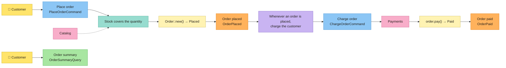

# Tutorial: una tienda, del tablero al código

## Post-it → código

| Post-it | Concepto | En Cerne |
|---|---|---|
| 🟦 | Command | trait `Command<CompositionRoot>`, que devuelve `Executed { output, events }` |
| 🟨 | Aggregate / Entity | atributos `#[entity]` y `#[aggregate]`, que escriben los traits `Entity` y `Aggregate`; las invariantes van en el trait `Validate` |
| — | Value Object | trait `ValueObject`, que también es el tipo del id de toda entidad; atributo `#[value_object]`, para un value object de un solo valor |
| 🟧 | Domain Event | trait `DomainEvent<CompositionRoot>`; el command lo guarda en el `EventOutbox` |
| 🟪 | Policy | `Policy` + `Policies`; el `SyncEventBus` o el `AsyncEventBus` las ejecuta |
| 🩷 | External System | un port (un trait asíncrono de la aplicación) y sus adapters, reunidos en el `CompositionRoot` |
| 🟩 | Read Model / Query | trait `Query<CompositionRoot>`, que devuelve un read model: un struct de campos simples |
| — | Invariantes | `Invariant` + `Invariants`: lo que siempre es cierto sobre una entidad o un value object |
| — | Reglas de negocio | `BusinessRule` + `BusinessRules`: lo que debe cumplirse para que un command se ejecute |

## Instalación

```bash
cargo install cerne-cli
```

Cerne necesita Rust 1.88 o más reciente.

## El tablero

El tablero tiene dos flujos. El cliente hace un pedido; la tienda comprueba el stock, y una policy cobra al cliente. Después, el cliente consulta el pedido.



Cada bloque de código de abajo es un archivo entero del proyecto. Un test de este repositorio ejecuta estos comandos, escribe estos archivos y corre `cargo test` sobre el resultado, así que el tutorial siempre compila. El código está en inglés, como lo genera Cerne.

## 1. El proyecto y sus post-its

Crea el proyecto `shop`.

```bash
cerne new shop
```

Entra en el proyecto: los comandos `cerne g` se ejecutan dentro de él.

```bash
cd shop
```

Crea el agregado 🟨 `Order`: un pedido, con el port de su repositorio y un estado que empieza en `Placed`. El campo `id` lo crea el CLI por su cuenta: un value object `OrderId`, con un `u64` dentro. Con `id:<tipo>` (por ejemplo, `id:String`), `OrderId` guarda un `String` en lugar del `u64`.

```bash
cerne g entity Order product:String quantity:u32 total:u64 status=Placed:Placed,Paid --aggregate
```

Crea el evento 🟧 `OrderPlaced`: se hizo el pedido.

```bash
cerne g event OrderPlaced order_id:OrderId total:u64
```

Crea el evento 🟧 `OrderPaid`: se pagó el pedido.

```bash
cerne g event OrderPaid order_id:OrderId
```

Crea el command 🟦 `PlaceOrder`: el cliente hace un pedido.

```bash
cerne g command PlaceOrder product:String quantity:u32
```

Crea el command 🟦 `ChargeOrder`: cobrar el pedido. Lo envía una policy, no un actor; para el CLI, es un command como cualquier otro.

```bash
cerne g command ChargeOrder order_id:OrderId total:u64
```

Crea el port 🩷 `Catalog`: el sistema externo con los precios y el stock.

```bash
cerne g port Catalog
```

Crea `InMemoryCatalog`: un catálogo en memoria, para los tests y para este tutorial.

```bash
cerne g adapter InMemoryCatalog Catalog
```

Crea el port 🩷 `Payments`: el sistema externo que cobra al cliente.

```bash
cerne g port Payments
```

Crea `InMemoryPayments`: un sistema de pagos en memoria, para los tests y para este tutorial.

```bash
cerne g adapter InMemoryPayments Payments
```

Crea el read model 🟩 `OrderSummary`: el resumen del pedido que ve el cliente.

```bash
cerne g read_model OrderSummary product:String quantity:u32 total:u64 status:String
```

Crea la query `OrderSummary`: busca ese resumen por el id del pedido.

```bash
cerne g query OrderSummary order_id:OrderId
```

Los campos son `nombre:tipo`, y `status=Placed:Placed,Paid` crea un enum con los valores `Placed` y `Paid`, que empieza en `Placed`. Después de cada comando, el proyecto sigue compilando. `--aggregate` también añade el campo `order_repository` al `CompositionRoot` y, en `main.rs`, una función `order_repository_adapter()` con un `todo!()`: Cerne no trae adapters, y el repositorio lo escribes tú.

```console
$ tree shop
shop
├── Cargo.toml
├── rustfmt.toml
├── src
│   ├── application
│   │   ├── commands
│   │   │   ├── charge_order.rs
│   │   │   ├── mod.rs
│   │   │   └── place_order.rs
│   │   ├── mod.rs
│   │   ├── ports
│   │   │   ├── catalog.rs
│   │   │   ├── mod.rs
│   │   │   └── payments.rs
│   │   ├── queries
│   │   │   ├── mod.rs
│   │   │   └── order_summary.rs
│   │   └── read_models
│   │       ├── mod.rs
│   │       └── order_summary.rs
│   ├── composition_root.rs
│   ├── domain
│   │   ├── entities
│   │   │   ├── mod.rs
│   │   │   └── order.rs
│   │   ├── events
│   │   │   ├── mod.rs
│   │   │   ├── order_paid.rs
│   │   │   └── order_placed.rs
│   │   ├── mod.rs
│   │   └── value_objects
│   │       ├── mod.rs
│   │       └── order_id.rs
│   ├── infrastructure
│   │   ├── in_memory_catalog.rs
│   │   ├── in_memory_payments.rs
│   │   └── mod.rs
│   ├── lib.rs
│   └── main.rs
└── tests
    └── board.rs
```

Cada capa tiene su carpeta. `domain/` es puro y síncrono: nada de IO. `application/` es asíncrono: commands, queries y los ports que usan. `infrastructure/` guarda los adapters, que escribes tú: aquí, todos en memoria.

Falta rellenar los post-its.

## 2. Value object: `OrderId`

Un value object no tiene identidad: dos `OrderId(7)` son la misma cosa. Solo existe si se cumplen sus invariantes, y nunca cambia. El id de toda entidad es un value object, así que un `0` nunca se convierte en id de pedido, ni siquiera al leerlo de vuelta del JSON.

El `src/domain/value_objects/order_id.rs` tal como lo generó `cerne g entity Order product:String quantity:u32 total:u64 status=Placed:Placed,Paid --aggregate`:

<!-- generated: src/domain/value_objects/order_id.rs -->
```rust
use cerne::domain::{EnforcementResult, Invariants, ValueObject, value_object};
use serde::{Deserialize, Serialize};

/// In JSON it is the `u64` itself, and reading it back goes through `new`: the invariants hold there too.
#[value_object]
#[derive(Debug, Clone, PartialEq, Serialize, Deserialize)]
pub struct OrderId(u64);

impl ValueObject for OrderId {
    type Constructor = u64;

    fn new(value: u64) -> EnforcementResult<Self> {
        Invariants::enforce([])?;

        Ok(Self(value))
    }
}
```

Después de rellenarlo:

<!-- file: src/domain/value_objects/order_id.rs -->
```rust
use cerne::domain::{EnforcementResult, Invariants, ValueObject, invariant, value_object};
use serde::{Deserialize, Serialize};

/// In JSON it is the `u64` itself, and reading it back goes through `new`: the invariants hold there too.
#[value_object]
#[derive(Debug, Clone, PartialEq, Serialize, Deserialize)]
pub struct OrderId(u64);

impl ValueObject for OrderId {
    type Constructor = u64;

    fn new(value: u64) -> EnforcementResult<Self> {
        let order_id_is_positive = value > 0;

        Invariants::enforce([invariant!("order id is positive", order_id_is_positive)])?;

        Ok(Self(value))
    }
}
```

Cada invariante es un nombre más una condición, escrita con `invariant!`. La condición va antes a una variable, con el nombre de la frase del tablero. `Invariants::enforce` las ejecuta todas y, si alguna falla, devuelve `DomainError::Violations` con el nombre de cada una que falló.

`#[value_object]` escribe lo que tiene en común un value object de un solo valor: `TryFrom<u64> for OrderId`, que pasa por `new`, `From<OrderId> for u64`, que devuelve el `u64`, y, como `OrderId` deriva `Serialize` y `Deserialize`, `#[serde(try_from = "u64", into = "u64")]`. `new`, con las invariantes, es tuyo. El repositorio del paso 4 usa el `TryFrom` para crear el id de un pedido nuevo.

## 3. Agregado: `Order` 🟨

El `src/domain/entities/order.rs` tal como lo generó `cerne g entity Order product:String quantity:u32 total:u64 status=Placed:Placed,Paid --aggregate`:

<!-- generated: src/domain/entities/order.rs -->
```rust
use crate::domain::value_objects::order_id::OrderId;
use cerne::domain::{EnforcementResult, Invariants, Validate, aggregate};

// --- Status ------------------------------------------------------------------

#[derive(Debug, Clone, Copy, Default, PartialEq)]
pub enum OrderStatus {
    #[default]
    Placed,
    Paid,
}

// --- Aggregate ---------------------------------------------------------------

#[aggregate]
#[derive(Debug, Clone, PartialEq)]
pub struct Order {
    pub id: Option<OrderId>,
    pub product: String,
    pub quantity: u32,
    pub total: u64,
    #[skip_constructor]
    pub status: OrderStatus,
}

// --- Invariants --------------------------------------------------------------

impl Validate for Order {
    fn validate(self) -> EnforcementResult<Self> {
        Invariants::enforce([])?;

        Ok(self)
    }
}

// --- State transitions -------------------------------------------------------

impl Order {}
```

Después de rellenarlo:

<!-- file: src/domain/entities/order.rs -->
```rust
use crate::domain::value_objects::order_id::OrderId;
use cerne::domain::{EnforcementResult, Invariants, Validate, aggregate, invariant};

// --- Status ------------------------------------------------------------------

#[derive(Debug, Clone, Copy, Default, PartialEq)]
pub enum OrderStatus {
    #[default]
    Placed,
    Paid,
}

// --- Aggregate ---------------------------------------------------------------

#[aggregate]
#[derive(Debug, Clone, PartialEq)]
pub struct Order {
    pub id: Option<OrderId>,
    pub product: String,
    pub quantity: u32,
    pub total: u64,
    #[skip_constructor]
    pub status: OrderStatus,
}

// --- Invariants --------------------------------------------------------------

impl Validate for Order {
    fn validate(self) -> EnforcementResult<Self> {
        let order_has_a_product = !self.product.is_empty();
        let quantity_is_positive = self.quantity > 0;

        Invariants::enforce([
            invariant!("order has a product", order_has_a_product),
            invariant!("quantity is positive", quantity_is_positive),
        ])?;

        Ok(self)
    }
}

// --- State transitions -------------------------------------------------------

impl Order {
    pub fn pay(self) -> EnforcementResult<Self> {
        Self {
            status: OrderStatus::Paid,
            ..self
        }
        .validate()
    }
}
```

- `#[aggregate]` escribe lo que todo agregado tiene en común: `impl Entity` (el `id()`, el `with_id` que llama el repositorio y `new`), `impl Aggregate` y el `OrderConstructor`. Una entidad que no es agregado (`cerne g entity` sin `--aggregate`) recibe `#[entity]`, que escribe lo mismo salvo `impl Aggregate`: ningún repositorio la acepta.
- `Order::new` recibe el `OrderConstructor`, con todos los campos menos dos: el id, que el repositorio decide en el primer `save` (hasta entonces, `id()` es `None`), y `status`, marcado con `#[skip_constructor]`. Un campo omitido empieza en su `Default`: `OrderStatus` deriva `Default`, con `#[default]` en `Placed`, el valor inicial de `status=Placed:Placed,Paid`.
- `validate`, en `impl Validate`, guarda las invariantes: el CLI lo genera vacío, para que lo completes. Se ejecuta en `new` y en cada transición de estado (`pay`): un pedido que rompe una invariante nunca existe en memoria.
- Las transiciones de estado son métodos que consumen el pedido y devuelven el siguiente.

## 4. Sistemas externos: ports y adapters 🩷

Un port es un trait asíncrono de la aplicación, y cada método devuelve `Result<_, cerne::Error>`. El command no sabe qué adapter hay detrás.

El `src/application/ports/catalog.rs` tal como lo generó `cerne g port Catalog`:

<!-- generated: src/application/ports/catalog.rs -->
```rust
use cerne::async_trait;

/// External system "Catalog": one async method per thing the commands ask of it, each returning
/// `Result<_, cerne::Error>`.
#[async_trait]
pub trait Catalog: Send + Sync {}
```

Después de rellenarlo:

<!-- file: src/application/ports/catalog.rs -->
```rust
use cerne::{Error, async_trait};

/// External system "Catalog": what the shop sells, at what price, and how much is left.
#[async_trait]
pub trait Catalog: Send + Sync {
    /// The price of one unit, in cents.
    async fn unit_price(&self, product: &str) -> Result<u64, Error>;

    async fn units_in_stock(&self, product: &str) -> Result<u32, Error>;
}
```

El `src/application/ports/payments.rs` tal como lo generó `cerne g port Payments`:

<!-- generated: src/application/ports/payments.rs -->
```rust
use cerne::async_trait;

/// External system "Payments": one async method per thing the commands ask of it, each returning
/// `Result<_, cerne::Error>`.
#[async_trait]
pub trait Payments: Send + Sync {}
```

Después de rellenarlo:

<!-- file: src/application/ports/payments.rs -->
```rust
use crate::domain::value_objects::order_id::OrderId;
use cerne::{Error, async_trait};

/// External system "Payments": charges the customer. The order id is the idempotency key: charging the same order
/// twice charges it once.
#[async_trait]
pub trait Payments: Send + Sync {
    async fn charge(&self, order_id: &OrderId, amount: u64) -> Result<(), Error>;
}
```

Los adapters en memoria hacen el papel de los sistemas reales en los tests y en este tutorial:

El `src/infrastructure/in_memory_catalog.rs` tal como lo generó `cerne g adapter InMemoryCatalog Catalog`:

<!-- generated: src/infrastructure/in_memory_catalog.rs -->
```rust
use crate::application::ports::catalog::Catalog;
use cerne::async_trait;

/// An adapter of the port `Catalog`.
pub struct InMemoryCatalog;

#[async_trait]
impl Catalog for InMemoryCatalog {}
```

Después de rellenarlo:

<!-- file: src/infrastructure/in_memory_catalog.rs -->
```rust
use crate::application::ports::catalog::Catalog;
use cerne::{ApplicationError, Error, async_trait};

/// A catalog with fixed products: (name, unit price in cents, units in stock).
pub struct InMemoryCatalog {
    pub products: Vec<(&'static str, u64, u32)>,
}

impl InMemoryCatalog {
    fn product(&self, product: &str) -> Result<(&'static str, u64, u32), Error> {
        let found = self.products.iter().find(|(name, _, _)| *name == product);

        Ok(*found.ok_or(ApplicationError::NotFound("product"))?)
    }
}

#[async_trait]
impl Catalog for InMemoryCatalog {
    async fn unit_price(&self, product: &str) -> Result<u64, Error> {
        let (_, unit_price, _) = self.product(product)?;

        Ok(unit_price)
    }

    async fn units_in_stock(&self, product: &str) -> Result<u32, Error> {
        let (_, _, units_in_stock) = self.product(product)?;

        Ok(units_in_stock)
    }
}
```

El `src/infrastructure/in_memory_payments.rs` tal como lo generó `cerne g adapter InMemoryPayments Payments`:

<!-- generated: src/infrastructure/in_memory_payments.rs -->
```rust
use crate::application::ports::payments::Payments;
use cerne::async_trait;

/// An adapter of the port `Payments`.
pub struct InMemoryPayments;

#[async_trait]
impl Payments for InMemoryPayments {}
```

Después de rellenarlo:

<!-- file: src/infrastructure/in_memory_payments.rs -->
```rust
use crate::application::ports::payments::Payments;
use crate::domain::value_objects::order_id::OrderId;
use cerne::{Error, async_trait};
use std::sync::Mutex;

/// Keeps every charge instead of calling a payment provider.
#[derive(Default)]
pub struct InMemoryPayments {
    pub charges: Mutex<Vec<(OrderId, u64)>>,
}

#[async_trait]
impl Payments for InMemoryPayments {
    async fn charge(&self, order_id: &OrderId, amount: u64) -> Result<(), Error> {
        let mut charges = self.charges.lock().unwrap();

        if !charges.iter().any(|(charged, _)| charged == order_id) {
            charges.push((order_id.clone(), amount));
        }

        Ok(())
    }
}
```

Dos ports son traits del propio Cerne: `Repository<Order>`, que carga y guarda el pedido, y `EventOutbox`, que guarda todo evento que produce un command. `cerne g adapter` solo escribe adapters de los ports del proyecto, así que estos dos se escriben a mano. En una aplicación real, están sobre la base de datos, y `begin` abre una transacción en ella; aquí, un `InMemoryDatabase` guarda los pedidos y los eventos, y cada clon suyo comparte los mismos datos.

<!-- file: src/infrastructure/in_memory_database.rs -->
```rust
use crate::domain::entities::order::Order;
use crate::domain::value_objects::order_id::OrderId;
use cerne::application::{EventOutbox, OutboxEntry, Repository};
use cerne::domain::Entity;
use cerne::{ApplicationError, Error, async_trait};
use std::sync::{Arc, Mutex};

/// What a database would hold, in memory: cloning it shares the same data. There is no transaction: a command that
/// fails halfway keeps what it already wrote.
#[derive(Clone, Default)]
pub struct InMemoryDatabase {
    pub orders: Arc<Mutex<Vec<Order>>>,
    pub event_outbox: Arc<Mutex<Vec<OutboxEntry>>>,
}

// --- Repository<Order> -------------------------------------------------------

pub struct InMemoryOrderRepository {
    database: InMemoryDatabase,
}

impl InMemoryOrderRepository {
    pub fn new(database: InMemoryDatabase) -> Self {
        Self { database }
    }
}

#[async_trait]
impl Repository<Order> for InMemoryOrderRepository {
    async fn load(&self, order_id: &OrderId) -> Result<Order, Error> {
        let orders = self.database.orders.lock().unwrap();
        let order = orders.iter().find(|order| order.id() == Some(order_id));

        Ok(order.cloned().ok_or(ApplicationError::NotFound("order"))?)
    }

    async fn save(&self, order: Order) -> Result<OrderId, Error> {
        let mut orders = self.database.orders.lock().unwrap();

        let order_id = match order.id() {
            Some(order_id) => order_id.clone(),
            None => OrderId::try_from(orders.len() as u64 + 1)?,
        };

        orders.retain(|saved_order| saved_order.id() != Some(&order_id));
        orders.push(order.with_id(order_id.clone()));

        Ok(order_id)
    }
}

// --- EventOutbox -------------------------------------------------------------

pub struct InMemoryEventOutbox {
    database: InMemoryDatabase,
}

impl InMemoryEventOutbox {
    pub fn new(database: InMemoryDatabase) -> Self {
        Self { database }
    }
}

#[async_trait]
impl EventOutbox for InMemoryEventOutbox {
    async fn store(&self, outbox_entry: OutboxEntry) -> Result<(), Error> {
        self.database.event_outbox.lock().unwrap().push(outbox_entry);

        Ok(())
    }
}
```

El `src/infrastructure/mod.rs` tal como lo generaron `cerne g adapter InMemoryCatalog Catalog` y `cerne g adapter InMemoryPayments Payments`:

<!-- generated: src/infrastructure/mod.rs -->
```rust
pub mod in_memory_catalog;
pub mod in_memory_payments;
```

Después de rellenarlo:

<!-- file: src/infrastructure/mod.rs -->
```rust
pub mod in_memory_catalog;
pub mod in_memory_database;
pub mod in_memory_payments;
```

El `CompositionRoot` reúne todos los ports, y `CompositionRoot::new` solo guarda los adapters que recibe: quien los construye es `main.rs`. `cerne g entity --aggregate` ya añadió el `order_repository`; la base de datos y los dos sistemas externos se añaden a mano.

`begin` y `commit` también son tuyos: `cerne new` los escribe con un `todo!()`, porque solo los adapters saben abrir una transacción. `begin` construye un `CompositionRoot` nuevo, cuyo repositorio y cuyo event outbox escriben en la transacción. Los sistemas externos siguen siendo los mismos, un `Arc::clone` de los mismos adapters, porque una llamada a ellos no se puede deshacer. En memoria no hay transacción: `begin` construye los adapters de nuevo sobre el mismo `InMemoryDatabase`, y `commit` no tiene nada que hacer.

El `src/composition_root.rs` tal como lo generaron `cerne new shop` y `cerne g entity Order product:String quantity:u32 total:u64 status=Placed:Placed,Paid --aggregate`:

<!-- generated: src/composition_root.rs -->
```rust
use crate::domain::entities::order::Order;
use cerne::Error;
use cerne::application::{EventOutbox, Repository};

/// The composition root: every port the commands and queries can use.
pub struct CompositionRoot {
    pub order_repository: Box<dyn Repository<Order>>,
    pub event_outbox: Box<dyn EventOutbox>,
}

/// What `CompositionRoot::new` takes: every adapter, already built.
pub struct CompositionRootConstructor {
    pub order_repository: Box<dyn Repository<Order>>,
    pub event_outbox: Box<dyn EventOutbox>,
}

impl CompositionRoot {
    pub fn new(constructor: CompositionRootConstructor) -> Self {
        Self {
            order_repository: constructor.order_repository,
            event_outbox: constructor.event_outbox,
        }
    }

    /// A composition root whose repositories and event outbox write in one new transaction. External systems are not
    /// part of it: the new composition root gets the same adapters.
    pub async fn begin(&self) -> Result<CompositionRoot, Error> {
        todo!("open a transaction on your adapters and build a CompositionRoot on it")
    }

    /// Makes every write of the transaction permanent; dropping it without `commit` rolls them back.
    pub async fn commit(self) -> Result<(), Error> {
        todo!("commit the transaction of your adapters")
    }
}
```

Después de rellenarlo:

<!-- file: src/composition_root.rs -->
```rust
use crate::application::ports::catalog::Catalog;
use crate::application::ports::payments::Payments;
use crate::domain::entities::order::Order;
use crate::infrastructure::in_memory_database::{InMemoryDatabase, InMemoryEventOutbox, InMemoryOrderRepository};
use cerne::Error;
use cerne::application::{EventOutbox, Repository};
use std::sync::Arc;

/// The composition root: every port the commands and queries can use.
pub struct CompositionRoot {
    pub database: InMemoryDatabase,
    pub order_repository: Box<dyn Repository<Order>>,
    pub event_outbox: Box<dyn EventOutbox>,
    pub catalog: Arc<dyn Catalog>,
    pub payments: Arc<dyn Payments>,
}

/// What `CompositionRoot::new` takes: every adapter, already built.
pub struct CompositionRootConstructor {
    pub database: InMemoryDatabase,
    pub order_repository: Box<dyn Repository<Order>>,
    pub event_outbox: Box<dyn EventOutbox>,
    pub catalog: Arc<dyn Catalog>,
    pub payments: Arc<dyn Payments>,
}

impl CompositionRoot {
    pub fn new(constructor: CompositionRootConstructor) -> Self {
        Self {
            database: constructor.database,
            order_repository: constructor.order_repository,
            event_outbox: constructor.event_outbox,
            catalog: constructor.catalog,
            payments: constructor.payments,
        }
    }

    /// In memory there is no transaction: the repository and the event outbox are built again on the same data.
    pub async fn begin(&self) -> Result<CompositionRoot, Error> {
        let transaction = self.database.clone();

        let order_repository = InMemoryOrderRepository::new(transaction.clone());
        let event_outbox = InMemoryEventOutbox::new(transaction.clone());

        let composition_root_constructor = CompositionRootConstructor {
            database: transaction,
            order_repository: Box::new(order_repository),
            event_outbox: Box::new(event_outbox),
            catalog: Arc::clone(&self.catalog),
            payments: Arc::clone(&self.payments),
        };

        Ok(CompositionRoot::new(composition_root_constructor))
    }

    /// Nothing to make permanent: every write is already in memory.
    pub async fn commit(self) -> Result<(), Error> {
        Ok(())
    }
}
```

## 5. Command: `PlaceOrderCommand` 🟦

El command es un struct con lo que envía el actor, y nada más: sin id, porque quien decide el id es el repositorio. El `execute` sigue el tablero de izquierda a derecha, una sección por post-it:

El `src/application/commands/place_order.rs` tal como lo generó `cerne g command PlaceOrder product:String quantity:u32`:

<!-- generated: src/application/commands/place_order.rs -->
```rust
use crate::composition_root::CompositionRoot;
use cerne::application::{Command, Executed};
use cerne::{Error, async_trait};

/// Who sends it: an actor, or a policy?
pub struct PlaceOrderCommand {
    pub product: String,
    pub quantity: u32,
}

#[async_trait]
impl Command<CompositionRoot> for PlaceOrderCommand {
    type Output = ();

    async fn execute(&self, composition_root: &CompositionRoot) -> Result<Executed<(), CompositionRoot>, Error> {
        // --- Transaction -----------------------------------------------------

        let transaction = composition_root.begin().await?;

        // --- Ports -----------------------------------------------------------

        // --- Business rules --------------------------------------------------

        // --- Aggregate -------------------------------------------------------

        // --- Domain events ---------------------------------------------------

        transaction.commit().await?;

        Ok(Executed {
            output: (),
            events: vec![],
        })
    }
}
```

Después de rellenarlo:

<!-- file: src/application/commands/place_order.rs -->
```rust
use crate::composition_root::CompositionRoot;
use crate::domain::entities::order::{Order, OrderConstructor};
use crate::domain::events::order_placed::OrderPlaced;
use crate::domain::value_objects::order_id::OrderId;
use cerne::application::{Command, Executed, OutboxEntry};
use cerne::domain::{BusinessRules, Entity, business_rule};
use cerne::{Error, async_trait};

/// Actor: the customer.
pub struct PlaceOrderCommand {
    pub product: String,
    pub quantity: u32,
}

#[async_trait]
impl Command<CompositionRoot> for PlaceOrderCommand {
    type Output = OrderId; // the id of the new order, for the customer to follow it

    async fn execute(&self, composition_root: &CompositionRoot) -> Result<Executed<OrderId, CompositionRoot>, Error> {
        // --- Transaction -----------------------------------------------------

        let transaction = composition_root.begin().await?;

        // --- Ports -----------------------------------------------------------

        let unit_price = transaction.catalog.unit_price(&self.product).await?;
        let units_in_stock = transaction.catalog.units_in_stock(&self.product).await?;

        // --- Business rules --------------------------------------------------

        let stock_covers_the_quantity = units_in_stock >= self.quantity;

        BusinessRules::check([business_rule!("stock covers the quantity", stock_covers_the_quantity)])?;

        // --- Aggregate -------------------------------------------------------

        let total = unit_price * u64::from(self.quantity);

        let order = Order::new(OrderConstructor {
            product: self.product.clone(),
            quantity: self.quantity,
            total,
        })?;

        let order_id = transaction.order_repository.save(order).await?;

        // --- Domain events ---------------------------------------------------

        let order_placed = OrderPlaced {
            order_id: order_id.clone(),
            total,
        };

        transaction.event_outbox.store(OutboxEntry::new(&order_placed)?).await?;
        transaction.commit().await?;

        Ok(Executed {
            output: order_id,
            events: vec![Box::new(order_placed)],
        })
    }
}
```

- **Transaction:** `composition_root.begin()` la abre, y todo port de aquí en adelante se lee de `transaction`.
- **Ports:** toda lectura que necesita el command, antes de cualquier decisión.
- **Business rules:** cada condición en una variable, después `BusinessRules::check([business_rule!(..)])?`. Una regla de negocio necesita el mundo de fuera (aquí, el stock); una invariante solo necesita la propia entidad.
- **Aggregate:** el cambio, después el `save`, que devuelve el id.
- **Domain events:** cada evento en una variable, guardado en el event outbox con `OutboxEntry::new`, en la misma transacción que el pedido: se guardan los dos, o ninguno. Después el `commit` y `Ok(Executed { output, events })`. El `output` vuelve a quien envió el command (aquí, el id del pedido nuevo), y los `events` también, que ese llamador publica en el event bus (paso 6).

## 6. Evento de dominio y policy: `OrderPlaced` 🟧 🟪

Un evento dice lo que pasó, en pasado. Deriva `Serialize` para que el command lo guarde en el event outbox, y `Deserialize` para leerlo de vuelta de allí. Su `trigger_policies` lista las policies que reaccionan a él: cada una es un `policy!` con tres argumentos: un nombre, una condición (`true` en una policy que siempre se dispara) y el command que dispara. El command solo se construye si se cumple la condición, y lleva los valores que usa: aquí, `order_id` y `total`, leídos del evento antes. `Policies::trigger` devuelve las policies que se dispararon.

El `src/domain/events/order_placed.rs` tal como lo generó `cerne g event OrderPlaced order_id:OrderId total:u64`:

<!-- generated: src/domain/events/order_placed.rs -->
```rust
use crate::composition_root::CompositionRoot;
use crate::domain::value_objects::order_id::OrderId;
use cerne::domain::{DomainEvent, EnforcementResult, FiredPolicy, Policies};
use serde::{Deserialize, Serialize};

/// `Serialize`: the command that produces it stores it in the event outbox; `Deserialize`, to read it back from there.
#[derive(Serialize, Deserialize)]
pub struct OrderPlaced {
    pub order_id: OrderId,
    pub total: u64,
}

impl DomainEvent<CompositionRoot> for OrderPlaced {
    fn trigger_policies(&self) -> EnforcementResult<Vec<FiredPolicy<CompositionRoot>>> {
        // --- Policies --------------------------------------------------------

        Ok(Policies::trigger([]))
    }
}
```

Después de rellenarlo:

<!-- file: src/domain/events/order_placed.rs -->
```rust
use crate::application::commands::charge_order::ChargeOrderCommand;
use crate::composition_root::CompositionRoot;
use crate::domain::value_objects::order_id::OrderId;
use cerne::domain::{DomainEvent, EnforcementResult, FiredPolicy, Policies, policy};
use serde::{Deserialize, Serialize};

/// `Serialize`: the command that produces it stores it in the event outbox; `Deserialize`, to read it back from there.
#[derive(Serialize, Deserialize)]
pub struct OrderPlaced {
    pub order_id: OrderId,
    pub total: u64,
}

impl DomainEvent<CompositionRoot> for OrderPlaced {
    fn trigger_policies(&self) -> EnforcementResult<Vec<FiredPolicy<CompositionRoot>>> {
        // --- Policies --------------------------------------------------------

        let order_id = self.order_id.clone();
        let total = self.total;

        let charge_the_customer_policy =
            policy!("whenever an order is placed, charge the customer", true, ChargeOrderCommand { order_id, total });

        Ok(Policies::trigger([charge_the_customer_policy]))
    }
}
```

La policy no ejecuta el command: lo ejecuta el event bus. Quien envió el `PlaceOrderCommand` publica sus eventos con `sync_event_bus.publish(events)`, y, para cada evento, el bus llama a `trigger_policies`, ejecuta el command de cada policy que se disparó y publica los eventos que devuelve ese command, hasta que termina la cadena. El bus no abre transacciones: cada command abre la suya. El command solo devuelve sus eventos: nunca los publica.

| | `SyncEventBus` | `AsyncEventBus` |
|---|---|---|
| Orden | una cadena a la vez: el siguiente `publish` espera a que termine la cadena actual | cada evento empieza en cuanto llega |
| `publish` | vuelve, después del `.await`, cuando se ejecutó toda la cadena | vuelve enseguida, sin `.await`: los eventos ya empezaron |
| Hilos | una cadena, así que un core a la vez | cada evento en su propia task de Tokio, en todos los cores |

Los dos funcionan sobre Tokio, por eso `main` se ejecuta en `#[tokio::main]` y los tests en `#[tokio::test]`. El `AsyncEventBus` solo usa todos los cores en el runtime multi-thread, el predeterminado de `#[tokio::main]`; `#[tokio::test]` se ejecuta en un solo hilo.

El bus espera lo mejor. Un command que falla, o un evento cuyas invariantes fallan, va al `on_error` con que se construyó el bus, y el bus sigue: nada se ejecuta de nuevo, y nada marca el evento. Cómo sobrevive cada policy a un fallo lo decides tú. Piensa en una policy que envía un e-mail por una API de notificaciones: si la API está caída, el command falla, y el e-mail se pierde, a menos que hagas algo. Puedes leer de nuevo la tabla `event_outbox` y publicar lo que quedó atrás, o dejar que el propio command lo intente de nuevo; entonces la API puede recibir el mismo e-mail dos veces, a menos que acepte una clave de idempotencia. Cerne guarda todo evento en el outbox; leerlo de vuelta es cosa tuya.

`OrderPaid` queda como lo generó `cerne g event`: ninguna policy reacciona a él todavía.

## 7. El command que dispara una policy: `ChargeOrderCommand` 🟦

El `src/application/commands/charge_order.rs` tal como lo generó `cerne g command ChargeOrder order_id:OrderId total:u64`:

<!-- generated: src/application/commands/charge_order.rs -->
```rust
use crate::composition_root::CompositionRoot;
use crate::domain::value_objects::order_id::OrderId;
use cerne::application::{Command, Executed};
use cerne::{Error, async_trait};

/// Who sends it: an actor, or a policy?
pub struct ChargeOrderCommand {
    pub order_id: OrderId,
    pub total: u64,
}

#[async_trait]
impl Command<CompositionRoot> for ChargeOrderCommand {
    type Output = ();

    async fn execute(&self, composition_root: &CompositionRoot) -> Result<Executed<(), CompositionRoot>, Error> {
        // --- Transaction -----------------------------------------------------

        let transaction = composition_root.begin().await?;

        // --- Ports -----------------------------------------------------------

        // --- Business rules --------------------------------------------------

        // --- Aggregate -------------------------------------------------------

        // --- Domain events ---------------------------------------------------

        transaction.commit().await?;

        Ok(Executed {
            output: (),
            events: vec![],
        })
    }
}
```

Después de rellenarlo:

<!-- file: src/application/commands/charge_order.rs -->
```rust
use crate::composition_root::CompositionRoot;
use crate::domain::entities::order::OrderStatus;
use crate::domain::events::order_paid::OrderPaid;
use crate::domain::value_objects::order_id::OrderId;
use cerne::application::{Command, Executed, OutboxEntry};
use cerne::domain::{BusinessRules, business_rule};
use cerne::{Error, async_trait};

/// No actor: the policy "whenever an order is placed, charge the customer" fires it.
pub struct ChargeOrderCommand {
    pub order_id: OrderId,
    pub total: u64,
}

#[async_trait]
impl Command<CompositionRoot> for ChargeOrderCommand {
    type Output = ();

    async fn execute(&self, composition_root: &CompositionRoot) -> Result<Executed<(), CompositionRoot>, Error> {
        // --- Transaction -----------------------------------------------------

        let transaction = composition_root.begin().await?;

        // --- Ports -----------------------------------------------------------

        let order = transaction.order_repository.load(&self.order_id).await?;

        // --- Business rules --------------------------------------------------

        let order_is_still_placed = order.status == OrderStatus::Placed;

        BusinessRules::check([business_rule!("order is still placed", order_is_still_placed)])?;

        // --- External system: Payments ---------------------------------------

        transaction.payments.charge(&self.order_id, self.total).await?;

        // --- Aggregate -------------------------------------------------------

        let paid_order = order.pay()?;

        transaction.order_repository.save(paid_order).await?;

        // --- Domain events ---------------------------------------------------

        let order_paid = OrderPaid {
            order_id: self.order_id.clone(),
        };

        transaction.event_outbox.store(OutboxEntry::new(&order_paid)?).await?;
        transaction.commit().await?;

        Ok(Executed {
            output: (),
            events: vec![Box::new(order_paid)],
        })
    }
}
```

Si el cobro falla, el error va al `on_error` del bus, y el pedido sigue `Placed`. Cobrarlo de nuevo lo decide la aplicación, y aquí es seguro: el id del pedido es la clave de idempotencia del pago, y la regla "order is still placed" rechaza un pedido que ya se pagó. La sección `External system: Payments` está entre las reglas y el agregado.

## 8. Query y read model: `OrderSummary` 🟩

El read model es lo que el actor ve en la pantalla: campos simples, sin comportamiento. `cerne g read_model` lo generó, y se queda como está. La query lee los ports y lo construye; no cambia nada, así que no abre transacción:

El `src/application/queries/order_summary.rs` tal como lo generó `cerne g query OrderSummary order_id:OrderId`:

<!-- generated: src/application/queries/order_summary.rs -->
```rust
use crate::application::read_models::order_summary::OrderSummary;
use crate::composition_root::CompositionRoot;
use crate::domain::value_objects::order_id::OrderId;
use cerne::application::Query;
use cerne::{Error, async_trait};

pub struct OrderSummaryQuery {
    pub order_id: OrderId,
}

#[async_trait]
impl Query<CompositionRoot> for OrderSummaryQuery {
    type ReadModel = OrderSummary;

    async fn execute(&self, _ports: &CompositionRoot) -> Result<OrderSummary, Error> {
        // --- Ports -----------------------------------------------------------

        // --- Read model ------------------------------------------------------

        todo!("read the ports and build the OrderSummary read model")
    }
}
```

Después de rellenarlo:

<!-- file: src/application/queries/order_summary.rs -->
```rust
use crate::application::read_models::order_summary::OrderSummary;
use crate::composition_root::CompositionRoot;
use crate::domain::value_objects::order_id::OrderId;
use cerne::application::Query;
use cerne::{Error, async_trait};

pub struct OrderSummaryQuery {
    pub order_id: OrderId,
}

#[async_trait]
impl Query<CompositionRoot> for OrderSummaryQuery {
    type ReadModel = OrderSummary;

    async fn execute(&self, composition_root: &CompositionRoot) -> Result<OrderSummary, Error> {
        // --- Ports -----------------------------------------------------------

        let order = composition_root
            .order_repository
            .load(&self.order_id)
            .await?;

        // --- Read model ------------------------------------------------------

        let order_summary = OrderSummary {
            product: order.product,
            quantity: order.quantity,
            total: order.total,
            status: format!("{:?}", order.status),
        };

        Ok(order_summary)
    }
}
```

## 9. El tablero como test

`tests/board.rs` tiene un bloque por flujo, sobre los mismos adapters en memoria que `main.rs`.

El `tests/board.rs` tal como lo generó `cerne new shop`:

<!-- generated: tests/board.rs -->
```rust
//! One block per flow of the board: an actor sends a command, and the test checks its events and the policies that fired.
```

Después de rellenarlo:

<!-- file: tests/board.rs -->
```rust
//! One block per flow of the board: an actor sends a command, and the test checks its events and the policies that fired.

use cerne::Error;
use cerne::application::{Command, Query, SyncEventBus};
use cerne::domain::{DomainError, ValueObject};
use shop::application::commands::place_order::PlaceOrderCommand;
use shop::application::queries::order_summary::OrderSummaryQuery;
use shop::application::read_models::order_summary::OrderSummary;
use shop::composition_root::{CompositionRoot, CompositionRootConstructor};
use shop::domain::value_objects::order_id::OrderId;
use shop::infrastructure::in_memory_catalog::InMemoryCatalog;
use shop::infrastructure::in_memory_database::{InMemoryDatabase, InMemoryEventOutbox, InMemoryOrderRepository};
use shop::infrastructure::in_memory_payments::InMemoryPayments;
use std::sync::Arc;

fn composition_root(payments: Arc<InMemoryPayments>) -> Arc<CompositionRoot> {
    let database = InMemoryDatabase::default();

    let order_repository = InMemoryOrderRepository::new(database.clone());
    let event_outbox = InMemoryEventOutbox::new(database.clone());

    let catalog = InMemoryCatalog {
        products: vec![("mug", 3000, 10)],
    };

    let composition_root_constructor = CompositionRootConstructor {
        database,
        order_repository: Box::new(order_repository),
        event_outbox: Box::new(event_outbox),
        catalog: Arc::new(catalog),
        payments,
    };

    Arc::new(CompositionRoot::new(composition_root_constructor))
}

#[tokio::test]
async fn the_customer_places_an_order_and_the_policy_charges_it() -> anyhow::Result<()> {
    let payments = Arc::new(InMemoryPayments::default());
    let composition_root = composition_root(Arc::clone(&payments));

    let sync_event_bus = SyncEventBus::new(Arc::clone(&composition_root), |error| eprintln!("policy: {error}"));

    // --- Customer: places an order -------------------------------------------

    let place_order = PlaceOrderCommand {
        product: "mug".into(),
        quantity: 2,
    };

    let place_order_execution = place_order.execute(&composition_root).await?;

    let order_id = place_order_execution.output;

    sync_event_bus.publish(place_order_execution.events).await;

    // --- Policy: whenever an order is placed, charge the customer -----------

    assert_eq!(*payments.charges.lock().unwrap(), vec![(order_id.clone(), 6000)]);

    let stored_events: Vec<String> = composition_root
        .database
        .event_outbox
        .lock()
        .unwrap()
        .iter()
        .map(|outbox_entry| outbox_entry.event.clone())
        .collect();

    assert_eq!(stored_events, ["order_placed", "order_paid"]);

    // --- Customer: reads the order -------------------------------------------

    let order_summary_query = OrderSummaryQuery { order_id };

    let order_summary = order_summary_query.execute(&composition_root).await?;

    let paid_order_summary = OrderSummary {
        product: "mug".into(),
        quantity: 2,
        total: 6000,
        status: "Paid".into(),
    };

    assert_eq!(order_summary, paid_order_summary);

    Ok(())
}

#[tokio::test]
async fn the_domain_refuses_what_breaks_a_rule_or_an_invariant() -> anyhow::Result<()> {
    let composition_root = composition_root(Arc::default());

    // --- Business rule: stock covers the quantity ----------------------------

    let too_many_mugs = PlaceOrderCommand {
        product: "mug".into(),
        quantity: 11,
    };

    let refused = too_many_mugs.execute(&composition_root).await;

    assert!(matches!(
        refused,
        Err(Error::Domain(DomainError::Violations(violations))) if violations == ["stock covers the quantity"]
    ));

    // --- Invariant: quantity is positive -------------------------------------

    let no_mugs = PlaceOrderCommand {
        product: "mug".into(),
        quantity: 0,
    };

    let refused = no_mugs.execute(&composition_root).await;

    assert!(matches!(
        refused,
        Err(Error::Domain(DomainError::Violations(violations))) if violations == ["quantity is positive"]
    ));

    // --- Value object: order id is positive ----------------------------------

    assert!(OrderId::new(0).is_err());

    Ok(())
}
```

El test hace lo que hace un actor: ejecuta el command, guarda el `output` y publica los `events` en el `SyncEventBus`. `publish(..).await` vuelve cuando se ejecutó toda la cadena, así que el cobro ya está ahí en la línea siguiente.

```bash
cargo test
```

## 10. La aplicación: `main.rs`

`main.rs` construye todos los adapters, el composition root y el event bus, y después tiene un bloque por actor. `cerne new` escribe una función con un `todo!()` para cada adapter que falta; en el archivo completo, dejan su lugar a los adapters en memoria.

El `src/main.rs` tal como lo generaron `cerne new shop` y `cerne g entity Order product:String quantity:u32 total:u64 status=Placed:Placed,Paid --aggregate`:

<!-- generated: src/main.rs -->
```rust
use cerne::application::{EventOutbox, Repository, SyncEventBus};
use shop::composition_root::{CompositionRoot, CompositionRootConstructor};
use shop::domain::entities::order::Order;
use std::sync::Arc;

#[tokio::main]
async fn main() -> anyhow::Result<()> {
    // --- Composition root ----------------------------------------------------

    let order_repository = order_repository_adapter();
    let event_outbox = event_outbox_adapter();

    let composition_root_constructor = CompositionRootConstructor {
        order_repository,
        event_outbox,
    };

    let composition_root = Arc::new(CompositionRoot::new(composition_root_constructor));

    // --- Event bus: the policies of every event ------------------------------

    #[expect(unused_variables, reason = "the blocks of the actors publish their events on it")]
    let sync_event_bus = SyncEventBus::new(composition_root, |error| eprintln!("policy: {error}"));

    // One block per actor: execute the command, then publish its events with
    // `sync_event_bus.publish(execution.events).await;`.

    Ok(())
}

/// No adapter of EventOutbox yet: write one in `infrastructure/` and build it here.
fn event_outbox_adapter() -> Box<dyn EventOutbox> {
    todo!("an adapter of EventOutbox")
}

/// No adapter of Repository<Order> yet: write one in `infrastructure/` and build it here.
fn order_repository_adapter() -> Box<dyn Repository<Order>> {
    todo!("an adapter of Repository<Order>")
}
```

Después de rellenarlo:

<!-- file: src/main.rs -->
```rust
use cerne::application::{Command, Query, SyncEventBus};
use shop::application::commands::place_order::PlaceOrderCommand;
use shop::application::queries::order_summary::OrderSummaryQuery;
use shop::composition_root::{CompositionRoot, CompositionRootConstructor};
use shop::infrastructure::in_memory_catalog::InMemoryCatalog;
use shop::infrastructure::in_memory_database::{InMemoryDatabase, InMemoryEventOutbox, InMemoryOrderRepository};
use shop::infrastructure::in_memory_payments::InMemoryPayments;
use std::sync::Arc;

#[tokio::main]
async fn main() -> anyhow::Result<()> {
    // --- Composition root ----------------------------------------------------

    let database = InMemoryDatabase::default();

    let order_repository = InMemoryOrderRepository::new(database.clone());
    let event_outbox = InMemoryEventOutbox::new(database.clone());

    let catalog = InMemoryCatalog {
        products: vec![("mug", 3000, 10), ("t-shirt", 5000, 3)],
    };
    let payments = InMemoryPayments::default();

    let composition_root_constructor = CompositionRootConstructor {
        database,
        order_repository: Box::new(order_repository),
        event_outbox: Box::new(event_outbox),
        catalog: Arc::new(catalog),
        payments: Arc::new(payments),
    };

    let composition_root = Arc::new(CompositionRoot::new(composition_root_constructor));

    // --- Event bus: the policies of every event ------------------------------

    let sync_event_bus = SyncEventBus::new(Arc::clone(&composition_root), |error| eprintln!("policy: {error}"));

    // --- Customer: places an order -------------------------------------------

    let place_order = PlaceOrderCommand {
        product: "mug".into(),
        quantity: 2,
    };

    let place_order_execution = place_order.execute(&composition_root).await?;

    let order_id = place_order_execution.output;

    sync_event_bus.publish(place_order_execution.events).await;

    // --- Customer: reads the order -------------------------------------------

    let order_summary_query = OrderSummaryQuery { order_id };

    let order_summary = order_summary_query.execute(&composition_root).await?;

    println!("{order_summary:?}");

    Ok(())
}
```

```bash
cargo run
```

```console
$ cargo run
OrderSummary { product: "mug", quantity: 2, total: 6000, status: "Paid" }
```

El pedido ya está `Paid`: el `SyncEventBus` ejecutó el `ChargeOrderCommand` antes de que volviera `publish(..).await`. Un servidor web, un consumidor de cola o un CLI ocuparían el lugar de estos bloques: cada uno ejecuta el command y publica sus eventos, de la misma forma.

## 11. Cuando algo sale mal

Todo error es un `cerne::Error`, en una de tres categorías. Un adapter de HTTP (o de cualquier otra cosa) mira la categoría para decidir su respuesta:

| Error | Cuándo |
|---|---|
| `DomainError::Violations` | falló una invariante o una regla de negocio; trae todos los nombres que fallaron, como están escritos en el tablero |
| `ApplicationError::NotFound` | el repositorio (o un adapter) no encontró nada |
| `InfrastructureError` | base de datos, red, cola |

En el test del paso 9, `PlaceOrderCommand { product: "mug".into(), quantity: 11 }` vuelve como `DomainError::Violations(["stock covers the quantity"])`.

## Otras opciones

- **Una base de datos real:** escribe sobre ella un adapter de `Repository<Order>` y de `EventOutbox` (con `sqlx`, `diesel` o cualquier otro), y un `begin` que abre una transacción y los construye sobre ella. La tabla `event_outbox` es tuya: leerla de vuelta para publicar lo que quedó atrás es cómo una policy sobrevive a una caída.
- **HTTP, una cola, un CLI:** cada petición ejecuta un bloque de actor de `main.rs`: ejecuta el command, responde con su `output` y publica sus `events`.
- **Event bus asíncrono:** `AsyncEventBus::new(..)` en lugar del `SyncEventBus`: cada evento empieza en su propia task en cuanto llega, y `async_event_bus.publish(..)` vuelve sin esperar la cadena.

## CLI

```
cerne new <name>
cerne g entity <Name> [field:type ...] [field:Value1,Value2 ...] [field=Initial:Value1,Value2 ...] [id:type] [--aggregate]
cerne g value_object <Name> field:type [field:type ...]
cerne g event <Name> [field:type ...]
cerne g command <Name> [field:type ...]
cerne g read_model <Name> [field:type ...]
cerne g query <Name> [field:type ...]
cerne g port <Name>
cerne g adapter <Name> <Port>
```
