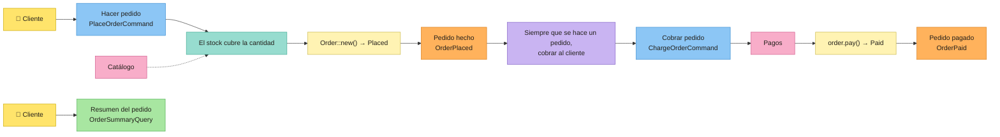

# Tutorial: una tienda, del tablero al código

## Post-it → código

| Post-it | Concepto | En Cerne |
|---|---|---|
| 🟦 | Command | trait `Command<Ports>`, que devuelve `Executed { output, events }` |
| 🟨 | Aggregate / Entity | traits `Entity` y `Aggregate` |
| — | Value Object | trait `ValueObject`, que también es el tipo del id de toda entidad |
| 🟧 | Domain Event | trait `DomainEvent<Ports>` |
| 🟪 | Policy | `Policy` + `Policies`; sus commands van a la `Outbox`, y el `OutboxPolicyProcessor` los ejecuta |
| 🩷 | External System | un port (un trait asíncrono de la aplicación) y sus adapters, reunidos en el composition root `Ports` |
| 🟩 | Read Model / Query | trait `Query<Ports>`, que devuelve un `ReadModel` |
| — | Invariantes | `Invariant` + `Invariants`: lo que siempre es cierto sobre una entidad o un value object |
| — | Reglas de negocio | `BusinessRule` + `BusinessRules`: lo que debe cumplirse para que un command se ejecute |
| — | Base de datos | `cerne::sqlite` (también en memoria) y `cerne::postgres`: la misma API, el mismo SQL |
| — | HTTP | feature `axum`: REST o JSON-RPC 2.0 |

## Instalación

```bash
cargo install cerne-cli
```

Cerne necesita Rust 1.88 o más reciente.

## El tablero

El tablero tiene dos flujos. El cliente hace un pedido; la tienda comprueba el stock, y una policy cobra al cliente. Después, el cliente consulta el pedido.



Cada bloque de código de abajo es un archivo entero del proyecto. Un test de este repositorio ejecuta estos comandos, escribe estos archivos y corre `cargo test` sobre el resultado, así que el tutorial siempre compila. El código está en inglés, como lo genera Cerne.

## 1. El proyecto y sus post-its

Crea el proyecto `shop`, con SQLite como base de datos y una API REST.

```bash
cerne new shop --db sqlite --http rest
```

Entra en el proyecto: los comandos `cerne g` se ejecutan dentro de él.

```bash
cd shop
```

Crea el agregado 🟨 `Order`: Un pedido, con su repositorio SQL (el proyecto tiene base de datos, por el `--db sqlite`) y un estado que empieza en `Placed`. El campo `id` lo crea el CLI por su cuenta: un value object `OrderId`, con un `u64` dentro. Con `id:<tipo>` (por ejemplo, `id:String`), `OrderId` guarda un `String` en lugar del `u64`. Como `Order` es un agregado, su repositorio solo acepta un id entero o `String`.

```bash
cerne g entity Order product:String quantity:u32 total:u64 status=Placed:Placed,Paid --aggregate
```

Crea el evento 🟧 `OrderPlaced`: se hizo el pedido.

```bash
cerne g event OrderPlaced order_id:OrderId total:u64
```

Crea el evento 🟧 `OrderPaid`: se pagó el pedido.

```bash
cerne g event OrderPaid order_id:OrderId
```

Crea el command 🟦 `PlaceOrder`: el cliente hace un pedido.

```bash
cerne g command PlaceOrder product:String quantity:u32
```

Crea el command 🟦 `ChargeOrder`: cobrar el pedido, disparado por una policy y no por un actor.

```bash
cerne g command ChargeOrder order_id:OrderId total:u64 --policy
```

Crea el port 🩷 `Catalog`: el sistema externo con los precios y el stock.

```bash
cerne g port Catalog
```

Crea `InMemoryCatalog`: un catálogo en memoria, para los tests y para este tutorial.

```bash
cerne g adapter InMemoryCatalog Catalog
```

Crea el port 🩷 `Payments`: el sistema externo que cobra al cliente.

```bash
cerne g port Payments
```

Crea `InMemoryPayments`: un sistema de pagos en memoria, para los tests y para este tutorial.

```bash
cerne g adapter InMemoryPayments Payments
```

Crea el read model 🟩 `OrderSummary`: el resumen del pedido que ve el cliente.

```bash
cerne g read_model OrderSummary product:String quantity:u32 total:u64 status:String
```

Crea la query `OrderSummary`: busca ese resumen por el id del pedido.

```bash
cerne g query OrderSummary order_id:OrderId
```

Conecta `PlaceOrder` a la ruta `POST /orders`.

```bash
cerne g endpoint PlaceOrder POST /orders
```

Conecta `OrderSummary` a la ruta `GET /orders`.

```bash
cerne g endpoint OrderSummary GET /orders
```

Los campos son `nombre:tipo`, y `status=Placed:Placed,Paid` crea un enum con los valores `Placed` y `Paid`, que empieza en `Placed`. Después de cada comando, el proyecto sigue compilando. `--aggregate` también añade el campo `orders` a los `Ports`, y `--policy` registra el command en la outbox.

```console
$ tree shop
shop
├── Cargo.toml
├── migrations
│   ├── 1791416037_create_orders.sql
│   └── 1_create_cerne_outbox.sql
├── src
│   ├── application
│   │   ├── commands
│   │   │   ├── charge_order.rs
│   │   │   ├── mod.rs
│   │   │   └── place_order.rs
│   │   ├── mod.rs
│   │   ├── ports
│   │   │   ├── catalog.rs
│   │   │   ├── mod.rs
│   │   │   └── payments.rs
│   │   ├── queries
│   │   │   ├── mod.rs
│   │   │   └── order_summary.rs
│   │   └── read_models
│   │       ├── mod.rs
│   │       └── order_summary.rs
│   ├── domain
│   │   ├── entities
│   │   │   ├── mod.rs
│   │   │   └── order.rs
│   │   ├── events
│   │   │   ├── mod.rs
│   │   │   ├── order_paid.rs
│   │   │   └── order_placed.rs
│   │   ├── mod.rs
│   │   └── value_objects
│   │       ├── mod.rs
│   │       └── order_id.rs
│   ├── infrastructure
│   │   ├── http
│   │   │   ├── mod.rs
│   │   │   ├── order_summary.rs
│   │   │   └── place_order.rs
│   │   ├── in_memory_catalog.rs
│   │   ├── in_memory_payments.rs
│   │   ├── mod.rs
│   │   └── sqlite_order_repository.rs
│   ├── lib.rs
│   ├── main.rs
│   └── ports.rs
└── tests
    └── board.rs
```

Cada capa tiene su carpeta. `domain/` es puro y síncrono: nada de IO. `application/` es asíncrono: commands, queries y los ports que usan. `infrastructure/` guarda los adapters: el repositorio SQL, los adapters en memoria y HTTP. El número delante de la migración es el momento en que se generó.

Falta rellenar los post-its.

## 2. Value object: `OrderId`

Un value object no tiene identidad: dos `OrderId(7)` son lo mismo. Solo existe si sus invariantes se cumplen, y nunca cambia. El id de toda entidad es un value object, así que un `0` nunca se convierte en id de pedido, ni siquiera al leerlo de vuelta de un JSON o de la base de datos.

El `src/domain/value_objects/order_id.rs` tal como lo generó `cerne g entity Order product:String quantity:u32 total:u64 status=Placed:Placed,Paid --aggregate`:

<!-- generated: src/domain/value_objects/order_id.rs -->
```rust
use cerne::domain::{DomainError, EnforcementResult, Invariants, ValueObject};
use serde::{Deserialize, Serialize};

/// In JSON it is the `u64` itself, and reading it back goes through `new`: the invariants hold there too.
#[derive(Debug, Clone, PartialEq, Serialize, Deserialize)]
#[serde(try_from = "u64", into = "u64")]
pub struct OrderId(u64);

impl ValueObject for OrderId {
    type Props = u64;

    fn new(value: u64) -> EnforcementResult<Self> {
        Invariants::new(vec![]).enforce()?;

        Ok(Self(value))
    }
}

impl TryFrom<u64> for OrderId {
    type Error = DomainError;

    fn try_from(value: u64) -> EnforcementResult<Self> {
        Self::new(value)
    }
}

impl From<OrderId> for u64 {
    fn from(value: OrderId) -> u64 {
        value.0
    }
}
```

Después de rellenarlo:

<!-- file: src/domain/value_objects/order_id.rs -->
```rust
use cerne::domain::{DomainError, EnforcementResult, Invariant, Invariants, ValueObject};
use serde::{Deserialize, Serialize};

/// In JSON it is the `u64` itself, and reading it back goes through `new`: the invariants hold there too.
#[derive(Debug, Clone, PartialEq, Serialize, Deserialize)]
#[serde(try_from = "u64", into = "u64")]
pub struct OrderId(u64);

impl ValueObject for OrderId {
    type Props = u64;

    fn new(value: u64) -> EnforcementResult<Self> {
        let order_id_is_positive = value > 0;

        Invariants::new(vec![Invariant::new("order id is positive", move || {
            order_id_is_positive
        })])
        .enforce()?;

        Ok(Self(value))
    }
}

impl TryFrom<u64> for OrderId {
    type Error = DomainError;

    fn try_from(value: u64) -> EnforcementResult<Self> {
        Self::new(value)
    }
}

impl From<OrderId> for u64 {
    fn from(value: OrderId) -> u64 {
        value.0
    }
}
```

Cada invariante es un nombre más una closure. La condición va a una variable antes de la closure, con el nombre de la frase del tablero. `enforce` las ejecuta todas y, si alguna falla, devuelve `DomainError::Violations` con el nombre de cada una que falló.

## 3. Agregado: `Order` 🟨

El `src/domain/entities/order.rs` tal como lo generó `cerne g entity Order product:String quantity:u32 total:u64 status=Placed:Placed,Paid --aggregate`:

<!-- generated: src/domain/entities/order.rs -->
```rust
use crate::domain::value_objects::order_id::OrderId;
use cerne::domain::{Aggregate, EnforcementResult, Entity, Invariants};

// --- Status ------------------------------------------------------------------

#[derive(Debug, Clone, Copy, PartialEq)]
pub enum OrderStatus {
    Placed,
    Paid,
}

// --- Aggregate ---------------------------------------------------------------

#[derive(Debug, Clone, PartialEq)]
pub struct Order {
    pub id: Option<OrderId>,
    pub product: String,
    pub quantity: u32,
    pub total: u64,
    pub status: OrderStatus,
}

/// What a new `Order` is made of. There is no id: the repository decides it on the first `save`.
pub struct OrderProps {
    pub product: String,
    pub quantity: u32,
    pub total: u64,
}

impl Aggregate for Order {}

// --- Entity: identity and invariants -----------------------------------------

impl Entity for Order {
    type Id = OrderId;
    type Props = OrderProps;

    fn id(&self) -> Option<&OrderId> {
        self.id.as_ref()
    }

    fn with_id(self, id: OrderId) -> Self {
        Self {
            id: Some(id),
            ..self
        }
    }

    fn new(props: OrderProps) -> EnforcementResult<Self> {
        Self {
            id: None,
            product: props.product,
            quantity: props.quantity,
            total: props.total,
            status: OrderStatus::Placed,
        }
        .validate()
    }

    fn validate(self) -> EnforcementResult<Self> {
        Invariants::new(vec![]).enforce()?;

        Ok(self)
    }
}

// --- State transitions -------------------------------------------------------

impl Order {}
```

Después de rellenarlo:

<!-- file: src/domain/entities/order.rs -->
```rust
use crate::domain::value_objects::order_id::OrderId;
use cerne::domain::{Aggregate, EnforcementResult, Entity, Invariant, Invariants};

// --- Status ------------------------------------------------------------------

#[derive(Debug, Clone, Copy, PartialEq)]
pub enum OrderStatus {
    Placed,
    Paid,
}

// --- Aggregate ---------------------------------------------------------------

#[derive(Debug, Clone, PartialEq)]
pub struct Order {
    pub id: Option<OrderId>,
    pub product: String,
    pub quantity: u32,
    pub total: u64,
    pub status: OrderStatus,
}

/// What a new `Order` is made of. There is no id: the repository decides it on the first `save`.
pub struct OrderProps {
    pub product: String,
    pub quantity: u32,
    pub total: u64,
}

impl Aggregate for Order {}

// --- Entity: identity and invariants -----------------------------------------

impl Entity for Order {
    type Id = OrderId;
    type Props = OrderProps;

    fn id(&self) -> Option<&OrderId> {
        self.id.as_ref()
    }

    fn with_id(self, id: OrderId) -> Self {
        Self {
            id: Some(id),
            ..self
        }
    }

    fn new(props: OrderProps) -> EnforcementResult<Self> {
        Self {
            id: None,
            product: props.product,
            quantity: props.quantity,
            total: props.total,
            status: OrderStatus::Placed,
        }
        .validate()
    }

    fn validate(self) -> EnforcementResult<Self> {
        let order_has_a_product = !self.product.is_empty();
        let quantity_is_positive = self.quantity > 0;

        Invariants::new(vec![
            Invariant::new("order has a product", move || order_has_a_product),
            Invariant::new("quantity is positive", move || quantity_is_positive),
        ])
        .enforce()?;

        Ok(self)
    }
}

// --- State transitions -------------------------------------------------------

impl Order {
    pub fn pay(self) -> EnforcementResult<Self> {
        Self {
            status: OrderStatus::Paid,
            ..self
        }
        .validate()
    }
}
```

- `Order::new` recibe las `OrderProps`, sin id: el repositorio decide el id en el primer `save`. Hasta entonces, `id()` es `None`.
- `validate` guarda las invariantes. Se ejecuta en `new`, en cada transición de estado (`pay`) y cuando el repositorio lee una fila de vuelta: un pedido que rompe una invariante nunca existe en memoria.
- Las transiciones de estado son métodos que consumen el pedido y devuelven el siguiente.

## 4. Sistemas externos: ports y adapters 🩷

Un port es un trait asíncrono de la aplicación, y cada método devuelve `Result<_, cerne::Error>`. El command no sabe qué adapter hay detrás.

El `src/application/ports/catalog.rs` tal como lo generó `cerne g port Catalog`:

<!-- generated: src/application/ports/catalog.rs -->
```rust
use cerne::async_trait;

/// External system "Catalog": one async method per thing the commands ask of it, each returning
/// `Result<_, cerne::Error>`.
#[async_trait]
pub trait Catalog: Send + Sync {}
```

Después de rellenarlo:

<!-- file: src/application/ports/catalog.rs -->
```rust
use cerne::{Error, async_trait};

/// External system "Catalog": what the shop sells, at what price, and how much is left.
#[async_trait]
pub trait Catalog: Send + Sync {
    /// The price of one unit, in cents.
    async fn unit_price(&self, product: &str) -> Result<u64, Error>;

    async fn units_in_stock(&self, product: &str) -> Result<u32, Error>;
}
```

El `src/application/ports/payments.rs` tal como lo generó `cerne g port Payments`:

<!-- generated: src/application/ports/payments.rs -->
```rust
use cerne::async_trait;

/// External system "Payments": one async method per thing the commands ask of it, each returning
/// `Result<_, cerne::Error>`.
#[async_trait]
pub trait Payments: Send + Sync {}
```

Después de rellenarlo:

<!-- file: src/application/ports/payments.rs -->
```rust
use crate::domain::value_objects::order_id::OrderId;
use cerne::{Error, async_trait};

/// External system "Payments": charges the customer. The order id is the idempotency key: charging the same order
/// twice charges it once.
#[async_trait]
pub trait Payments: Send + Sync {
    async fn charge(&self, order_id: &OrderId, amount: u64) -> Result<(), Error>;
}
```

Los adapters en memoria hacen el papel de los sistemas reales en los tests y en este tutorial:

El `src/infrastructure/in_memory_catalog.rs` tal como lo generó `cerne g adapter InMemoryCatalog Catalog`:

<!-- generated: src/infrastructure/in_memory_catalog.rs -->
```rust
use crate::application::ports::catalog::Catalog;
use cerne::async_trait;

/// An adapter of the port `Catalog`.
pub struct InMemoryCatalog;

#[async_trait]
impl Catalog for InMemoryCatalog {}
```

Después de rellenarlo:

<!-- file: src/infrastructure/in_memory_catalog.rs -->
```rust
use crate::application::ports::catalog::Catalog;
use cerne::{ApplicationError, Error, async_trait};

/// A catalog with fixed products: (name, unit price in cents, units in stock).
pub struct InMemoryCatalog {
    pub products: Vec<(&'static str, u64, u32)>,
}

impl InMemoryCatalog {
    fn product(&self, product: &str) -> Result<(&'static str, u64, u32), Error> {
        let found = self.products.iter().find(|(name, _, _)| *name == product);

        Ok(*found.ok_or(ApplicationError::NotFound("product"))?)
    }
}

#[async_trait]
impl Catalog for InMemoryCatalog {
    async fn unit_price(&self, product: &str) -> Result<u64, Error> {
        let (_, unit_price, _) = self.product(product)?;

        Ok(unit_price)
    }

    async fn units_in_stock(&self, product: &str) -> Result<u32, Error> {
        let (_, _, units_in_stock) = self.product(product)?;

        Ok(units_in_stock)
    }
}
```

El `src/infrastructure/in_memory_payments.rs` tal como lo generó `cerne g adapter InMemoryPayments Payments`:

<!-- generated: src/infrastructure/in_memory_payments.rs -->
```rust
use crate::application::ports::payments::Payments;
use cerne::async_trait;

/// An adapter of the port `Payments`.
pub struct InMemoryPayments;

#[async_trait]
impl Payments for InMemoryPayments {}
```

Después de rellenarlo:

<!-- file: src/infrastructure/in_memory_payments.rs -->
```rust
use crate::application::ports::payments::Payments;
use crate::domain::value_objects::order_id::OrderId;
use cerne::{Error, async_trait};
use std::sync::Mutex;

/// Keeps every charge instead of calling a payment provider.
#[derive(Default)]
pub struct InMemoryPayments {
    pub charges: Mutex<Vec<(OrderId, u64)>>,
}

#[async_trait]
impl Payments for InMemoryPayments {
    async fn charge(&self, order_id: &OrderId, amount: u64) -> Result<(), Error> {
        let mut charges = self.charges.lock().unwrap();

        if !charges.iter().any(|(charged, _)| charged == order_id) {
            charges.push((order_id.clone(), amount));
        }

        Ok(())
    }
}
```

Los `Ports` reúnen todos los ports. `cerne g entity --aggregate` ya añadió el repositorio `orders`; los dos sistemas externos se añaden a mano. El repositorio y la outbox viven en la base de datos, así que `begin` abre una transacción y se los entrega a los nuevos `Ports`. Los sistemas externos siguen siendo los mismos, porque una llamada a ellos no se puede deshacer.

El `src/ports.rs` tal como lo generaron `cerne new shop --db sqlite --http rest`, `cerne g entity Order product:String quantity:u32 total:u64 status=Placed:Placed,Paid --aggregate` y `cerne g command ChargeOrder order_id:OrderId total:u64 --policy`:

<!-- generated: src/ports.rs -->
```rust
use crate::application::commands::charge_order::ChargeOrderCommand;
use crate::domain::entities::order::Order;
use crate::infrastructure::sqlite_order_repository::SqliteOrderRepository;
use cerne::application::{CommandRegistry, Outbox, Repository, TransactionalPorts};
use cerne::sqlite::{SqliteDatabase, SqliteOutbox};
use cerne::{Error, async_trait};

/// The composition root: every port the commands and queries can use.
///
/// The repositories and the outbox live in the database, so they follow its transaction. External systems do not:
/// `begin` hands the same adapters to the new ports.
pub struct Ports {
    pub database: SqliteDatabase,
    pub orders: Box<dyn Repository<Order>>,
    pub outbox: Box<dyn Outbox<Ports>>,
}

impl Ports {
    pub fn new(database: SqliteDatabase) -> Self {
        Self {
            orders: Box::new(SqliteOrderRepository::new(database.clone())),
            outbox: Box::new(SqliteOutbox::new(database.clone())),
            database,
        }
    }
}

/// Every command a policy fires, so the outbox can read it back from its row.
pub fn command_registry() -> CommandRegistry<Ports> {
    CommandRegistry::new().register::<ChargeOrderCommand>()
}

#[async_trait]
impl TransactionalPorts for Ports {
    async fn begin(&self) -> Result<Self, Error> {
        let transaction = self.database.begin().await?;

        Ok(Ports::new(transaction))
    }

    async fn commit(self) -> Result<(), Error> {
        self.database.commit().await
    }

    fn outbox(&self) -> &dyn Outbox<Self> {
        self.outbox.as_ref()
    }
}
```

Después de rellenarlo:

<!-- file: src/ports.rs -->
```rust
use crate::application::commands::charge_order::ChargeOrderCommand;
use crate::application::ports::catalog::Catalog;
use crate::application::ports::payments::Payments;
use crate::domain::entities::order::Order;
use crate::infrastructure::sqlite_order_repository::SqliteOrderRepository;
use cerne::application::{CommandRegistry, Outbox, Repository, TransactionalPorts};
use cerne::sqlite::{SqliteDatabase, SqliteOutbox};
use cerne::{Error, async_trait};
use std::sync::Arc;

/// The composition root: every port the commands and queries can use.
///
/// The repositories and the outbox live in the database, so they follow its transaction. External systems do not:
/// `begin` hands the same adapters to the new ports.
pub struct Ports {
    pub database: SqliteDatabase,
    pub orders: Box<dyn Repository<Order>>,
    pub outbox: Box<dyn Outbox<Ports>>,
    pub catalog: Arc<dyn Catalog>,
    pub payments: Arc<dyn Payments>,
}

impl Ports {
    pub fn new(
        database: SqliteDatabase,
        catalog: Arc<dyn Catalog>,
        payments: Arc<dyn Payments>,
    ) -> Self {
        Self {
            orders: Box::new(SqliteOrderRepository::new(database.clone())),
            outbox: Box::new(SqliteOutbox::new(database.clone())),
            database,
            catalog,
            payments,
        }
    }
}

/// Every command a policy fires, so the outbox can read it back from its row.
pub fn command_registry() -> CommandRegistry<Ports> {
    CommandRegistry::new().register::<ChargeOrderCommand>()
}

#[async_trait]
impl TransactionalPorts for Ports {
    async fn begin(&self) -> Result<Self, Error> {
        let transaction = self.database.begin().await?;

        let catalog = Arc::clone(&self.catalog);
        let payments = Arc::clone(&self.payments);

        Ok(Ports::new(transaction, catalog, payments))
    }

    async fn commit(self) -> Result<(), Error> {
        self.database.commit().await
    }

    fn outbox(&self) -> &dyn Outbox<Self> {
        self.outbox.as_ref()
    }
}
```

## 5. Command: `PlaceOrderCommand` 🟦

El command es un struct con lo que envía el actor, y nada más: sin id, porque quien decide el id es el repositorio. El `execute` sigue el tablero de izquierda a derecha, una sección por post-it:

El `src/application/commands/place_order.rs` tal como lo generó `cerne g command PlaceOrder product:String quantity:u32`:

<!-- generated: src/application/commands/place_order.rs -->
```rust
use crate::ports::Ports;
use cerne::application::{Command, Executed};
use cerne::{Error, async_trait};
use serde::{Deserialize, Serialize};

/// Actor: who sends it? The body of the request is this command (that is why it is `Deserialize`).
///
/// In JSON-RPC, the params can come by position, in the order of these fields: that order is part of the API.
#[derive(Serialize, Deserialize)]
pub struct PlaceOrderCommand {
    pub product: String,
    pub quantity: u32,
}

#[async_trait]
impl Command<Ports> for PlaceOrderCommand {
    type Output = ();

    async fn execute(&self, _ports: &Ports) -> Result<Executed<(), Ports>, Error> {
        // --- Ports -----------------------------------------------------------

        // --- Business rules --------------------------------------------------

        // --- Aggregate -------------------------------------------------------

        // --- Domain events ---------------------------------------------------

        Ok(Executed {
            output: (),
            events: vec![],
        })
    }
}
```

Después de rellenarlo:

<!-- file: src/application/commands/place_order.rs -->
```rust
use crate::domain::entities::order::{Order, OrderProps};
use crate::domain::events::order_placed::OrderPlaced;
use crate::domain::value_objects::order_id::OrderId;
use crate::ports::Ports;
use cerne::application::{Command, Executed};
use cerne::domain::{BusinessRule, BusinessRules, Entity};
use cerne::{Error, async_trait};
use serde::{Deserialize, Serialize};

/// Actor: the customer. The body of `POST /orders` is this command (that is why it is `Deserialize`).
#[derive(Serialize, Deserialize)]
pub struct PlaceOrderCommand {
    pub product: String,
    pub quantity: u32,
}

#[async_trait]
impl Command<Ports> for PlaceOrderCommand {
    type Output = OrderId; // the id of the new order, for the customer to follow it

    async fn execute(&self, ports: &Ports) -> Result<Executed<OrderId, Ports>, Error> {
        // --- Ports -----------------------------------------------------------

        let unit_price = ports.catalog.unit_price(&self.product).await?;
        let units_in_stock = ports.catalog.units_in_stock(&self.product).await?;

        // --- Business rules --------------------------------------------------

        let stock_covers_the_quantity = units_in_stock >= self.quantity;

        BusinessRules::new(vec![BusinessRule::new(
            "stock covers the quantity",
            move || stock_covers_the_quantity,
        )])
        .check()?;

        // --- Aggregate -------------------------------------------------------

        let total = unit_price * u64::from(self.quantity);

        let order = Order::new(OrderProps {
            product: self.product.clone(),
            quantity: self.quantity,
            total,
        })?;

        let order_id = ports.orders.save(order).await?;

        // --- Domain events ---------------------------------------------------

        let order_placed = OrderPlaced {
            order_id: order_id.clone(),
            total,
        };

        Ok(Executed {
            output: order_id,
            events: vec![Box::new(order_placed)],
        })
    }
}
```

- **Ports:** toda lectura que necesita el command, antes de cualquier decisión.
- **Business rules:** cada condición en una variable, después `BusinessRules::new(..).check()?`. Una regla de negocio necesita el mundo de fuera (aquí, el stock); una invariante solo necesita la propia entidad.
- **Aggregate:** el cambio, después el `save`, que devuelve el id.
- **Domain events:** cada evento en una variable, después `Ok(Executed { output, events })`. El `output` vuelve a quien envió el command (aquí, el id del pedido nuevo); los `events` van a la outbox.

## 6. Evento de dominio y policy: `OrderPlaced` 🟧 🟪

Un evento dice lo que ocurrió, en pasado. Su `trigger_policies` enumera las policies que reaccionan a él: cada una tiene un nombre, una condición (`when`) y el command que dispara (`then`).

El `src/domain/events/order_placed.rs` tal como lo generó `cerne g event OrderPlaced order_id:OrderId total:u64`:

<!-- generated: src/domain/events/order_placed.rs -->
```rust
use crate::domain::value_objects::order_id::OrderId;
use crate::ports::Ports;
use cerne::domain::{DomainEvent, EnforcementResult, FiredPolicy, Policies};

pub struct OrderPlaced {
    pub order_id: OrderId,
    pub total: u64,
}

impl DomainEvent<Ports> for OrderPlaced {
    fn trigger_policies(&self) -> EnforcementResult<Vec<FiredPolicy<Ports>>> {
        // --- Policies --------------------------------------------------------

        Ok(Policies::new(vec![]).trigger())
    }
}
```

Después de rellenarlo:

<!-- file: src/domain/events/order_placed.rs -->
```rust
use crate::application::commands::charge_order::ChargeOrderCommand;
use crate::domain::value_objects::order_id::OrderId;
use crate::ports::Ports;
use cerne::domain::{DomainEvent, EnforcementResult, FiredPolicy, Policies, Policy};

pub struct OrderPlaced {
    pub order_id: OrderId,
    pub total: u64,
}

impl DomainEvent<Ports> for OrderPlaced {
    fn trigger_policies(&self) -> EnforcementResult<Vec<FiredPolicy<Ports>>> {
        // --- Policies --------------------------------------------------------

        let order_id = self.order_id.clone();
        let total = self.total;

        let charge_the_customer_policy = Policy::new(
            "whenever an order is placed, charge the customer",
            || true,
            move || {
                Box::new(ChargeOrderCommand {
                    order_id: order_id.clone(),
                    total,
                })
            },
        );

        Ok(Policies::new(vec![charge_the_customer_policy]).trigger())
    }
}
```

La policy no ejecuta el command. `execute_in_transaction` (paso 9) guarda el pedido y escribe el `ChargeOrderCommand` en la tabla `cerne_outbox` en la misma transacción: se guardan los dos, o ninguno. Después, el `OutboxPolicyProcessor` lee la tabla y ejecuta cada command en una transacción propia.

`OrderPaid` queda como lo generó `cerne g event`: ninguna policy reacciona a él todavía.

## 7. El command que dispara una policy: `ChargeOrderCommand` 🟦

El `src/application/commands/charge_order.rs` tal como lo generó `cerne g command ChargeOrder order_id:OrderId total:u64 --policy`:

<!-- generated: src/application/commands/charge_order.rs -->
```rust
use crate::domain::value_objects::order_id::OrderId;
use crate::ports::Ports;
use cerne::application::{Command, Executed};
use cerne::{Error, async_trait};
use serde::{Deserialize, Serialize};

/// No actor: a policy fires this command, and the outbox stores it (that is why it is `Serialize`).
#[derive(Serialize, Deserialize)]
pub struct ChargeOrderCommand {
    pub order_id: OrderId,
    pub total: u64,
}

#[async_trait]
impl Command<Ports> for ChargeOrderCommand {
    type Output = ();

    async fn execute(&self, _ports: &Ports) -> Result<Executed<(), Ports>, Error> {
        // --- Ports -----------------------------------------------------------

        // --- Business rules --------------------------------------------------

        // --- Aggregate -------------------------------------------------------

        // --- Domain events ---------------------------------------------------

        Ok(Executed {
            output: (),
            events: vec![],
        })
    }
}
```

Después de rellenarlo:

<!-- file: src/application/commands/charge_order.rs -->
```rust
use crate::domain::entities::order::OrderStatus;
use crate::domain::events::order_paid::OrderPaid;
use crate::domain::value_objects::order_id::OrderId;
use crate::ports::Ports;
use cerne::application::{Command, Executed};
use cerne::domain::{BusinessRule, BusinessRules};
use cerne::{Error, async_trait};
use serde::{Deserialize, Serialize};

/// No actor: a policy fires this command, and the outbox stores it (that is why it is `Serialize`).
#[derive(Serialize, Deserialize)]
pub struct ChargeOrderCommand {
    pub order_id: OrderId,
    pub total: u64,
}

#[async_trait]
impl Command<Ports> for ChargeOrderCommand {
    type Output = ();

    async fn execute(&self, ports: &Ports) -> Result<Executed<(), Ports>, Error> {
        // --- Ports -----------------------------------------------------------

        let order = ports.orders.load(&self.order_id).await?;

        // --- Business rules --------------------------------------------------

        let order_is_still_placed = order.status == OrderStatus::Placed;

        BusinessRules::new(vec![BusinessRule::new(
            "order is still placed",
            move || order_is_still_placed,
        )])
        .check()?;

        // --- External system: Payments ---------------------------------------

        ports.payments.charge(&self.order_id, self.total).await?;

        // --- Aggregate -------------------------------------------------------

        let paid_order = order.pay()?;

        ports.orders.save(paid_order).await?;

        // --- Domain events ---------------------------------------------------

        let order_paid = OrderPaid {
            order_id: self.order_id.clone(),
        };

        Ok(Executed {
            output: (),
            events: vec![Box::new(order_paid)],
        })
    }
}
```

Si el proceso se cae después del cobro y antes del commit, la outbox ejecuta el command otra vez. Por eso un command disparado por una policy tiene que ser idempotente: aquí, el id del pedido es la clave de idempotencia del pago, y la regla "order is still placed" rechaza un pedido que ya se pagó. La sección `External system: Payments` va entre las reglas y el agregado.

## 8. Query y read model: `OrderSummary` 🟩

El read model es lo que el actor ve en la pantalla: campos simples, sin comportamiento. `cerne g read_model` lo generó, y queda como está. La query lee los ports y lo construye:

El `src/application/queries/order_summary.rs` tal como lo generó `cerne g query OrderSummary order_id:OrderId`:

<!-- generated: src/application/queries/order_summary.rs -->
```rust
use crate::application::read_models::order_summary::OrderSummary;
use crate::domain::value_objects::order_id::OrderId;
use crate::ports::Ports;
use cerne::application::Query;
use cerne::{Error, async_trait};
use serde::Deserialize;

#[derive(Deserialize)]
pub struct OrderSummaryQuery {
    pub order_id: OrderId,
}

#[async_trait]
impl Query<Ports> for OrderSummaryQuery {
    type ReadModel = OrderSummary;

    async fn execute(&self, _ports: &Ports) -> Result<OrderSummary, Error> {
        // --- Ports -----------------------------------------------------------

        // --- Read model ------------------------------------------------------

        todo!("read the ports and build the OrderSummary read model")
    }
}
```

Después de rellenarlo:

<!-- file: src/application/queries/order_summary.rs -->
```rust
use crate::application::read_models::order_summary::OrderSummary;
use crate::domain::value_objects::order_id::OrderId;
use crate::ports::Ports;
use cerne::application::Query;
use cerne::{Error, async_trait};
use serde::Deserialize;

#[derive(Deserialize)]
pub struct OrderSummaryQuery {
    pub order_id: OrderId,
}

#[async_trait]
impl Query<Ports> for OrderSummaryQuery {
    type ReadModel = OrderSummary;

    async fn execute(&self, ports: &Ports) -> Result<OrderSummary, Error> {
        // --- Ports -----------------------------------------------------------

        let order = ports.orders.load(&self.order_id).await?;

        // --- Read model ------------------------------------------------------

        let order_summary = OrderSummary {
            product: order.product,
            quantity: order.quantity,
            total: order.total,
            status: format!("{:?}", order.status),
        };

        Ok(order_summary)
    }
}
```

## 9. El tablero como test

`tests/board.rs` tiene un bloque por flujo. La base de datos es un SQLite en memoria, con el mismo adapter SQL de producción; un repositorio nunca es un `Vec`.

El `tests/board.rs` tal como lo generó `cerne new shop --db sqlite --http rest`:

<!-- generated: tests/board.rs -->
```rust
//! One block per flow of the board: an actor sends a command, and the test checks its events and the policies that fired.
```

Después de rellenarlo:

<!-- file: tests/board.rs -->
```rust
//! One block per flow of the board: an actor sends a command, and the test checks its events and the policies that fired.

use cerne::Error;
use cerne::application::{OutboxPolicyProcessor, Query, TransactionalPorts};
use cerne::domain::{DomainError, ValueObject};
use cerne::sqlite::SqliteDatabase;
use shop::application::commands::place_order::PlaceOrderCommand;
use shop::application::queries::order_summary::OrderSummaryQuery;
use shop::application::read_models::order_summary::OrderSummary;
use shop::domain::value_objects::order_id::OrderId;
use shop::infrastructure::in_memory_catalog::InMemoryCatalog;
use shop::infrastructure::in_memory_payments::InMemoryPayments;
use shop::ports::{Ports, command_registry};
use std::sync::Arc;

async fn ports(payments: Arc<InMemoryPayments>) -> Result<Arc<Ports>, Error> {
    let database = SqliteDatabase::in_memory().await?;

    database.migrate(&sqlx::migrate!()).await?;

    let catalog = Arc::new(InMemoryCatalog {
        products: vec![("mug", 3000, 10)],
    });

    Ok(Arc::new(Ports::new(database, catalog, payments)))
}

#[tokio::test]
async fn the_customer_places_an_order_and_the_policy_charges_it() -> Result<(), Error> {
    let payments = Arc::new(InMemoryPayments::default());
    let ports = ports(Arc::clone(&payments)).await?;

    let outbox_policy_processor =
        OutboxPolicyProcessor::new(Arc::clone(&ports), command_registry());

    // --- Customer: places an order -------------------------------------------

    let place_order = PlaceOrderCommand {
        product: "mug".into(),
        quantity: 2,
    };

    let order_id = ports.execute_in_transaction(place_order).await?;

    // --- Policy: whenever an order is placed, charge the customer -----------

    let command_runs = outbox_policy_processor.run_pending().await?;

    assert_eq!(command_runs.len(), 1);
    assert_eq!(
        *payments.charges.lock().unwrap(),
        vec![(order_id.clone(), 6000)]
    );

    // --- Customer: reads the order -------------------------------------------

    let order_summary_query = OrderSummaryQuery { order_id };

    let order_summary = order_summary_query.execute(&ports).await?;

    let paid_order_summary = OrderSummary {
        product: "mug".into(),
        quantity: 2,
        total: 6000,
        status: "Paid".into(),
    };

    assert_eq!(order_summary, paid_order_summary);

    Ok(())
}

#[tokio::test]
async fn the_domain_refuses_what_breaks_a_rule_or_an_invariant() -> Result<(), Error> {
    let ports = ports(Arc::default()).await?;

    // --- Business rule: stock covers the quantity ----------------------------

    let too_many_mugs = PlaceOrderCommand {
        product: "mug".into(),
        quantity: 11,
    };

    let refused = ports.execute_in_transaction(too_many_mugs).await;

    assert!(matches!(
        refused,
        Err(Error::Domain(DomainError::Violations(violations))) if violations == ["stock covers the quantity"]
    ));

    // --- Invariant: quantity is positive -------------------------------------

    let no_mugs = PlaceOrderCommand {
        product: "mug".into(),
        quantity: 0,
    };

    let refused = ports.execute_in_transaction(no_mugs).await;

    assert!(matches!(
        refused,
        Err(Error::Domain(DomainError::Violations(violations))) if violations == ["quantity is positive"]
    ));

    // --- Value object: order id is positive ----------------------------------

    assert!(OrderId::new(0).is_err());

    Ok(())
}
```

`execute_in_transaction` abre la transacción, ejecuta el command, escribe en la outbox los commands de sus policies y hace el commit. Después, `run_pending` ejecuta lo que hay en la outbox.

```bash
cargo test
```

## 10. HTTP

`cerne new --http rest` generó el router, y cada `cerne g endpoint` añadió una ruta: el cuerpo de `POST /orders` es el `PlaceOrderCommand`, y la query string de `GET /orders` es la `OrderSummaryQuery`. En `main.rs`, solo los dos adapters se añaden a mano:

El `src/main.rs` tal como lo generó `cerne new shop --db sqlite --http rest`:

<!-- generated: src/main.rs -->
```rust
use cerne::application::OutboxPolicyProcessor;
use cerne::sqlite::SqliteDatabase;
use shop::infrastructure::http::router;
use shop::ports::{Ports, command_registry};
use std::sync::Arc;
use std::time::Duration;

#[tokio::main]
async fn main() -> anyhow::Result<()> {
    // --- Composition root ----------------------------------------------------

    let database_url = std::env::var("DATABASE_URL").unwrap_or("sqlite://shop.db?mode=rwc".into());

    let database = SqliteDatabase::connect(&database_url, 5).await?;

    database.migrate(&sqlx::migrate!()).await?;

    let ports = Arc::new(Ports::new(database));

    // --- Outbox: the commands of the policies --------------------------------

    let outbox_policy_processor = OutboxPolicyProcessor::new(Arc::clone(&ports), command_registry());

    tokio::spawn(async move {
        outbox_policy_processor
            .run_every(Duration::from_millis(200), |error| eprintln!("outbox: {error}"))
            .await
    });

    // --- HTTP: REST ----------------------------------------------------------

    let listener = tokio::net::TcpListener::bind("127.0.0.1:3000").await?;

    println!("listening on http://127.0.0.1:3000");

    axum::serve(listener, router(ports)).await?;

    Ok(())
}
```

Después de rellenarlo:

<!-- file: src/main.rs -->
```rust
use cerne::application::OutboxPolicyProcessor;
use cerne::sqlite::SqliteDatabase;
use shop::infrastructure::http::router;
use shop::infrastructure::in_memory_catalog::InMemoryCatalog;
use shop::infrastructure::in_memory_payments::InMemoryPayments;
use shop::ports::{Ports, command_registry};
use std::sync::Arc;
use std::time::Duration;

#[tokio::main]
async fn main() -> anyhow::Result<()> {
    // --- Composition root ----------------------------------------------------

    let database_url = std::env::var("DATABASE_URL").unwrap_or("sqlite://shop.db?mode=rwc".into());

    let database = SqliteDatabase::connect(&database_url, 5).await?;

    database.migrate(&sqlx::migrate!()).await?;

    let catalog = Arc::new(InMemoryCatalog {
        products: vec![("mug", 3000, 10), ("t-shirt", 5000, 3)],
    });
    let payments = Arc::new(InMemoryPayments::default());

    let ports = Arc::new(Ports::new(database, catalog, payments));

    // --- Outbox: the commands of the policies --------------------------------

    let outbox_policy_processor =
        OutboxPolicyProcessor::new(Arc::clone(&ports), command_registry());

    tokio::spawn(async move {
        outbox_policy_processor
            .run_every(Duration::from_millis(200), |error| {
                eprintln!("outbox: {error}")
            })
            .await
    });

    // --- HTTP: REST ----------------------------------------------------------

    let listener = tokio::net::TcpListener::bind("127.0.0.1:3000").await?;

    println!("listening on http://127.0.0.1:3000");

    axum::serve(listener, router(ports)).await?;

    Ok(())
}
```

```bash
cargo run
```

```console
$ curl -X POST localhost:3000/orders -H 'content-type: application/json' -d '{"product": "mug", "quantity": 2}'
1
$ curl 'localhost:3000/orders?order_id=1'
{"product":"mug","quantity":2,"total":6000,"status":"Paid"}
```

El pedido ya está `Paid`: en segundo plano, el `OutboxPolicyProcessor` ejecutó el `ChargeOrderCommand`.

## 11. Cuando algo sale mal

Todo error es un `cerne::Error`, en una de tres categorías, y HTTP convierte cada una en una respuesta:

| Error | Cuándo | REST | JSON-RPC |
|---|---|---|---|
| `DomainError::Violations` | falló una invariante o una regla de negocio | 422, con los nombres | `-32001`, con los nombres en `message` y en `data` |
| `ApplicationError::NotFound` | el repositorio (o un adapter) no encontró nada | 404 | `-32004` |
| `InfrastructureError` | base de datos, red, cola | 500, sin detalles | `-32603` |

```console
$ curl -X POST localhost:3000/orders -H 'content-type: application/json' -d '{"product": "mug", "quantity": 11}'
{"error":"domain","violations":["stock covers the quantity"]}
$ curl -X POST localhost:3000/orders -H 'content-type: application/json' -d '{"product": "lamp", "quantity": 1}'
{"error":"not_found","message":"product not found"}
```

## Otras opciones

- **Postgres:** `cerne new shop --db postgres` usa `cerne::postgres`, con la misma API y el mismo SQL. La dirección viene de `DATABASE_URL`.
- **Sin base de datos:** `cerne new shop`, sin `--db`, no usa ningún adapter de base de datos de Cerne. La outbox vive en memoria (`InMemoryOutbox`), y `--aggregate` genera solo el agregado, sin repositorio. Si el proceso se cae, los commands de las policies que aún no se ejecutaron se pierden.
- **Base de datos más tarde:** `cerne g db sqlite` (o `postgres`, o `memory`) escribe lo que `cerne new --db` habría escrito: `sqlx`, la tabla de la outbox, los `Ports` sobre la base de datos y el repositorio SQL de cada agregado que ya existe.
- **Sin archivo de base de datos:** `cerne new shop --db memory` empieza con un SQLite en memoria, el mismo adapter.
- **JSON-RPC 2.0:** `cerne new shop --http jsonrpc` atiende `POST /rpc`, y cada `cerne g command` y `cerne g query` añade su método (`place_order`, `order_summary`). Los `params` llegan por nombre (un objeto) o por posición (un array, en el orden de los campos del command).
- **HTTP más tarde:** un proyecto creado sin `--http` lo obtiene con `cerne g http rest` o `cerne g http jsonrpc`.
- **Otros procesadores de policy:** además del `OutboxPolicyProcessor` (el predeterminado), el `InlinePolicyProcessor` ejecuta los commands en el acto, en la misma task, y el `TokioPolicyProcessor` los ejecuta en una task en segundo plano.

## CLI

```
cerne new <name> [--db memory|sqlite|postgres] [--http rest|jsonrpc]
cerne g entity <Name> [field:type ...] [field:Value1,Value2 ...] [field=Initial:Value1,Value2 ...] [id:type] [--aggregate]
cerne g value_object <Name> field:type [field:type ...]
cerne g event <Name> [field:type ...]
cerne g command <Name> [field:type ...] [--policy]
cerne g read_model <Name> [field:type ...]
cerne g query <Name> [field:type ...]
cerne g endpoint <Name> <GET|POST|PUT|PATCH|DELETE> </path>
cerne g http <rest|jsonrpc>
cerne g db <memory|sqlite|postgres>
cerne g port <Name>
cerne g adapter <Name> <Port>
```
