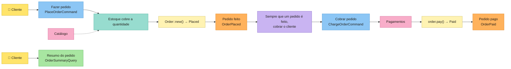

# Tutorial: uma loja, do board ao código

## Post-it → código

| Post-it | Conceito | No Cerne |
|---|---|---|
| 🟦 | Command | trait `Command<CompositionRoot>`, que devolve `Executed { output, events }` |
| 🟨 | Aggregate / Entity | atributos `#[entity]` e `#[aggregate]`, que escrevem as traits `Entity` e `Aggregate`; as invariantes ficam na trait `Validate` |
| — | Value Object | trait `ValueObject`, que também é o tipo do id de toda entidade; atributo `#[value_object]`, para um value object de um valor só |
| 🟧 | Domain Event | trait `DomainEvent<CompositionRoot>` |
| 🟪 | Policy | `Policy` + `Policies`; os commands delas vão para a `Outbox`, e o `OutboxPolicyProcessor` os executa |
| 🩷 | External System | um port (uma trait assíncrona da aplicação) e seus adapters, reunidos no `CompositionRoot` |
| 🟩 | Read Model / Query | trait `Query<CompositionRoot>`, que devolve um `ReadModel` |
| — | Invariantes | `Invariant` + `Invariants`: o que é sempre verdade sobre uma entidade ou um value object |
| — | Regras de negócio | `BusinessRule` + `BusinessRules`: o que precisa valer para um command rodar |
| — | Banco | `cerne::sqlite` (também em memória) e `cerne::postgres`: a mesma API, o mesmo SQL |
| — | HTTP | feature `axum`: REST ou JSON-RPC 2.0 |

## Instalação

```bash
cargo install cerne-cli
```

O Cerne precisa do Rust 1.88 ou mais novo.

## O board

O board tem dois fluxos. O cliente faz um pedido; a loja confere o estoque, e uma policy cobra o cliente. Depois, o cliente consulta o pedido.



Cada bloco de código abaixo é um arquivo inteiro do projeto. Um teste deste repositório roda estes comandos, escreve estes arquivos e roda `cargo test` no resultado, então o tutorial sempre compila. O código fica em inglês, como o Cerne gera.

## 1. O projeto e seus post-its

Cria o projeto `shop`, com SQLite como banco e uma API REST.

```bash
cerne new shop --db sqlite --http rest
```

Entra no projeto: os comandos `cerne g` rodam dentro dele.

```bash
cd shop
```

Cria o agregado 🟨 `Order`: Um pedido, com seu repositório SQL (o projeto tem banco, por causa do `--db sqlite`) e um status que começa em `Placed`. O campo `id` o CLI cria sozinho: um value object `OrderId`, com um `u64` dentro. Com `id:<tipo>` (por exemplo, `id:String`), o `OrderId` guarda um `String` no lugar do `u64`. Como o `Order` é um agregado, o repositório dele só aceita um id inteiro ou `String`.

```bash
cerne g entity Order product:String quantity:u32 total:u64 status=Placed:Placed,Paid --aggregate
```

Cria o evento 🟧 `OrderPlaced`: o pedido foi feito.

```bash
cerne g event OrderPlaced order_id:OrderId total:u64
```

Cria o evento 🟧 `OrderPaid`: o pedido foi pago.

```bash
cerne g event OrderPaid order_id:OrderId
```

Cria o command 🟦 `PlaceOrder`: o cliente faz um pedido.

```bash
cerne g command PlaceOrder product:String quantity:u32
```

Cria o command 🟦 `ChargeOrder`: cobrar o pedido, disparado por uma policy e não por um ator.

```bash
cerne g command ChargeOrder order_id:OrderId total:u64 --policy
```

Cria o port 🩷 `Catalog`: o sistema externo com os preços e o estoque.

```bash
cerne g port Catalog
```

Cria o `InMemoryCatalog`: um catálogo em memória, para os testes e para este tutorial.

```bash
cerne g adapter InMemoryCatalog Catalog
```

Cria o port 🩷 `Payments`: o sistema externo que cobra o cliente.

```bash
cerne g port Payments
```

Cria o `InMemoryPayments`: um sistema de pagamentos em memória, para os testes e para este tutorial.

```bash
cerne g adapter InMemoryPayments Payments
```

Cria o read model 🟩 `OrderSummary`: o resumo do pedido que o cliente vê.

```bash
cerne g read_model OrderSummary product:String quantity:u32 total:u64 status:String
```

Cria a query `OrderSummary`: ela busca esse resumo pelo id do pedido.

```bash
cerne g query OrderSummary order_id:OrderId
```

Liga o `PlaceOrder` à rota `POST /orders`.

```bash
cerne g endpoint PlaceOrder POST /orders
```

Liga a `OrderSummary` à rota `GET /orders`.

```bash
cerne g endpoint OrderSummary GET /orders
```

Os campos são `nome:tipo`, e `status=Placed:Placed,Paid` cria um enum com os valores `Placed` e `Paid`, que começa em `Placed`. Depois de cada comando, o projeto continua compilando. O `--aggregate` também acrescenta o campo `order_repository` no `CompositionRoot` e monta o repositório no `main.rs` e no `begin`, e o `--policy` registra o command na outbox.

```console
$ tree shop
shop
├── Cargo.toml
├── migrations
│   ├── 1791416037_create_orders.sql
│   └── 1_create_cerne_outbox.sql
├── rustfmt.toml
├── src
│   ├── application
│   │   ├── commands
│   │   │   ├── charge_order.rs
│   │   │   ├── mod.rs
│   │   │   └── place_order.rs
│   │   ├── mod.rs
│   │   ├── ports
│   │   │   ├── catalog.rs
│   │   │   ├── mod.rs
│   │   │   └── payments.rs
│   │   ├── queries
│   │   │   ├── mod.rs
│   │   │   └── order_summary.rs
│   │   └── read_models
│   │       ├── mod.rs
│   │       └── order_summary.rs
│   ├── composition_root.rs
│   ├── domain
│   │   ├── entities
│   │   │   ├── mod.rs
│   │   │   └── order.rs
│   │   ├── events
│   │   │   ├── mod.rs
│   │   │   ├── order_paid.rs
│   │   │   └── order_placed.rs
│   │   ├── mod.rs
│   │   └── value_objects
│   │       ├── mod.rs
│   │       └── order_id.rs
│   ├── infrastructure
│   │   ├── http
│   │   │   ├── mod.rs
│   │   │   ├── order_summary.rs
│   │   │   └── place_order.rs
│   │   ├── in_memory_catalog.rs
│   │   ├── in_memory_payments.rs
│   │   ├── mod.rs
│   │   └── sqlite_order_repository.rs
│   ├── lib.rs
│   └── main.rs
└── tests
    └── board.rs
```

Cada camada tem a sua pasta. O `domain/` é puro e síncrono: nada de IO. O `application/` é assíncrono: commands, queries e os ports que eles usam. O `infrastructure/` guarda os adapters: o repositório SQL, os adapters em memória e o HTTP. O número na frente da migração é o momento em que ela foi gerada.

Falta preencher os post-its.

## 2. Value object: `OrderId`

Um value object não tem identidade: dois `OrderId(7)` são a mesma coisa. Ele só existe se as invariantes dele valem, e nunca muda. O id de toda entidade é um value object, então um `0` nunca vira id de pedido, nem quando é lido de volta de um JSON ou do banco.

Como o `cerne g entity Order product:String quantity:u32 total:u64 status=Placed:Placed,Paid --aggregate` gerou o `src/domain/value_objects/order_id.rs`:

<!-- generated: src/domain/value_objects/order_id.rs -->
```rust
use cerne::domain::{EnforcementResult, Invariants, ValueObject, value_object};
use serde::{Deserialize, Serialize};

/// In JSON it is the `u64` itself, and reading it back goes through `new`: the invariants hold there too.
#[value_object]
#[derive(Debug, Clone, PartialEq, Serialize, Deserialize)]
pub struct OrderId(u64);

impl ValueObject for OrderId {
    type Constructor = u64;

    fn new(value: u64) -> EnforcementResult<Self> {
        Invariants::enforce([])?;

        Ok(Self(value))
    }
}
```

Depois de preenchido:

<!-- file: src/domain/value_objects/order_id.rs -->
```rust
use cerne::domain::{EnforcementResult, Invariants, ValueObject, invariant, value_object};
use serde::{Deserialize, Serialize};

/// In JSON it is the `u64` itself, and reading it back goes through `new`: the invariants hold there too.
#[value_object]
#[derive(Debug, Clone, PartialEq, Serialize, Deserialize)]
pub struct OrderId(u64);

impl ValueObject for OrderId {
    type Constructor = u64;

    fn new(value: u64) -> EnforcementResult<Self> {
        let order_id_is_positive = value > 0;

        Invariants::enforce([invariant!("order id is positive", order_id_is_positive)])?;

        Ok(Self(value))
    }
}
```

Cada invariante é um nome mais uma condição, escrita com o `invariant!`. A condição vai antes para uma variável, com o nome da frase do board. O `Invariants::enforce` roda todas e, se alguma falha, devolve `DomainError::Violations` com o nome de cada uma que falhou.

O `#[value_object]` escreve o que um value object de um valor só tem em comum: o `TryFrom<u64> for OrderId`, que passa pelo `new`, o `From<OrderId> for u64`, que devolve o `u64`, e, como o `OrderId` deriva `Serialize` e `Deserialize`, o `#[serde(try_from = "u64", into = "u64")]`. O `new`, com as invariantes, é seu. O repositório SQL usa o `From` para gravar o id na coluna.

## 3. Agregado: `Order` 🟨

Como o `cerne g entity Order product:String quantity:u32 total:u64 status=Placed:Placed,Paid --aggregate` gerou o `src/domain/entities/order.rs`:

<!-- generated: src/domain/entities/order.rs -->
```rust
use crate::domain::value_objects::order_id::OrderId;
use cerne::domain::{EnforcementResult, Invariants, Validate, aggregate};

// --- Status ------------------------------------------------------------------

#[derive(Debug, Clone, Copy, Default, PartialEq)]
pub enum OrderStatus {
    #[default]
    Placed,
    Paid,
}

// --- Aggregate ---------------------------------------------------------------

#[aggregate]
#[derive(Debug, Clone, PartialEq)]
pub struct Order {
    pub id: Option<OrderId>,
    pub product: String,
    pub quantity: u32,
    pub total: u64,
    #[skip_constructor]
    pub status: OrderStatus,
}

// --- Invariants --------------------------------------------------------------

impl Validate for Order {
    fn validate(self) -> EnforcementResult<Self> {
        Invariants::enforce([])?;

        Ok(self)
    }
}

// --- State transitions -------------------------------------------------------

impl Order {}
```

Depois de preenchido:

<!-- file: src/domain/entities/order.rs -->
```rust
use crate::domain::value_objects::order_id::OrderId;
use cerne::domain::{EnforcementResult, Invariants, Validate, aggregate, invariant};

// --- Status ------------------------------------------------------------------

#[derive(Debug, Clone, Copy, Default, PartialEq)]
pub enum OrderStatus {
    #[default]
    Placed,
    Paid,
}

// --- Aggregate ---------------------------------------------------------------

#[aggregate]
#[derive(Debug, Clone, PartialEq)]
pub struct Order {
    pub id: Option<OrderId>,
    pub product: String,
    pub quantity: u32,
    pub total: u64,
    #[skip_constructor]
    pub status: OrderStatus,
}

// --- Invariants --------------------------------------------------------------

impl Validate for Order {
    fn validate(self) -> EnforcementResult<Self> {
        let order_has_a_product = !self.product.is_empty();
        let quantity_is_positive = self.quantity > 0;

        Invariants::enforce([
            invariant!("order has a product", order_has_a_product),
            invariant!("quantity is positive", quantity_is_positive),
        ])?;

        Ok(self)
    }
}

// --- State transitions -------------------------------------------------------

impl Order {
    pub fn pay(self) -> EnforcementResult<Self> {
        Self {
            status: OrderStatus::Paid,
            ..self
        }
        .validate()
    }
}
```

- O `#[aggregate]` escreve o que todo agregado tem em comum: o `impl Entity` (o `id()`, o `with_id` que o repositório chama e o `new`), o `impl Aggregate` e o `OrderConstructor`. Uma entidade que não é agregado (`cerne g entity` sem `--aggregate`) ganha o `#[entity]`, que escreve o mesmo menos o `impl Aggregate`: nenhum repositório a aceita.
- O `Order::new` recebe o `OrderConstructor`, com todos os campos menos dois: o id, que o repositório decide no primeiro `save` (até lá, o `id()` é `None`), e o `status`, marcado com `#[skip_constructor]`. Um campo pulado começa no seu `Default`: o `OrderStatus` deriva `Default`, com `#[default]` no `Placed`, o valor inicial de `status=Placed:Placed,Paid`.
- O `validate`, no `impl Validate`, guarda as invariantes: o CLI o gera vazio, para você preencher. Ele roda no `new`, em toda transição de estado (`pay`) e quando o repositório lê uma linha de volta: um pedido que quebra uma invariante nunca existe em memória.
- As transições de estado são métodos que consomem o pedido e devolvem o próximo.

## 4. Sistemas externos: ports e adapters 🩷

Um port é uma trait assíncrona da aplicação, e todo método devolve `Result<_, cerne::Error>`. O command não sabe qual adapter está por trás.

Como o `cerne g port Catalog` gerou o `src/application/ports/catalog.rs`:

<!-- generated: src/application/ports/catalog.rs -->
```rust
use cerne::async_trait;

/// External system "Catalog": one async method per thing the commands ask of it, each returning
/// `Result<_, cerne::Error>`.
#[async_trait]
pub trait Catalog: Send + Sync {}
```

Depois de preenchido:

<!-- file: src/application/ports/catalog.rs -->
```rust
use cerne::{Error, async_trait};

/// External system "Catalog": what the shop sells, at what price, and how much is left.
#[async_trait]
pub trait Catalog: Send + Sync {
    /// The price of one unit, in cents.
    async fn unit_price(&self, product: &str) -> Result<u64, Error>;

    async fn units_in_stock(&self, product: &str) -> Result<u32, Error>;
}
```

Como o `cerne g port Payments` gerou o `src/application/ports/payments.rs`:

<!-- generated: src/application/ports/payments.rs -->
```rust
use cerne::async_trait;

/// External system "Payments": one async method per thing the commands ask of it, each returning
/// `Result<_, cerne::Error>`.
#[async_trait]
pub trait Payments: Send + Sync {}
```

Depois de preenchido:

<!-- file: src/application/ports/payments.rs -->
```rust
use crate::domain::value_objects::order_id::OrderId;
use cerne::{Error, async_trait};

/// External system "Payments": charges the customer. The order id is the idempotency key: charging the same order
/// twice charges it once.
#[async_trait]
pub trait Payments: Send + Sync {
    async fn charge(&self, order_id: &OrderId, amount: u64) -> Result<(), Error>;
}
```

Os adapters em memória fazem o papel dos sistemas de verdade nos testes e neste tutorial:

Como o `cerne g adapter InMemoryCatalog Catalog` gerou o `src/infrastructure/in_memory_catalog.rs`:

<!-- generated: src/infrastructure/in_memory_catalog.rs -->
```rust
use crate::application::ports::catalog::Catalog;
use cerne::async_trait;

/// An adapter of the port `Catalog`.
pub struct InMemoryCatalog;

#[async_trait]
impl Catalog for InMemoryCatalog {}
```

Depois de preenchido:

<!-- file: src/infrastructure/in_memory_catalog.rs -->
```rust
use crate::application::ports::catalog::Catalog;
use cerne::{ApplicationError, Error, async_trait};

/// A catalog with fixed products: (name, unit price in cents, units in stock).
pub struct InMemoryCatalog {
    pub products: Vec<(&'static str, u64, u32)>,
}

impl InMemoryCatalog {
    fn product(&self, product: &str) -> Result<(&'static str, u64, u32), Error> {
        let found = self.products.iter().find(|(name, _, _)| *name == product);

        Ok(*found.ok_or(ApplicationError::NotFound("product"))?)
    }
}

#[async_trait]
impl Catalog for InMemoryCatalog {
    async fn unit_price(&self, product: &str) -> Result<u64, Error> {
        let (_, unit_price, _) = self.product(product)?;

        Ok(unit_price)
    }

    async fn units_in_stock(&self, product: &str) -> Result<u32, Error> {
        let (_, _, units_in_stock) = self.product(product)?;

        Ok(units_in_stock)
    }
}
```

Como o `cerne g adapter InMemoryPayments Payments` gerou o `src/infrastructure/in_memory_payments.rs`:

<!-- generated: src/infrastructure/in_memory_payments.rs -->
```rust
use crate::application::ports::payments::Payments;
use cerne::async_trait;

/// An adapter of the port `Payments`.
pub struct InMemoryPayments;

#[async_trait]
impl Payments for InMemoryPayments {}
```

Depois de preenchido:

<!-- file: src/infrastructure/in_memory_payments.rs -->
```rust
use crate::application::ports::payments::Payments;
use crate::domain::value_objects::order_id::OrderId;
use cerne::{Error, async_trait};
use std::sync::Mutex;

/// Keeps every charge instead of calling a payment provider.
#[derive(Default)]
pub struct InMemoryPayments {
    pub charges: Mutex<Vec<(OrderId, u64)>>,
}

#[async_trait]
impl Payments for InMemoryPayments {
    async fn charge(&self, order_id: &OrderId, amount: u64) -> Result<(), Error> {
        let mut charges = self.charges.lock().unwrap();

        if !charges.iter().any(|(charged, _)| charged == order_id) {
            charges.push((order_id.clone(), amount));
        }

        Ok(())
    }
}
```

O `CompositionRoot` reúne todos os ports, e o `CompositionRoot::new` só guarda os adapters que recebe: quem os monta é o `main.rs`. O `cerne g entity --aggregate` já acrescentou o `order_repository`; os dois sistemas externos entram à mão. O repositório e a outbox moram no banco, então o `begin` abre uma transação e os monta de novo em cima dela. Os sistemas externos continuam os mesmos, um `Arc::clone` dos mesmos adapters, porque uma chamada a eles não tem como ser desfeita.

Como o `cerne new shop --db sqlite --http rest`, o `cerne g entity Order product:String quantity:u32 total:u64 status=Placed:Placed,Paid --aggregate` e o `cerne g command ChargeOrder order_id:OrderId total:u64 --policy` geraram o `src/composition_root.rs`:

<!-- generated: src/composition_root.rs -->
```rust
use crate::application::commands::charge_order::ChargeOrderCommand;
use crate::domain::entities::order::Order;
use crate::infrastructure::sqlite_order_repository::SqliteOrderRepository;
use cerne::application::{CommandRegistry, Outbox, Repository, TransactionalCompositionRoot};
use cerne::sqlite::{SqliteDatabase, SqliteOutbox};
use cerne::{Error, async_trait};

/// The composition root: every port the commands and queries can use.
///
/// The repositories and the outbox live in the database, so `begin` builds them again on its transaction. External
/// systems do not: `begin` hands the same adapters to the new composition root.
pub struct CompositionRoot {
    pub database: SqliteDatabase,
    pub order_repository: Box<dyn Repository<Order>>,
    pub outbox: Box<dyn Outbox<CompositionRoot>>,
}

/// What `CompositionRoot::new` takes: every adapter, already built.
pub struct CompositionRootConstructor {
    pub database: SqliteDatabase,
    pub order_repository: Box<dyn Repository<Order>>,
    pub outbox: Box<dyn Outbox<CompositionRoot>>,
}

impl CompositionRoot {
    pub fn new(constructor: CompositionRootConstructor) -> Self {
        Self {
            database: constructor.database,
            order_repository: constructor.order_repository,
            outbox: constructor.outbox,
        }
    }
}

/// Every command a policy fires, so the outbox can read it back from its row.
pub fn command_registry() -> CommandRegistry<CompositionRoot> {
    CommandRegistry::new().register::<ChargeOrderCommand>()
}

#[async_trait]
impl TransactionalCompositionRoot for CompositionRoot {
    async fn begin(&self) -> Result<Self, Error> {
        let transaction = self.database.begin().await?;

        let order_repository = SqliteOrderRepository::new(transaction.clone());
        let outbox = SqliteOutbox::new(transaction.clone());

        let composition_root_constructor = CompositionRootConstructor {
            database: transaction,
            order_repository: Box::new(order_repository),
            outbox: Box::new(outbox),
        };

        Ok(CompositionRoot::new(composition_root_constructor))
    }

    async fn commit(self) -> Result<(), Error> {
        self.database.commit().await
    }

    fn outbox(&self) -> &dyn Outbox<Self> {
        self.outbox.as_ref()
    }
}
```

Depois de preenchido:

<!-- file: src/composition_root.rs -->
```rust
use crate::application::commands::charge_order::ChargeOrderCommand;
use crate::application::ports::catalog::Catalog;
use crate::application::ports::payments::Payments;
use crate::domain::entities::order::Order;
use crate::infrastructure::sqlite_order_repository::SqliteOrderRepository;
use cerne::application::{CommandRegistry, Outbox, Repository, TransactionalCompositionRoot};
use cerne::sqlite::{SqliteDatabase, SqliteOutbox};
use cerne::{Error, async_trait};
use std::sync::Arc;

/// The composition root: every port the commands and queries can use.
///
/// The repositories and the outbox live in the database, so `begin` builds them again on its transaction. External
/// systems do not: `begin` hands the same adapters to the new composition root.
pub struct CompositionRoot {
    pub database: SqliteDatabase,
    pub order_repository: Box<dyn Repository<Order>>,
    pub outbox: Box<dyn Outbox<CompositionRoot>>,
    pub catalog: Arc<dyn Catalog>,
    pub payments: Arc<dyn Payments>,
}

/// What `CompositionRoot::new` takes: every adapter, already built.
pub struct CompositionRootConstructor {
    pub database: SqliteDatabase,
    pub order_repository: Box<dyn Repository<Order>>,
    pub outbox: Box<dyn Outbox<CompositionRoot>>,
    pub catalog: Arc<dyn Catalog>,
    pub payments: Arc<dyn Payments>,
}

impl CompositionRoot {
    pub fn new(constructor: CompositionRootConstructor) -> Self {
        Self {
            database: constructor.database,
            order_repository: constructor.order_repository,
            outbox: constructor.outbox,
            catalog: constructor.catalog,
            payments: constructor.payments,
        }
    }
}

/// Every command a policy fires, so the outbox can read it back from its row.
pub fn command_registry() -> CommandRegistry<CompositionRoot> {
    CommandRegistry::new().register::<ChargeOrderCommand>()
}

#[async_trait]
impl TransactionalCompositionRoot for CompositionRoot {
    async fn begin(&self) -> Result<Self, Error> {
        let transaction = self.database.begin().await?;

        let order_repository = SqliteOrderRepository::new(transaction.clone());
        let outbox = SqliteOutbox::new(transaction.clone());

        let composition_root_constructor = CompositionRootConstructor {
            database: transaction,
            order_repository: Box::new(order_repository),
            outbox: Box::new(outbox),
            catalog: Arc::clone(&self.catalog),
            payments: Arc::clone(&self.payments),
        };

        Ok(CompositionRoot::new(composition_root_constructor))
    }

    async fn commit(self) -> Result<(), Error> {
        self.database.commit().await
    }

    fn outbox(&self) -> &dyn Outbox<Self> {
        self.outbox.as_ref()
    }
}
```

## 5. Command: `PlaceOrderCommand` 🟦

O command é uma struct com o que o ator envia, e nada mais: sem id, porque quem decide o id é o repositório. O `execute` segue o board da esquerda para a direita, uma seção por post-it:

Como o `cerne g command PlaceOrder product:String quantity:u32` gerou o `src/application/commands/place_order.rs`:

<!-- generated: src/application/commands/place_order.rs -->
```rust
use crate::composition_root::CompositionRoot;
use cerne::application::{Command, Executed};
use cerne::{Error, async_trait};
use serde::{Deserialize, Serialize};

/// Actor: who sends it? The body of the request is this command (that is why it is `Deserialize`).
///
/// In JSON-RPC, the params can come by position, in the order of these fields: that order is part of the API.
#[derive(Serialize, Deserialize)]
pub struct PlaceOrderCommand {
    pub product: String,
    pub quantity: u32,
}

#[async_trait]
impl Command<CompositionRoot> for PlaceOrderCommand {
    type Output = ();

    async fn execute(&self, _ports: &CompositionRoot) -> Result<Executed<(), CompositionRoot>, Error> {
        // --- Ports -----------------------------------------------------------

        // --- Business rules --------------------------------------------------

        // --- Aggregate -------------------------------------------------------

        // --- Domain events ---------------------------------------------------

        Ok(Executed {
            output: (),
            events: vec![],
        })
    }
}
```

Depois de preenchido:

<!-- file: src/application/commands/place_order.rs -->
```rust
use crate::composition_root::CompositionRoot;
use crate::domain::entities::order::{Order, OrderConstructor};
use crate::domain::events::order_placed::OrderPlaced;
use crate::domain::value_objects::order_id::OrderId;
use cerne::application::{Command, Executed};
use cerne::domain::{BusinessRules, Entity, business_rule};
use cerne::{Error, async_trait};
use serde::{Deserialize, Serialize};

/// Actor: the customer. The body of `POST /orders` is this command (that is why it is `Deserialize`).
#[derive(Serialize, Deserialize)]
pub struct PlaceOrderCommand {
    pub product: String,
    pub quantity: u32,
}

#[async_trait]
impl Command<CompositionRoot> for PlaceOrderCommand {
    type Output = OrderId; // the id of the new order, for the customer to follow it

    async fn execute(&self, composition_root: &CompositionRoot) -> Result<Executed<OrderId, CompositionRoot>, Error> {
        // --- Ports -----------------------------------------------------------

        let unit_price = composition_root.catalog.unit_price(&self.product).await?;
        let units_in_stock = composition_root
            .catalog
            .units_in_stock(&self.product)
            .await?;

        // --- Business rules --------------------------------------------------

        let stock_covers_the_quantity = units_in_stock >= self.quantity;

        BusinessRules::check([business_rule!("stock covers the quantity", stock_covers_the_quantity)])?;

        // --- Aggregate -------------------------------------------------------

        let total = unit_price * u64::from(self.quantity);

        let order = Order::new(OrderConstructor {
            product: self.product.clone(),
            quantity: self.quantity,
            total,
        })?;

        let order_id = composition_root.order_repository.save(order).await?;

        // --- Domain events ---------------------------------------------------

        let order_placed = OrderPlaced {
            order_id: order_id.clone(),
            total,
        };

        Ok(Executed {
            output: order_id,
            events: vec![Box::new(order_placed)],
        })
    }
}
```

- **Ports:** toda leitura de que o command precisa, antes de qualquer decisão.
- **Business rules:** cada condição numa variável, depois o `BusinessRules::check([business_rule!(..)])?`. Uma regra de negócio precisa do mundo de fora (aqui, o estoque); uma invariante só precisa da própria entidade.
- **Aggregate:** a mudança, depois o `save`, que devolve o id.
- **Domain events:** cada evento numa variável, depois o `Ok(Executed { output, events })`. O `output` volta para quem enviou o command (aqui, o id do pedido novo); os `events` vão para a outbox.

## 6. Evento de domínio e policy: `OrderPlaced` 🟧 🟪

Um evento diz o que aconteceu, no passado. O `trigger_policies` dele lista as policies que reagem a ele: cada uma é um `policy!` com três argumentos: um nome, uma condição (`true` para uma policy que sempre dispara) e o command que ela dispara. O command só é montado se a condição vale, e leva os valores que usa: aqui, o `order_id` e o `total`, lidos do evento antes. O `Policies::trigger` devolve as policies que dispararam.

Como o `cerne g event OrderPlaced order_id:OrderId total:u64` gerou o `src/domain/events/order_placed.rs`:

<!-- generated: src/domain/events/order_placed.rs -->
```rust
use crate::composition_root::CompositionRoot;
use crate::domain::value_objects::order_id::OrderId;
use cerne::domain::{DomainEvent, EnforcementResult, FiredPolicy, Policies};

pub struct OrderPlaced {
    pub order_id: OrderId,
    pub total: u64,
}

impl DomainEvent<CompositionRoot> for OrderPlaced {
    fn trigger_policies(&self) -> EnforcementResult<Vec<FiredPolicy<CompositionRoot>>> {
        // --- Policies --------------------------------------------------------

        Ok(Policies::trigger([]))
    }
}
```

Depois de preenchido:

<!-- file: src/domain/events/order_placed.rs -->
```rust
use crate::application::commands::charge_order::ChargeOrderCommand;
use crate::composition_root::CompositionRoot;
use crate::domain::value_objects::order_id::OrderId;
use cerne::domain::{DomainEvent, EnforcementResult, FiredPolicy, Policies, policy};

pub struct OrderPlaced {
    pub order_id: OrderId,
    pub total: u64,
}

impl DomainEvent<CompositionRoot> for OrderPlaced {
    fn trigger_policies(&self) -> EnforcementResult<Vec<FiredPolicy<CompositionRoot>>> {
        // --- Policies --------------------------------------------------------

        let order_id = self.order_id.clone();
        let total = self.total;

        let charge_the_customer_policy =
            policy!("whenever an order is placed, charge the customer", true, ChargeOrderCommand { order_id, total });

        Ok(Policies::trigger([charge_the_customer_policy]))
    }
}
```

A policy não executa o command. O `execute_in_transaction` (passo 9) salva o pedido e grava o `ChargeOrderCommand` na tabela `cerne_outbox` na mesma transação: os dois são salvos, ou nenhum. Depois, o `OutboxPolicyProcessor` lê a tabela e executa cada command numa transação própria.

O `OrderPaid` fica como o `cerne g event` o gerou: nenhuma policy reage a ele ainda.

## 7. O command que uma policy dispara: `ChargeOrderCommand` 🟦

Como o `cerne g command ChargeOrder order_id:OrderId total:u64 --policy` gerou o `src/application/commands/charge_order.rs`:

<!-- generated: src/application/commands/charge_order.rs -->
```rust
use crate::composition_root::CompositionRoot;
use crate::domain::value_objects::order_id::OrderId;
use cerne::application::{Command, Executed};
use cerne::{Error, async_trait};
use serde::{Deserialize, Serialize};

/// No actor: a policy fires this command, and the outbox stores it (that is why it is `Serialize`).
#[derive(Serialize, Deserialize)]
pub struct ChargeOrderCommand {
    pub order_id: OrderId,
    pub total: u64,
}

#[async_trait]
impl Command<CompositionRoot> for ChargeOrderCommand {
    type Output = ();

    async fn execute(&self, _ports: &CompositionRoot) -> Result<Executed<(), CompositionRoot>, Error> {
        // --- Ports -----------------------------------------------------------

        // --- Business rules --------------------------------------------------

        // --- Aggregate -------------------------------------------------------

        // --- Domain events ---------------------------------------------------

        Ok(Executed {
            output: (),
            events: vec![],
        })
    }
}
```

Depois de preenchido:

<!-- file: src/application/commands/charge_order.rs -->
```rust
use crate::composition_root::CompositionRoot;
use crate::domain::entities::order::OrderStatus;
use crate::domain::events::order_paid::OrderPaid;
use crate::domain::value_objects::order_id::OrderId;
use cerne::application::{Command, Executed};
use cerne::domain::{BusinessRules, business_rule};
use cerne::{Error, async_trait};
use serde::{Deserialize, Serialize};

/// No actor: a policy fires this command, and the outbox stores it (that is why it is `Serialize`).
#[derive(Serialize, Deserialize)]
pub struct ChargeOrderCommand {
    pub order_id: OrderId,
    pub total: u64,
}

#[async_trait]
impl Command<CompositionRoot> for ChargeOrderCommand {
    type Output = ();

    async fn execute(&self, composition_root: &CompositionRoot) -> Result<Executed<(), CompositionRoot>, Error> {
        // --- Ports -----------------------------------------------------------

        let order = composition_root
            .order_repository
            .load(&self.order_id)
            .await?;

        // --- Business rules --------------------------------------------------

        let order_is_still_placed = order.status == OrderStatus::Placed;

        BusinessRules::check([business_rule!("order is still placed", order_is_still_placed)])?;

        // --- External system: Payments ---------------------------------------

        composition_root
            .payments
            .charge(&self.order_id, self.total)
            .await?;

        // --- Aggregate -------------------------------------------------------

        let paid_order = order.pay()?;

        composition_root.order_repository.save(paid_order).await?;

        // --- Domain events ---------------------------------------------------

        let order_paid = OrderPaid {
            order_id: self.order_id.clone(),
        };

        Ok(Executed {
            output: (),
            events: vec![Box::new(order_paid)],
        })
    }
}
```

Se o processo cair depois da cobrança e antes do commit, a outbox executa o command de novo. Por isso um command disparado por policy precisa ser idempotente: aqui, o id do pedido é a chave de idempotência do pagamento, e a regra "order is still placed" recusa um pedido que já foi pago. A seção `External system: Payments` fica entre as regras e o agregado.

## 8. Query e read model: `OrderSummary` 🟩

O read model é o que o ator vê na tela: campos simples, sem comportamento. O `cerne g read_model` o gerou, e ele fica como está. A query lê os ports e o monta:

Como o `cerne g query OrderSummary order_id:OrderId` gerou o `src/application/queries/order_summary.rs`:

<!-- generated: src/application/queries/order_summary.rs -->
```rust
use crate::application::read_models::order_summary::OrderSummary;
use crate::composition_root::CompositionRoot;
use crate::domain::value_objects::order_id::OrderId;
use cerne::application::Query;
use cerne::{Error, async_trait};
use serde::Deserialize;

#[derive(Deserialize)]
pub struct OrderSummaryQuery {
    pub order_id: OrderId,
}

#[async_trait]
impl Query<CompositionRoot> for OrderSummaryQuery {
    type ReadModel = OrderSummary;

    async fn execute(&self, _ports: &CompositionRoot) -> Result<OrderSummary, Error> {
        // --- Ports -----------------------------------------------------------

        // --- Read model ------------------------------------------------------

        todo!("read the ports and build the OrderSummary read model")
    }
}
```

Depois de preenchido:

<!-- file: src/application/queries/order_summary.rs -->
```rust
use crate::application::read_models::order_summary::OrderSummary;
use crate::composition_root::CompositionRoot;
use crate::domain::value_objects::order_id::OrderId;
use cerne::application::Query;
use cerne::{Error, async_trait};
use serde::Deserialize;

#[derive(Deserialize)]
pub struct OrderSummaryQuery {
    pub order_id: OrderId,
}

#[async_trait]
impl Query<CompositionRoot> for OrderSummaryQuery {
    type ReadModel = OrderSummary;

    async fn execute(&self, composition_root: &CompositionRoot) -> Result<OrderSummary, Error> {
        // --- Ports -----------------------------------------------------------

        let order = composition_root
            .order_repository
            .load(&self.order_id)
            .await?;

        // --- Read model ------------------------------------------------------

        let order_summary = OrderSummary {
            product: order.product,
            quantity: order.quantity,
            total: order.total,
            status: format!("{:?}", order.status),
        };

        Ok(order_summary)
    }
}
```

## 9. O board como teste

O `tests/board.rs` tem um bloco por fluxo. O banco é um SQLite em memória, com o mesmo adapter SQL de produção; um repositório nunca é um `Vec`.

Como o `cerne new shop --db sqlite --http rest` gerou o `tests/board.rs`:

<!-- generated: tests/board.rs -->
```rust
//! One block per flow of the board: an actor sends a command, and the test checks its events and the policies that fired.
```

Depois de preenchido:

<!-- file: tests/board.rs -->
```rust
//! One block per flow of the board: an actor sends a command, and the test checks its events and the policies that fired.

use cerne::Error;
use cerne::application::{OutboxPolicyProcessor, Query, TransactionalCompositionRoot};
use cerne::domain::{DomainError, ValueObject};
use cerne::sqlite::{SqliteDatabase, SqliteOutbox};
use shop::application::commands::place_order::PlaceOrderCommand;
use shop::application::queries::order_summary::OrderSummaryQuery;
use shop::application::read_models::order_summary::OrderSummary;
use shop::composition_root::{CompositionRoot, CompositionRootConstructor, command_registry};
use shop::domain::value_objects::order_id::OrderId;
use shop::infrastructure::in_memory_catalog::InMemoryCatalog;
use shop::infrastructure::in_memory_payments::InMemoryPayments;
use shop::infrastructure::sqlite_order_repository::SqliteOrderRepository;
use std::sync::Arc;

async fn composition_root(payments: Arc<InMemoryPayments>) -> Result<Arc<CompositionRoot>, Error> {
    let database = SqliteDatabase::in_memory().await?;

    let order_repository = SqliteOrderRepository::new(database.clone());
    let outbox = SqliteOutbox::new(database.clone());

    let catalog = InMemoryCatalog {
        products: vec![("mug", 3000, 10)],
    };

    database.migrate(&sqlx::migrate!()).await?;

    let composition_root_constructor = CompositionRootConstructor {
        database,
        order_repository: Box::new(order_repository),
        outbox: Box::new(outbox),
        catalog: Arc::new(catalog),
        payments,
    };

    Ok(Arc::new(CompositionRoot::new(composition_root_constructor)))
}

#[tokio::test]
async fn the_customer_places_an_order_and_the_policy_charges_it() -> Result<(), Error> {
    let payments = Arc::new(InMemoryPayments::default());
    let composition_root = composition_root(Arc::clone(&payments)).await?;

    let outbox_policy_processor = OutboxPolicyProcessor::new(Arc::clone(&composition_root), command_registry());

    // --- Customer: places an order -------------------------------------------

    let place_order = PlaceOrderCommand {
        product: "mug".into(),
        quantity: 2,
    };

    let order_id = composition_root.execute_in_transaction(place_order).await?;

    // --- Policy: whenever an order is placed, charge the customer -----------

    let command_runs = outbox_policy_processor.run_pending().await?;

    assert_eq!(command_runs.len(), 1);
    assert_eq!(*payments.charges.lock().unwrap(), vec![(order_id.clone(), 6000)]);

    // --- Customer: reads the order -------------------------------------------

    let order_summary_query = OrderSummaryQuery { order_id };

    let order_summary = order_summary_query.execute(&composition_root).await?;

    let paid_order_summary = OrderSummary {
        product: "mug".into(),
        quantity: 2,
        total: 6000,
        status: "Paid".into(),
    };

    assert_eq!(order_summary, paid_order_summary);

    Ok(())
}

#[tokio::test]
async fn the_domain_refuses_what_breaks_a_rule_or_an_invariant() -> Result<(), Error> {
    let composition_root = composition_root(Arc::default()).await?;

    // --- Business rule: stock covers the quantity ----------------------------

    let too_many_mugs = PlaceOrderCommand {
        product: "mug".into(),
        quantity: 11,
    };

    let refused = composition_root.execute_in_transaction(too_many_mugs).await;

    assert!(matches!(
        refused,
        Err(Error::Domain(DomainError::Violations(violations))) if violations == ["stock covers the quantity"]
    ));

    // --- Invariant: quantity is positive -------------------------------------

    let no_mugs = PlaceOrderCommand {
        product: "mug".into(),
        quantity: 0,
    };

    let refused = composition_root.execute_in_transaction(no_mugs).await;

    assert!(matches!(
        refused,
        Err(Error::Domain(DomainError::Violations(violations))) if violations == ["quantity is positive"]
    ));

    // --- Value object: order id is positive ----------------------------------

    assert!(OrderId::new(0).is_err());

    Ok(())
}
```

O `execute_in_transaction` abre a transação, executa o command, grava na outbox os commands das policies dele e faz o commit. Depois, o `run_pending` executa o que está na outbox.

```bash
cargo test
```

## 10. HTTP

O `cerne new --http rest` gerou o router, e cada `cerne g endpoint` acrescentou uma rota: o corpo do `POST /orders` é o `PlaceOrderCommand`, e a query string do `GET /orders` é a `OrderSummaryQuery`. No `main.rs`, só os dois adapters entram à mão:

Como o `cerne new shop --db sqlite --http rest` e o `cerne g entity Order product:String quantity:u32 total:u64 status=Placed:Placed,Paid --aggregate` geraram o `src/main.rs`:

<!-- generated: src/main.rs -->
```rust
use cerne::application::OutboxPolicyProcessor;
use cerne::sqlite::{SqliteDatabase, SqliteOutbox};
use shop::composition_root::{CompositionRoot, CompositionRootConstructor, command_registry};
use shop::infrastructure::http::router;
use shop::infrastructure::sqlite_order_repository::SqliteOrderRepository;
use std::sync::Arc;
use std::time::Duration;

#[tokio::main]
async fn main() -> anyhow::Result<()> {
    // --- Composition root ----------------------------------------------------

    let database_url = std::env::var("DATABASE_URL").unwrap_or("sqlite://shop.db?mode=rwc".into());

    let database = SqliteDatabase::connect(&database_url, 5).await?;

    let order_repository = SqliteOrderRepository::new(database.clone());
    let outbox = SqliteOutbox::new(database.clone());

    database.migrate(&sqlx::migrate!()).await?;

    let composition_root_constructor = CompositionRootConstructor {
        database,
        order_repository: Box::new(order_repository),
        outbox: Box::new(outbox),
    };

    let composition_root = Arc::new(CompositionRoot::new(composition_root_constructor));

    // --- Outbox: the commands of the policies --------------------------------

    let outbox_policy_processor = OutboxPolicyProcessor::new(Arc::clone(&composition_root), command_registry());

    tokio::spawn(async move {
        outbox_policy_processor
            .run_every(Duration::from_millis(200), |error| eprintln!("outbox: {error}"))
            .await
    });

    // --- HTTP: REST ----------------------------------------------------------

    let listener = tokio::net::TcpListener::bind("127.0.0.1:3000").await?;

    println!("listening on http://127.0.0.1:3000");

    axum::serve(listener, router(composition_root)).await?;

    Ok(())
}
```

Depois de preenchido:

<!-- file: src/main.rs -->
```rust
use cerne::application::OutboxPolicyProcessor;
use cerne::sqlite::{SqliteDatabase, SqliteOutbox};
use shop::composition_root::{CompositionRoot, CompositionRootConstructor, command_registry};
use shop::infrastructure::http::router;
use shop::infrastructure::in_memory_catalog::InMemoryCatalog;
use shop::infrastructure::in_memory_payments::InMemoryPayments;
use shop::infrastructure::sqlite_order_repository::SqliteOrderRepository;
use std::sync::Arc;
use std::time::Duration;

#[tokio::main]
async fn main() -> anyhow::Result<()> {
    // --- Composition root ----------------------------------------------------

    let database_url = std::env::var("DATABASE_URL").unwrap_or("sqlite://shop.db?mode=rwc".into());

    let database = SqliteDatabase::connect(&database_url, 5).await?;

    let order_repository = SqliteOrderRepository::new(database.clone());
    let outbox = SqliteOutbox::new(database.clone());

    let catalog = InMemoryCatalog {
        products: vec![("mug", 3000, 10), ("t-shirt", 5000, 3)],
    };
    let payments = InMemoryPayments::default();

    database.migrate(&sqlx::migrate!()).await?;

    let composition_root_constructor = CompositionRootConstructor {
        database,
        order_repository: Box::new(order_repository),
        outbox: Box::new(outbox),
        catalog: Arc::new(catalog),
        payments: Arc::new(payments),
    };

    let composition_root = Arc::new(CompositionRoot::new(composition_root_constructor));

    // --- Outbox: the commands of the policies --------------------------------

    let outbox_policy_processor = OutboxPolicyProcessor::new(Arc::clone(&composition_root), command_registry());

    tokio::spawn(async move {
        outbox_policy_processor
            .run_every(Duration::from_millis(200), |error| eprintln!("outbox: {error}"))
            .await
    });

    // --- HTTP: REST ----------------------------------------------------------

    let listener = tokio::net::TcpListener::bind("127.0.0.1:3000").await?;

    println!("listening on http://127.0.0.1:3000");

    axum::serve(listener, router(composition_root)).await?;

    Ok(())
}
```

```bash
cargo run
```

```console
$ curl -X POST localhost:3000/orders -H 'content-type: application/json' -d '{"product": "mug", "quantity": 2}'
1
$ curl 'localhost:3000/orders?order_id=1'
{"product":"mug","quantity":2,"total":6000,"status":"Paid"}
```

O pedido já está `Paid`: em segundo plano, o `OutboxPolicyProcessor` executou o `ChargeOrderCommand`.

## 11. Quando algo dá errado

Todo erro é um `cerne::Error`, numa de três categorias, e o HTTP transforma cada uma numa resposta:

| Erro | Quando | REST | JSON-RPC |
|---|---|---|---|
| `DomainError::Violations` | uma invariante ou uma regra de negócio falhou | 422, com os nomes | `-32001`, com os nomes no `message` e no `data` |
| `ApplicationError::NotFound` | o repositório (ou um adapter) não achou nada | 404 | `-32004` |
| `InfrastructureError` | banco, rede, fila | 500, sem detalhes | `-32603` |

```console
$ curl -X POST localhost:3000/orders -H 'content-type: application/json' -d '{"product": "mug", "quantity": 11}'
{"error":"domain","violations":["stock covers the quantity"]}
$ curl -X POST localhost:3000/orders -H 'content-type: application/json' -d '{"product": "lamp", "quantity": 1}'
{"error":"not_found","message":"product not found"}
```

## Outras opções

- **Postgres:** o `cerne new shop --db postgres` usa o `cerne::postgres`, com a mesma API e o mesmo SQL. O endereço vem do `DATABASE_URL`.
- **Sem banco:** o `cerne new shop`, sem `--db`, não usa nenhum adapter de banco do Cerne. A outbox fica em memória (`InMemoryOutbox`), e o `--aggregate` gera só o agregado, sem repositório. Se o processo cair, os commands das policies que ainda não rodaram se perdem.
- **Banco depois:** o `cerne g db sqlite` (ou `postgres`, ou `memory`) escreve o que o `cerne new --db` teria escrito: o `sqlx`, a tabela da outbox, o `CompositionRoot` no banco e o repositório SQL de cada agregado que já existe.
- **Sem arquivo de banco:** o `cerne new shop --db memory` começa com um SQLite em memória, o mesmo adapter.
- **JSON-RPC 2.0:** o `cerne new shop --http jsonrpc` atende `POST /rpc`, e cada `cerne g command` e `cerne g query` acrescenta o seu método (`place_order`, `order_summary`). Os `params` chegam por nome (um objeto) ou por posição (um array, na ordem dos campos do command).
- **HTTP depois:** um projeto criado sem `--http` o ganha com `cerne g http rest` ou `cerne g http jsonrpc`.
- **Outros processadores de policy:** além do `OutboxPolicyProcessor` (o padrão), o `InlinePolicyProcessor` executa os commands na hora, na mesma task, e o `TokioPolicyProcessor` os executa numa task em segundo plano.

## CLI

```
cerne new <name> [--db memory|sqlite|postgres] [--http rest|jsonrpc]
cerne g entity <Name> [field:type ...] [field:Value1,Value2 ...] [field=Initial:Value1,Value2 ...] [id:type] [--aggregate]
cerne g value_object <Name> field:type [field:type ...]
cerne g event <Name> [field:type ...]
cerne g command <Name> [field:type ...] [--policy]
cerne g read_model <Name> [field:type ...]
cerne g query <Name> [field:type ...]
cerne g endpoint <Name> <GET|POST|PUT|PATCH|DELETE> </path>
cerne g http <rest|jsonrpc>
cerne g db <memory|sqlite|postgres>
cerne g port <Name>
cerne g adapter <Name> <Port>
```
